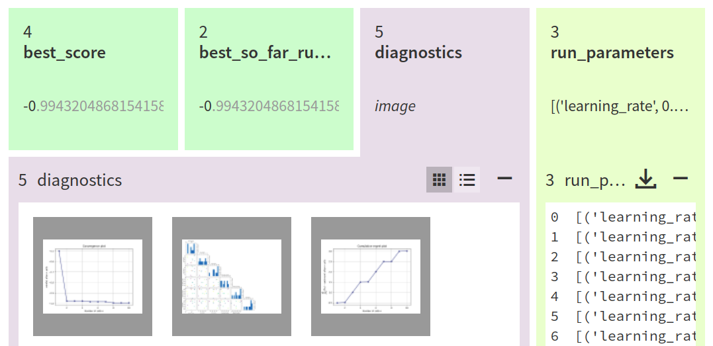
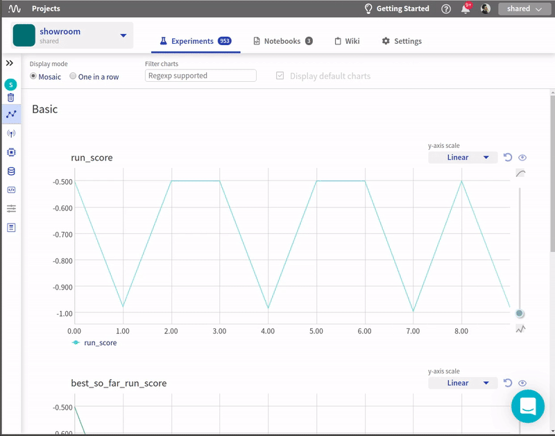

Neptune-Scikit-Optimize Integration
===================================

This integation lets you monitor |Scikit-Optimize| (skopt) hyperparameter optimization in Neptune.

Requirements
------------

Integration with the Scikit-Optimize framework is enabled as a part of the logging module so all you need to have installed is |neptune-client| and |neptune-contrib|.

.. code-block:: bash

    pip install neptune-client neptune-contrib['monitoring']

Initialize Neptune and create an experiment
-------------------------------------------

.. code-block:: python3

    import neptune

    neptune.init(api_token='ANONYMOUS',
                 project_qualified_name='shared/showroom')
    neptune.create_experiment(name='skopt sweep')

Create **NeptuneCallback**
--------------------------
Pass the experiment object as the first argument.

.. code-block:: python3

    import neptunecontrib.monitoring.skopt as skopt_utils

    neptune_callback = skopt_utils.NeptuneCallback()

Pass **neptune_callback** to **skopt.forest_minimize** or others
----------------------------------------------------------------
This causes the metrics, parameters and results pickle logged after every iteration.
Everything can be inspected live.

.. code-block:: python3

    results = skopt.forest_minimize(objective, space, callback=[neptune_callback],
                                    base_estimator='ET', n_calls=100, n_random_starts=10)

Log all results
---------------
You can log additional information from skopt results after the sweep has completed.
By running:

.. code-block:: python3

    skopt_utils.log_results(results)

You log the following things to Neptune:

* Best score
* Best parameters
* Figures from plots module: plot_evaluations, plot_convergence, plot_objective, and plot_regret
* Pickled results object

.. code-block:: python3

    skopt_utils.log_results(results)

Monitor your Scikit-Optimize training in Neptune
------------------------------------------------
Now you can watch your Scikit-Optimize hyperparameter optimization in Neptune!

Check out this |example experiment|.

Full script
-----------

.. code-block:: python3

    import lightgbm as lgb
    import skopt
    from sklearn.datasets import load_breast_cancer
    from sklearn.metrics import roc_auc_score
    from sklearn.model_selection import train_test_split

    import neptune
    import neptunecontrib.monitoring.skopt as skopt_utils

    neptune.init(api_token='ANONYMOUS',
                 project_qualified_name='shared/showroom')

    neptune.create_experiment('skopt-sweep')
    neptune_callback = skopt_utils.NeptuneCallback()

    space = [skopt.space.Real(0.01, 0.5, name='learning_rate', prior='log-uniform'),
             skopt.space.Integer(1, 30, name='max_depth'),
             skopt.space.Integer(2, 100, name='num_leaves'),
             skopt.space.Integer(10, 1000, name='min_data_in_leaf'),
             skopt.space.Real(0.1, 1.0, name='feature_fraction', prior='uniform'),
             skopt.space.Real(0.1, 1.0, name='subsample', prior='uniform'),
             ]

    @skopt.utils.use_named_args(space)
    def objective(**params):
        data, target = load_breast_cancer(return_X_y=True)
        train_x, test_x, train_y, test_y = train_test_split(data, target, test_size=0.25)
        dtrain = lgb.Dataset(train_x, label=train_y)

        param = {
            'objective': 'binary',
            'metric': 'binary_logloss',
            **params
        }

        gbm = lgb.train(param, dtrain)
        preds = gbm.predict(test_x)
        accuracy = roc_auc_score(test_y, preds)
        return -1.0 * accuracy

    results = skopt.forest_minimize(objective, space, n_calls=100, n_random_starts=10,
                                    callback=[neptune_callback])

    skopt_utils.log_results(results)

.. External links

.. |Scikit-Optimize| raw:: html

    <a href="https://scikit-optimize.github.io/stable/" target="_blank">Scikit-Optimize</a>

.. |example experiment| raw:: html

    <a href="https://ui.neptune.ai/o/shared/org/showroom/e/SHOW-1068/logs" target="_blank">example experiment</a>

.. |neptune-client| raw:: html

    <a href="https://github.com/neptune-ai/neptune-client" target="_blank">neptune-client</a>

.. |neptune-contrib| raw:: html

    <a href="https://github.com/neptune-ai/neptune-contrib" target="_blank">neptune-contrib</a>