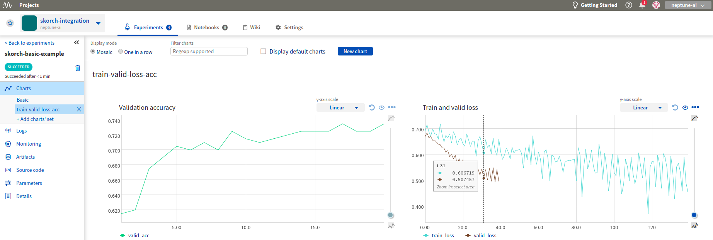

Log Skorch metrics to neptune
=============================

Prerequisites
-------------
Integration with |Skorch| framework is introduced as a part of logging module so just need to have |neptune-client| installed.

.. code-block:: bash

    pip install neptune-client

Create an **Experiment**
------------------------

.. note:: I am using a shared, anonymous token but you can change to your user api token.

.. code-block:: python3

    import neptune

    neptune.init(
        api_token='eyJhcGlfYWRkcmVzcyI6Imh0dHBzOi8vdWkubmVwdHVuZS5tbCIsImFwaV9rZXkiOiJiNzA2YmM4Zi03NmY5LTRjMmUtOTM5ZC00YmEwMzZmOTMyZTQifQ==',
        project_qualified_name='shared/skorch-integration')

    experiment = neptune.create_experiment(name='skorch-basic-example',
                                           params={'max_epochs': 20,
                                                   'lr': 0.1},
                                           upload_source_files=['skorch_example.py'])

Create **NeptuneLogger** callback
--------------------------------
Pass the experiment object as first argument.

.. note:: To be able to log information after the .fit() method finishes remember to pass ``close_after_train=False``

.. code-block:: python3

    from skorch.callbacks.logging import NeptuneLogger
    neptune_logger = NeptuneLogger(experiment, close_after_train=False)

Pass **neptune_logger** to **NeuralNetClassifier**
-------------------------------------------------
.. code-block:: python3

    net = NeuralNetClassifier(
        ClassifierModule,
        max_epochs=20,
        lr=0.1,
        callbacks=[neptune_logger])

    net.fit(X, y)

Log additional information
--------------------------

**Log test metrics after training**

.. code-block:: python3

    from sklearn.metrics import roc_auc_score

    y_pred = net.predict_proba(X)
    auc = roc_auc_score(y, y_pred[:, 1])

    neptune_logger.experiment.log_metric('roc_auc_score', auc)

**Log performance charts**

.. code-block:: python3

    from scikitplot.metrics import plot_roc
    import matplotlib.pyplot as plt

    fig, ax = plt.subplots(figsize=(16, 12))
    plot_roc(y, y_pred, ax=ax)

    neptune_logger.experiment.log_image('roc_curve', fig)

**Log trained model**

.. code-block:: python3

    net.save_params(f_params='basic_model.pkl')
    neptune_logger.experiment.log_artifact('basic_model.pkl')

Monitor your Skorch training in Neptune
---------------------------------------
Now you can watch your Skorch model training in neptune!

Check out this |example experiment|.

.. image:: ../_static/images/skorch/skorch_monitoring.gif
   :target: ../_static/images/skorch/skorch_monitoring.gif
   :alt: Skorch monitoring in neptune

Close experiment
----------------
If you passed ``close_after_train=False`` to ``NeptuneLogger`` you may want to close your experiment when you are done logging.

.. code-block:: python3

    neptune_logger.experiment.stop()

Full Skorch monitoring script
-----------------------------
Simply copy and paste it to ``skorch_example.py`` and run.
Remember to change your credentials in **neptune.init()**:

.. code-block:: python3

    neptune.init(api_token=os.getenv('NEPTUNE_API_TOKEN'),
                 project_qualified_name='USER_NAME/PROJECT_NAME')

.. code-block:: python3

    import torch
    from torch import nn
    import torch.nn.functional as F

    torch.manual_seed(0)

    # create data
    import numpy as np
    from sklearn.datasets import make_classification

    X, y = make_classification(1000, 20, n_informative=10, random_state=0)
    X = X.astype(np.float32)

    # create pytorch module
    class ClassifierModule(nn.Module):
        def __init__(
                self,
                num_units=10,
                nonlin=F.relu,
                dropout=0.5,
        ):
            super(ClassifierModule, self).__init__()
            self.num_units = num_units
            self.nonlin = nonlin
            self.dropout = dropout

            self.dense0 = nn.Linear(20, num_units)
            self.nonlin = nonlin
            self.dropout = nn.Dropout(dropout)
            self.dense1 = nn.Linear(num_units, 10)
            self.output = nn.Linear(10, 2)

        def forward(self, X, **kwargs):
            X = self.nonlin(self.dense0(X))
            X = self.dropout(X)
            X = F.relu(self.dense1(X))
            X = F.softmax(self.output(X), dim=-1)
            return X

    # create neptune logger and pass it to NeuralNetClassifier
    from skorch import NeuralNetClassifier
    import neptune
    from skorch.callbacks.logging import NeptuneLogger

    neptune.init('neptune-ai/skorch-integration')
    experiment = neptune.create_experiment(
        name='skorch-basic-example',
        params={'max_epochs': 20,
                'lr': 0.1},
        upload_source_files=['skorch_example.py'])
    neptune_logger = NeptuneLogger(experiment, close_after_train=False)

    net = NeuralNetClassifier(
        ClassifierModule,
        max_epochs=20,
        lr=0.1,
        callbacks=[neptune_logger]
    )

    # run training
    net.fit(X, y)

    # log score after training
    from sklearn.metrics import roc_auc_score

    y_pred = net.predict_proba(X)
    auc = roc_auc_score(y, y_pred[:, 1])

    neptune_logger.experiment.log_metric('roc_auc_score', auc)

    # log charts like ROC curve
    from scikitplot.metrics import plot_roc
    import matplotlib.pyplot as plt

    fig, ax = plt.subplots(figsize=(16, 12))
    plot_roc(y, y_pred, ax=ax)
    neptune_logger.experiment.log_image('roc_curve', fig)

    # log model after training
    net.save_params(f_params='basic_model.pkl')
    neptune_logger.experiment.log_artifact('basic_model.pkl')

    # close experiment
    neptune_logger.experiment.stop()

.. External links

.. |Skorch| raw:: html

    <a href="https://github.com/skorch-dev/skorch" target="_blank">Skorch</a>

.. |example experiment| raw:: html

    <a href="https://ui.neptune.ai/o/neptune-ai/org/skorch-integration/e/SKOR-27/charts" target="_blank">example experiment</a>

.. |neptune-client| raw:: html

    <a href="https://github.com/neptune-ai/neptune-client" target="_blank">neptune-client</a>