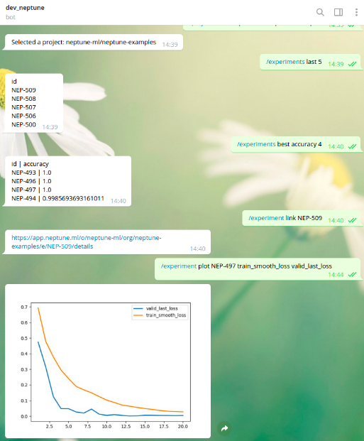

Use Telegram Bot to access experiment information
=================================================

Requirements
------------

You need to install |neptune-client| and |neptune-contrib|.

.. code-block:: bash

    pip install neptune-client neptune-contrib --user

Create telegram bot api token:

* Open the Telegram app
* Search for the BotFather user
* Start a conversation with BotFather and click on start
* Send /newbot and follow the instructions on the screen
* Copy the bot token

Fire up Telegram Bot
--------------------

.. code-block:: bash

    python -m neptunecontrib.bots.telegram_bot \
    --telegram_api_token "asdasfasdg23523rfasdfasd" \
    --neptune_api_token "ANONYMOUS"

.. note:: You can use anonymous token with access to public projects or your own private token.

Talk to your bot
----------------

Ask for projects or last experiments.

Plot metric charts directly into your Telegram.

.. External links

.. |neptune-client| raw:: html

    <a href="https://github.com/neptune-ai/neptune-client" target="_blank">neptune-client</a>

.. |neptune-contrib| raw:: html

    <a href="https://github.com/neptune-ai/neptune-contrib" target="_blank">neptune-contrib</a>
