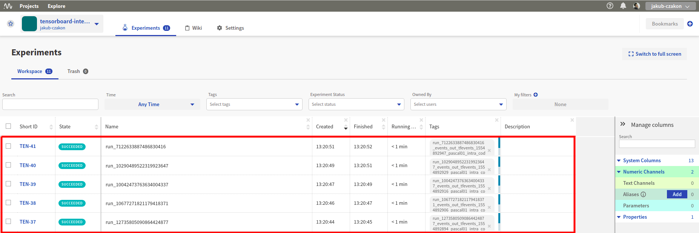
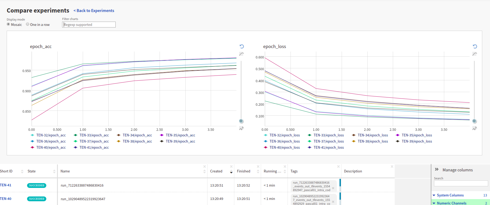

TensorBoard
===========

|neptune-tensorboard| is an open source project curated by Neptune team, that integrates |tensorboard| with Neptune to let you get the best of both worlds.
We support two major use cases:

1. With |neptune-tensorboard| you can have your TensorBoard visualizations hosted in Neptune (see example: `TensorBoard runs comparison <tensorboard/tensorboard_runs_comparison.html>`_).
2. You can use ``neptune.integrate_with_tensorflow()`` method to instantly log major metrics (epoch and batch related) to Neptune (see example: `Integrate with TensorBoard logging <tensorboard/tensorboard_integrate.html>`_).

Check example project in Neptune: |tensorboard-integration|.

Quick-start
-----------
**Installation**

.. code-block:: bash

    pip install neptune-tensorboard

**Sync TensorBoard logdir with Neptune**

Point Neptune to your TensorBoard logs directory:

.. code-block:: bash

    neptune tensorboard /PATH/TO/TensorBoard_logdir --project USER_NAME/PROJECT_NAME

.. note:: That's it! You can now browse and collaborate on your TensorBoard runs in Neptune.

You can now organize your TensorBoard experiments:

and compare your TensorBoard runs,

and share your work with others by sending an |experiment-link|.

Examples
----------
.. toctree::
   :maxdepth: 1

   Sync and compare TensorBoard runs <tensorboard/tensorboard_runs_comparison.rst>
   Integrate TensorBoard logging with Neptune <tensorboard/tensorboard_integrate.rst>

Support
-------
If you find yourself in any trouble drop an issue or talk to us directly on the |support-chat|.

.. External links

.. |GitHub| raw:: html

    <a href="https://github.com/neptune-ml/neptune-tensorboard" target="_blank">GitHub</a>

.. |support-chat| raw:: html

    <a href="https://spectrum.chat/neptune-community" target="_blank">support chat</a>

.. |neptune-tensorboard| raw:: html

    <a href="https://github.com/neptune-ml/neptune-tensorboard" target="_blank">Neptune-TensorBoard</a>

.. |tensorboard| raw:: html

    <a href="https://www.tensorflow.org/guide/summaries_and_tensorboard" target="_blank">TensorBoard</a>

.. |tensorboard-integration| raw:: html

    <a href="https://ui.neptune.ml/jakub-czakon/tensorboard-integration/experiments" target="_blank">TensorBoard project</a>

.. |experiment-link| raw:: html

    <a href="https://ui.neptune.ml/jakub-czakon/tensorboard-integration/compare?shortId=%5B%22TEN-41%22%2C%22TEN-40%22%2C%22TEN-39%22%2C%22TEN-38%22%2C%22TEN-37%22%2C%22TEN-36%22%2C%22TEN-35%22%2C%22TEN-34%22%2C%22TEN-33%22%2C%22TEN-32%22%5D" target="_blank">experiment link</a>
