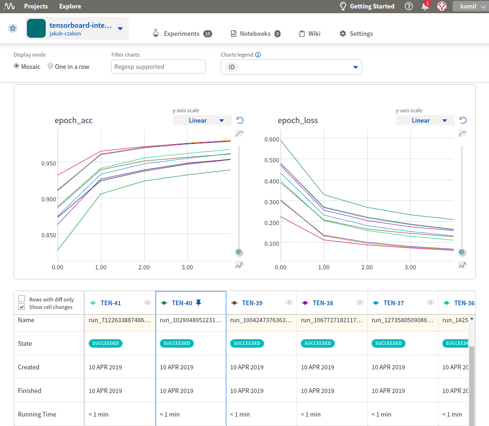
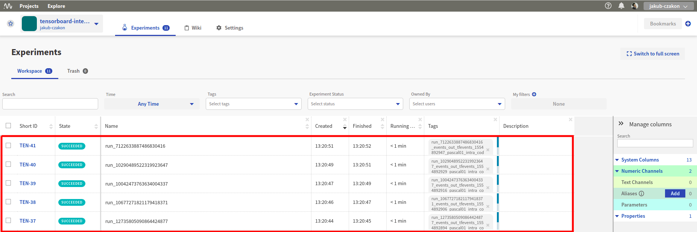

Neptune-TensorBoard Integration
===============================

|neptune-tensorboard|, an open source project curated by the Neptune team, integrates |tensorboard| with Neptune to let you enjoy the best of both worlds.

Neptune supports two major use cases:

1. With |neptune-tensorboard| you can have your TensorBoard visualizations hosted in Neptune. See `how to sync TensorBoard logdir <tensorboard.html>`_.
2. You can use the ``neptune.integrate_with_tensorflow()`` method to instantly log major metrics (epoch and batch related) to Neptune. See `how to integrate Neptune with Tensorflow <tensorflow.html>`_.

Check the example |tensorboard-integration| project in Neptune.

Installation
------------

.. code-block:: bash

    pip install neptune-tensorboard

Sync TensorBoard logdir with Neptune
------------------------------------

Point Neptune to your TensorBoard logs directory:

.. code-block:: bash

    neptune tensorboard /PATH/TO/TensorBoard_logdir --project USER_NAME/PROJECT_NAME

**That's it! You can now browse and collaborate on your TensorBoard runs in Neptune.**

- Organize your TensorBoard experiments:

- Compare your TensorBoard runs:

.. image:: ../_static/images/integrations/tensorboard_2.png
   :target: ../_static/images/integrations/tensorboard_2.png
   :alt: compare TensorBoard runs in Neptune

- Share your work with others by sending an |experiment-link|.

Support
-------
If you need assistance, report an issue in Git, or talk to us directly in a |support-chat|.

.. External links

.. |GitHub| raw:: html

    <a href="https://github.com/neptune-ai/neptune-tensorboard" target="_blank">GitHub</a>

.. |support-chat| raw:: html

    <a href="https://spectrum.chat/neptune-community" target="_blank">support chat</a>

.. |neptune-tensorboard| raw:: html

    <a href="https://github.com/neptune-ai/neptune-tensorboard" target="_blank">neptune-tensorboard</a>

.. |tensorboard| raw:: html

    <a href="https://www.tensorflow.org/guide/summaries_and_tensorboard" target="_blank">TensorBoard</a>

.. |tensorboard-integration| raw:: html

    <a href="https://ui.neptune.ai/jakub-czakon/tensorboard-integration/experiments" target="_blank">TensorBoard project</a>

.. |experiment-link| raw:: html

    <a href="https://ui.neptune.ai/jakub-czakon/tensorboard-integration/compare?shortId=%5B%22TEN-41%22%2C%22TEN-40%22%2C%22TEN-39%22%2C%22TEN-38%22%2C%22TEN-37%22%2C%22TEN-36%22%2C%22TEN-35%22%2C%22TEN-34%22%2C%22TEN-33%22%2C%22TEN-32%22%5D" target="_blank">experiment link</a>
