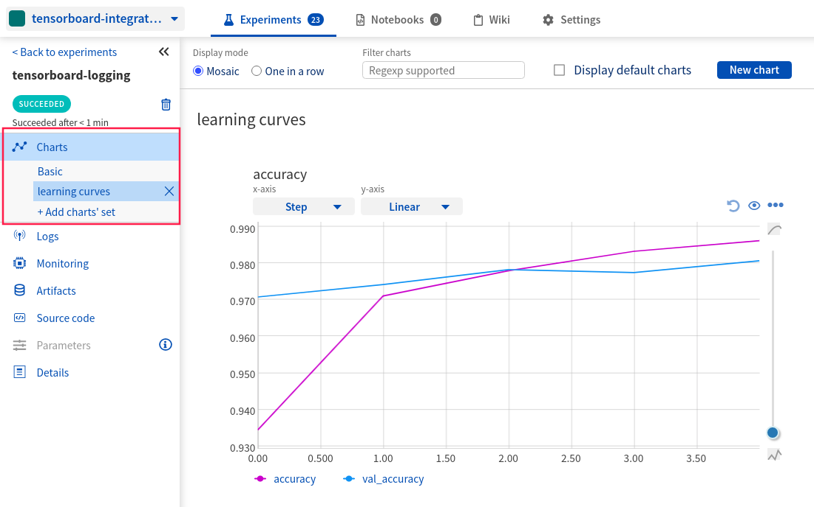
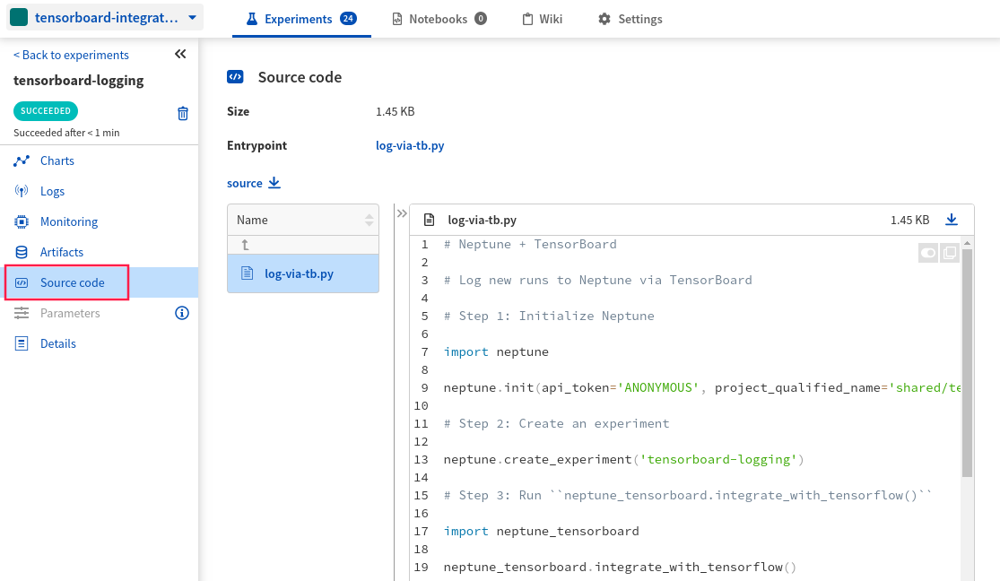
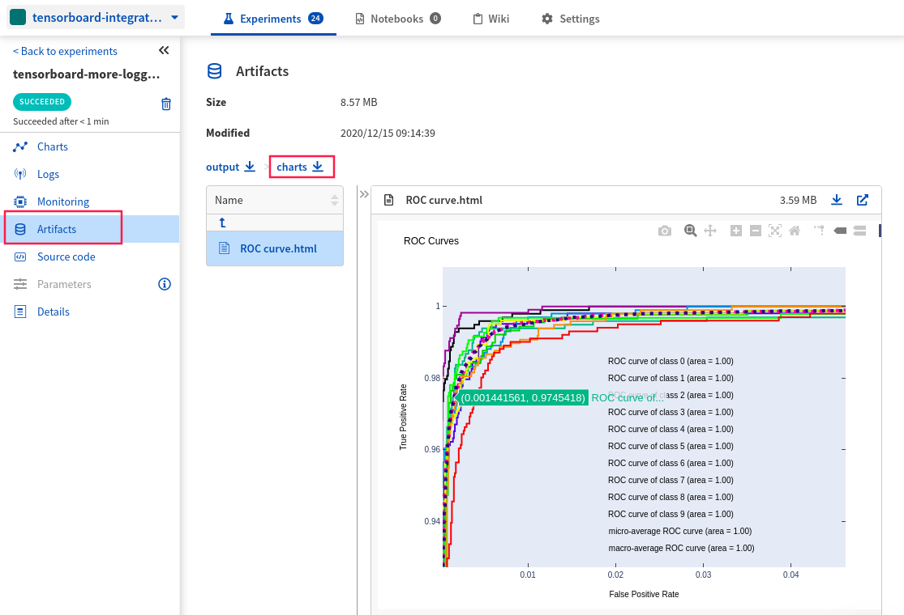

.. _integrations-tensorboard:

Neptune-TensorBoard Integration
===============================

.. note::

    Neptune integrates with both TensorFlow / Keras directly and via TensorBoard.
    If you are already using TensorBoard you may want to see the :ref:`TensorFlow / Keras integration page <integrations-tensorflow-keras>`

|tensorboard-code-example|

What will you get with this integration?
----------------------------------------

|tensorboard-tour-loom|

|TensorBoard| is a visualization toolkit for TensorFlow.
|neptune-tensorboard| is an open source project curated by the Neptune team that integrates TensorBoard with Neptune to let you enjoy the best of both worlds.

Neptune supports two major use cases:

1. With ``neptune tensorboard /path/to/tensorboard/logs`` bash command you can have your TensorBoard visualizations hosted in Neptune. See :ref:`Convert TensorBoard logs to Neptune experiments <tensorboard-convert-logdir>`.
2. You can use the :meth:`~neptune_tensorboard.integrate_with_tensorflow()` method to instantly log major metrics (epoch and batch related) to Neptune. See :ref:`Log new runs to Neptune via TensorBoard <tensorboard-log-to-neptune-via-tensorboard>`

Neptune currently logs and displays the following TensorBoard objects:

* Scalars (as metrics)
* Images (as images)
* String Tensors (as text)
* path to the TensorBoard run (as property 'tf/run/path')

You can also extend what you are currently logging via TensorBoard to objects like model checkpoints, interactive charts, video and more.
To learn about that see the :ref:`More options <tensorboard-more-options>` section.

.. note::

    This integration is tested with ``tensorflow==2.3.1``, ``tensorboard==2.4.0``, ``neptune-client==0.4.129``, and ``neptune-tensorboard==0.5.1``.

Where to start?
---------------
If you have already tracked some experiments with TensorBoard and you want to convert the TensorBoard logs directory into Neptune experiments see the :ref:`Convert TensorBoard logs to Neptune experiments <tensorboard-convert-logdir>` section.

If you want to log new experiments to Neptune via TensorBoard you should read the :ref:`Log new runs to Neptune via TensorBoard <tensorboard-log-to-neptune-via-tensorboard>` section.

To extend what you are already logging to TensorBoard with native Neptune logging read :ref:`More options <tensorboard-more-options>` section.

If you want to try things out and focus only on the code you can either:

|tensorboard-code-example|

.. _tensorboard-convert-logdir:

Convert TensorBoard logs to Neptune experiments
-----------------------------------------------

Before you start
^^^^^^^^^^^^^^^^
#. Ensure that you have ``Python 3.x`` and following libraries installed:

   * ``neptune-tensorboard``
   * ``tensorboard``.

.. code-block:: bash

  pip install --quiet tensorboard neptune-tensorboard

#. You also need minimal familiarity with TensorBoard. Have a look at the |tensorboard-install|.

Step 1: Set your ``NEPTUNE_API_TOKEN``
^^^^^^^^^^^^^^^^^^^^^^^^^^^^^^^^^^^^^^

Linux/iOS:

.. code:: bash

    export NEPTUNE_API_TOKEN='YOUR_API_TOKEN'

Windows:

.. code-block:: bat

    set NEPTUNE_API_TOKEN="YOUR_API_TOKEN"

.. tip::

    Read more about how to :ref:`securely set the Neptune API token <how-to-setup-api-token>`.

Point Neptune to your TensorBoard logs directory:

.. code-block:: bash

    neptune tensorboard /PATH/TO/TensorBoard_logdir --project USER_NAME/PROJECT_NAME

Step 2: Convert your TensorBoard logs directory with Neptune
^^^^^^^^^^^^^^^^^^^^^^^^^^^^^^^^^^^^^^^^^^^^^^^^^^^^^^^^^^^^

Navigate to your TensorBoard logs directory and run:

.. code-block:: bash

    neptune tensorboard --project USER_NAME/PROJECT_NAME

Alternatively, you can point Neptune to your TensorBoard logs directory:

.. code-block:: bash

    neptune tensorboard /PATH/TO/TensorBoard_logdir --project USER_NAME/PROJECT_NAME

.. tip::

    You can also set the project qualified name in the ``NEPTUNE_PROJECT`` environment variable and skip the ``--project`` argument

	Linux/macOS:

	.. code:: bash

		export NEPTUNE_PROJECT='USER_NAME/PROJECT_NAME'

	Windows:

	.. code-block:: bat

		set NEPTUNE_PROJECT="USER_NAME/PROJECT_NAME"

Browse and collaborate on your TensorBoard runs in Neptune
^^^^^^^^^^^^^^^^^^^^^^^^^^^^^^^^^^^^^^^^^^^^^^^^^^^^^^^^^^
You can now click on one of the links from the console and go to Neptune to see your experiments.

**Dashboard**

|example-dashboard|

**Comparison**

|example-compare|

Remember that you can try it out with zero setup:

|tensorboard-code-example|

.. _tensorboard-log-to-neptune-via-tensorboard:

Log new runs to Neptune via TensorBoard
---------------------------------------

Before you start
^^^^^^^^^^^^^^^^
#. Ensure that you have ``Python 3.x`` and following libraries installed:

   * ``neptune-tensorboard``
   * ``tensorflow``
   * ``tensorboard``. See the |tensorboard-install|.

.. code-block:: bash

  pip install --quiet tensorflow tensorboard neptune-tensorboard

#. You also need minimal familiarity with TensorBoard. Have a look at the |tensorboard-install| guide to get started.

Step 1: Initialize Neptune
^^^^^^^^^^^^^^^^^^^^^^^^^^
Add the following snippet at the top of your script.

.. code-block:: python3

    import neptune

    neptune.init(api_token='ANONYMOUS', project_qualified_name='shared/tensorboard-integration')

.. tip::

    You can also use your personal API token. Read more about how to :ref:`securely set the Neptune API token <how-to-setup-api-token>`.

Step 2: Create an experiment
^^^^^^^^^^^^^^^^^^^^^^^^^^^^
Run the code below to create a Neptune experiment:

.. code-block:: python3

    neptune.create_experiment('tensorboard-logging')

This also creates a link to the experiment. Open the link in a new tab.
The charts will currently be empty, but keep the window open. You will be able to see live metrics once logging starts.

When you create an experiment Neptune will look for the .git directory in your project and get the last commit information saved.

.. note::

    If you are using .py scripts for training Neptune will also log your training script automatically.

Step 3: Run ``neptune_tensorboard.integrate_with_tensorflow()``
---------------------------------------------------------------
Import and run :meth:`~neptune_tensorboard.integrate_with_tensorflow()` function from the ``neptune-tensorboard`` package.

.. code-block:: python3

    import neptune_tensorboard
    neptune_tensorboard.integrate_with_tensorflow()

Step 4: Run your training script
^^^^^^^^^^^^^^^^^^^^^^^^^^^^^^^^
Run your script as you normally would:

.. code-block:: bash

    python train.py

Step 5: Monitor your TensorBoard training in Neptune
^^^^^^^^^^^^^^^^^^^^^^^^^^^^^^^^^^^^^^^^^^^^^^^^^^^^
Now you can switch to the Neptune tab which you had opened previously to watch the training live!

**Charts**

|example-charts|

**Charts**

|example-charts|

.. _tensorboard-more-options:

**Code**

|example-code|

More options
------------
You can log many other experiment metadata like interactive charts, video, audio and more.
See the :ref:`full list of objects you can log and display in Neptune <what-you-can-log>`.

Two common use cases, logging model checkpoints and interactive charts to Neptune are show below.

Log model weights to Neptune
^^^^^^^^^^^^^^^^^^^^^^^^^^^^
You can log model weights to Neptune both during and after training.

To do that just use a :meth:`~neptune.experiments.Experiment.log_artifact` method on the saved model file.

.. code-block:: python3

    model.save('my_model')

    # log model
    neptune.log_artifact('my_model')

|example-artifacts|

Log interactive charts
^^^^^^^^^^^^^^^^^^^^^^
You can log interactive charts to Neptune.

For example, let's log an interactive ROC AUC curve.

1. Install dependencies including neptune-contrib library

.. code-block:: bash

    pip install neptune-contrib scikit-plot matplotlib==3.2.0 plotly==4.12.0

.. warning::

    Automatic conversion between matplotlib figures and plotly charts works only with ``matplotlib==3.2.0`` and ``plotly==4.12.0``.

2. Create a ROC AUC curve

.. code-block:: python3

    import matplotlib.pyplot as plt
    from scikitplot.metrics import plot_roc

    y_test_pred = model.predict(x_test)

    fig, ax = plt.subplots()
    plot_roc(y_test, y_test_pred, ax=ax)

3. Log it to Neptune via :meth:`~neptunecontrib.api.log_chart` function.

.. code-block:: python3

    from neptunecontrib.api import log_chart

    log_chart(name='ROC curve', chart=fig)

|example-interactive-charts|

Remember that you can try it out with zero setup:

|tensorboard-code-example|

How to ask for help?
--------------------
Please visit the :ref:`Getting help <getting-help>` page. Everything regarding support is there.

Other pages you may like
------------------------

You may also find the following pages useful:

- :ref:`TensorFlow / Keras integration <integrations-tensorflow-keras>`
- :ref:`Full list of objects you can log and display in Neptune <what-you-can-log>`
- :ref:`Optuna integration <integrations-optuna>`
- :ref:`Logging Plotly/Bokeh/Altair/Matplotlib charts to Neptune <integrations-visualization-tools>`

.. External links

.. |TensorBoard| raw:: html

    <a href="https://www.tensorflow.org/tensorboard" target="_blank">TensorBoard</a>

.. |tensorboard-install| raw:: html

    <a href="https://www.tensorflow.org/tensorboard/get_started" target="_blank">TensorBoard get started guide</a>

.. |neptune-tensorboard| raw:: html

    <a href="https://github.com/neptune-ai/neptune-tensorboard" target="_blank">neptune-tensorboard</a>

.. |tensorboard-code-example| raw:: html

    

        

        <a target="_blank" href="https://github.com/neptune-ai/neptune-examples/blob/master/integrations/tensorboard/docs/Neptune-TensorBoard.py">
            
            View source on GitHub
        </a>
        <a target="_blank" href="https://ui.neptune.ai/o/shared/org/tensorboard-integration/experiments?viewId=standard-view">
            
            See example in Neptune
        </a>
    

.. |example-dashboard| raw:: html

    

        <a target="_blank"  href="https://ui.neptune.ai/o/shared/org/tensorboard-integration/experiments?viewId=def2c858-3510-4bf9-9e52-8720fadecb11">
            
            See example in Neptune
        </a>
    

.. |example-compare| raw:: html

    

        <a target="_blank"  href="https://ui.neptune.ai/o/shared/org/tensorboard-integration/compare?shortId=%5B%22IN-22%22%2C%22IN-21%22%2C%22IN-20%22%2C%22IN-18%22%2C%22IN-16%22%5D&viewId=def2c858-3510-4bf9-9e52-8720fadecb11">
            
            See example in Neptune
        </a>
    

.. |example-charts| raw:: html

    

        <a target="_blank"  href="https://ui.neptune.ai/o/shared/org/tensorboard-integration/e/IN-23/charts">
            
            See example in Neptune
        </a>
    

.. |example-artifacts| raw:: html

    

        <a target="_blank"  href="https://ui.neptune.ai/o/shared/org/tensorboard-integration/e/IN-24/artifacts?path=my_model%2F">
            
            See example in Neptune
        </a>
    

.. |example-interactive-charts| raw:: html

    

        <a target="_blank"  href="https://ui.neptune.ai/o/shared/org/tensorboard-integration/e/IN-24/artifacts?path=charts%2F&file=ROC%20curve.html">
            
            See example in Neptune
        </a>
    

.. |example-code| raw:: html

    

        <a target="_blank"  href="https://ui.neptune.ai/o/shared/org/tensorboard-integration/e/IN-23/source-code?path=.&file=log-via-tb.py">
            
            See example in Neptune
        </a>
    

.. |tensorboard-tour-loom| raw:: html

    
<iframe src="https://www.loom.com/embed/4c1f3c0546ac48df8fced27d711bda8c" frameborder="0" webkitallowfullscreen mozallowfullscreen allowfullscreen style="position: absolute; top: 0; left: 0; width: 100%; height: 100%;"></iframe>

