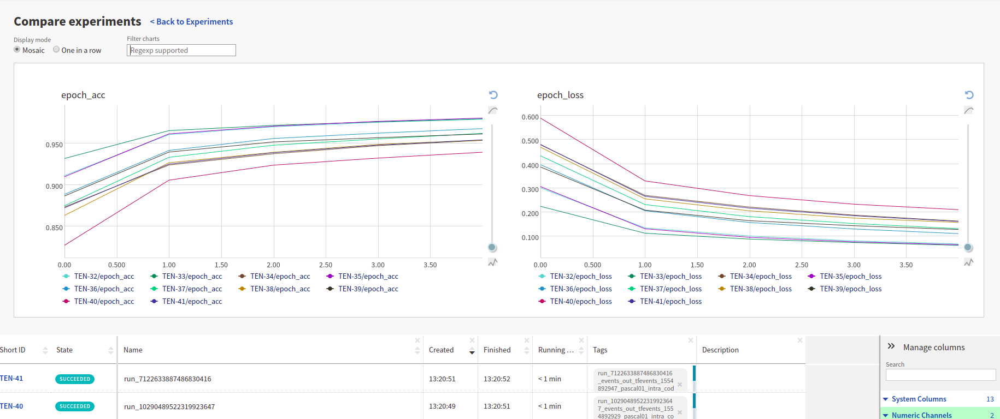

TensorBoard runs comparison
===========================

Prerequisites
-------------
Let’s create a simple training script with ``TensorBoard`` logging. In this example we use TensorFlow 1.x,
however, neptune-tensorboard works well with both TensorFlow 1 and TensorFlow 2.

.. code-block:: python3

    import random

    import tensorflow as tf

    PARAMS = {
        'epoch_nr': 5,
        'batch_size': 256,
        'lr': 0.1,
        'momentum': 0.4,
        'use_nesterov': True,
        'unit_nr': 256,
        'dropout': 0.0
    }

    RUN_NAME = 'run_{}'.format(random.getrandbits(64))
    EXPERIMENT_LOG_DIR = 'logs/{}'.format(RUN_NAME)

    mnist = tf.keras.datasets.mnist
    (x_train, y_train),(x_test, y_test) = mnist.load_data()
    x_train, x_test = x_train / 255.0, x_test / 255.0

    model = tf.keras.models.Sequential([
      tf.keras.layers.Flatten(),
      tf.keras.layers.Dense(PARAMS['unit_nr'], activation=tf.nn.relu),
      tf.keras.layers.Dropout(PARAMS['dropout']),
      tf.keras.layers.Dense(10, activation=tf.nn.softmax)
    ])

    optimizer = tf.keras.optimizers.SGD(lr=PARAMS['lr'],
                                        momentum=PARAMS['momentum'],
                                        nesterov=PARAMS['use_nesterov'],)

    model.compile(optimizer=optimizer,
                  loss='sparse_categorical_crossentropy',
                  metrics=['accuracy'])

    tensorboard = tf.keras.callbacks.TensorBoard(log_dir=EXPERIMENT_LOG_DIR)
    model.fit(x_train, y_train,
              epochs=PARAMS['epoch_nr'],
              batch_size=PARAMS['batch_size'],
              callbacks=[tensorboard])

Change parameters and run a few different experiments to see what works best.

.. code-block:: bash

    python main.py

Sync TensorBoard logdir with Neptune
------------------------------------
You can now sync your logs directory with Neptune.

.. code-block:: bash

    neptune tensorboard /path/to/logs --project USER_NAME/PROJECT_NAME

and be able to organize and collaborate on |your-experiments|.

.. image:: ../../_static/images/tensorboard/tensorboard_1.png
   :target: ../../_static/images/tensorboard/tensorboard_1.png
   :alt: organize TensorBoard experiments in Neptune

You can also compare runs just like in TensorBoard:

.. External links

.. |your-experiments| raw:: html

    <a href="https://ui.neptune.ml/jakub-czakon/tensorboard-integration/experiments?filterId=bcef6881-128a-4126-a582-31b179bebf67" target="_blank">your experiments</a>
