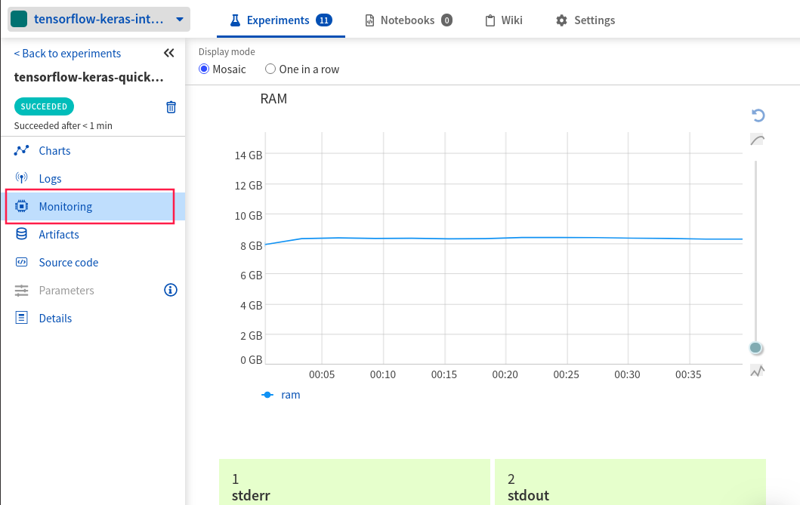

.. _integrations-tensorflow-keras:

Neptune - TensorFlow / Keras Integration
========================================

.. note::

    Neptune integrates with both TensorFlow / Keras directly and via TensorBoard.
    If you are already using TensorBoard you may want to see the :ref:`TensorBoard integration page <integrations-tensorboard>`

|tensorflow-keras-code-example|

What will you get with this integration?
----------------------------------------

|tensorflow keras tour loom|

|TensorFlow| is an open source deep learning framework commonly used for building neural network models.
|Keras| is an official higher level API on top of TensorFlow.
Neptune helps with keeping track of model training metadata.

With Neptune + TensorFlow / Keras integration you can:

- log hyperparameters for every run
- see learning curves for losses and metrics during training
- see hardware consumption and stdout/stderr output during training
- log TensorFlow tensors as images to see model predictions live
- log training code and git commit information
- log model weights

.. tip::
    You can log many other experiment metadata like interactive charts, video, audio and more.
    See the :ref:`full list <what-you-can-log>`.

.. note::

    This integration is tested with ``tensorflow==2.3.1``, ``neptune-client==0.4.129``, and ``neptune-contrib==0.24.9``

Where to start?
---------------
To get started with this integration, follow the :ref:`quickstart <keras-tensorflow-quickstart>` below.
You can also skip the basics and take a look at how to log model weights and prediction images in the :ref:`more options <keras-tensorflow-more-options>` section.

If you want to try things out and focus only on the code you can either:

|tensorflow-keras-code-example|

.. _keras-tensorflow-quickstart:

Quickstart
----------
This quickstart will show you how to:

* Install the necessary Neptune package
* Connect Neptune to your TensorFlow / Keras model training code and create the first experiment
* Log metrics, training scripts and .git info to Neptune
* Explore learning curves in the Neptune UI

.. _keras-tensorflow-more-options:

Before you start
^^^^^^^^^^^^^^^^
You have ``Python 3.x`` and following libraries installed:

* ``neptune-client``. See :ref:`neptune-client installation guide <installation-neptune-client>`.

    .. code-block:: bash

        pip install neptune-client

* ``neptune-contrib``. See :ref:`neptune-contrib installation guide <installation-neptune-contrib>`.

    .. code-block:: bash

        pip install neptune-contrib

* ``tensorflow==2.x``. See |tensorflow-install|.

You also need minimal familiarity with TensorFlow / Keras. Have a look at this |tensorflow-guide| to get started.

Step 1: Initialize Neptune
^^^^^^^^^^^^^^^^^^^^^^^^^^
Add the following snippet at the top of your script.

.. code-block:: python3

    import neptune

    neptune.init(api_token='ANONYMOUS', project_qualified_name='shared/tensorflow-keras-integration')

.. tip::

    You can also use your personal API token. Read more about how to :ref:`securely set the Neptune API token <how-to-setup-api-token>`.

Step 2: Create an experiment
^^^^^^^^^^^^^^^^^^^^^^^^^^^^
Run the code below to create a Neptune experiment:

.. code-block:: python3

    neptune.create_experiment('tensorflow-keras-quickstart')

This also creates a link to the experiment. Open the link in a new tab.
The charts will currently be empty, but keep the window open. You will be able to see live metrics once logging starts.

When you create an experiment Neptune will look for the .git directory in your project and get the last commit information saved.

.. note::

    If you are using .py scripts for training Neptune will also log your training script automatically.

Step 3: Add NeptuneMonitor Callback to model.fit()
^^^^^^^^^^^^^^^^^^^^^^^^^^^^^^^^^^^^^^^^^^^^^^^^^^
Import :meth:`~neptunecontrib.monitoring.keras.NeptuneMonitor `callback from the ``neptunecontrib`` package and pass it to the callbacks attribute of ``model.fit()``.

.. code-block:: python3

    from neptunecontrib.monitoring.keras import NeptuneMonitor

    model.fit(x_train, y_train,
              epochs=42,
              callbacks=[NeptuneMonitor()])

Step 4: Run your training script
^^^^^^^^^^^^^^^^^^^^^^^^^^^^^^^^
Run your script as you normally would:

.. code-block:: bash

    python train.py

Step 5: Monitor your TensorFlow / Keras training in Neptune
^^^^^^^^^^^^^^^^^^^^^^^^^^^^^^^^^^^^^^^^^^^^^^^^^^^^^^^^^^^
Now you can switch to the Neptune tab which you had opened previously to watch the training live!

|example-charts|

.. _tensorflow-keras-more-options:

More Options
------------

Log hardware consumption and stderr/stdout
^^^^^^^^^^^^^^^^^^^^^^^^^^^^^^^^^^^^^^^^^^
Neptune can automatically log your CPU and GPU consumption during training as well as stderr and stdout from your console.
To do that you just need to install |psutil|.

.. code-block:: bash

    pip install psutil

|example-hardware|

Log hyperparameters
^^^^^^^^^^^^^^^^^^^
You can log training and model hyperparameters.
To do that just pass the parameter dictionary to :meth:`~neptune.projects.Project.create_experiment` method:

.. code-block:: python3

    PARAMS = {'lr': 0.005,
              'momentum': 0.9,
              'epochs': 10,
              'batch_size': 64}

    optimizer = keras.optimizers.SGD(lr=PARAMS['lr'], momentum=PARAMS['momentum'])

    # log params
    neptune.create_experiment('keras-tensorflow-advanced', params=PARAMS)

    model.fit(x_train, y_train,
              epochs=PARAMS['epochs'],
              batch_size=PARAMS['batch_size'],
              callbacks=[NeptuneMonitor()])

.. image:: ../_static/images/integrations/tensorflow-keras-parameters.png
   :target: ../_static/images/integrations/tensorflow-keras-parameters.png
   :alt: TensorFlow Keras hyperparameter logging

|example-hyperparameters|

Log model weights
^^^^^^^^^^^^^^^^^
You can log model weights to Neptune both during and after training.

To do that just use a :meth:`~neptune.experiments.Experiment.log_artifact` method on the saved model file.

.. code-block:: python3

    model.save('my_model')

    # log model
    neptune.log_artifact('my_model')

|example-weights|

Log image predictions
^^^^^^^^^^^^^^^^^^^^^
You can log tensors as images to Neptune with some additional descriptions via :meth:`~neptune.experiments.Experiment.log_image` method.

.. code-block:: python3

    x_test_sample = x_test[:100]
    y_test_sample_pred = model.predict(x_test_sample)

    for x, y_pred in zip(x_test_sample, y_test_sample_pred):
        description = '\n'.join(['class {}: {}'.format(i, pred)
                                    for i, pred in enumerate(F.softmax(prediction))])
        neptune.log_image('predictions',
                          image.squeeze(),
                          description=description)

|example-images|

.. note::

    You can log many other experiment metadata like interactive charts, video, audio and more.
    See the :ref:`full list <what-you-can-log>`.

Remember that you can try it out with zero setup:

|tensorflow-keras-code-example|

How to ask for help?
--------------------
Please visit the :ref:`Getting help <getting-help>` page. Everything regarding support is there.

Other pages you may like
------------------------

You may also find the following pages useful:

- :ref:`Full list of objects you can log and display in Neptune <what-you-can-log>`
- :ref:`Optuna integration <integrations-optuna>`
- :ref:`Logging Plotly/Bokeh/Altair/Matplotlib charts to Neptune <integrations-visualization-tools>`

.. External links

.. |Keras| raw:: html

    <a href="https://keras.io" target="_blank">Keras</a>

.. |tensorflow-install| raw:: html

    <a href="https://www.tensorflow.org/install" target="_blank">TensorFlow installation</a>
