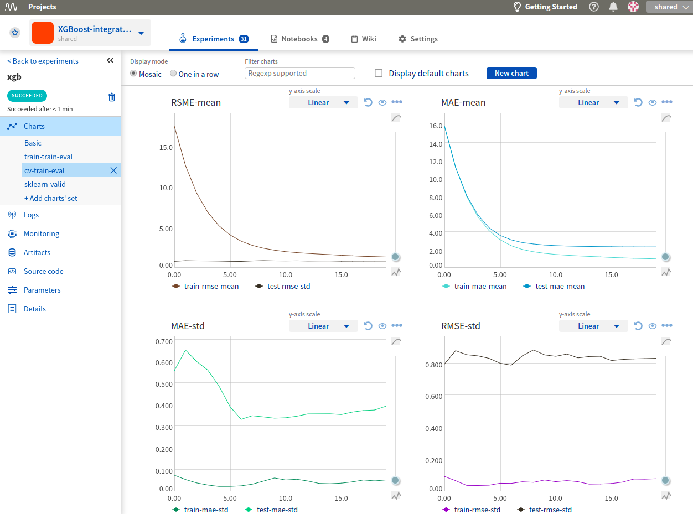
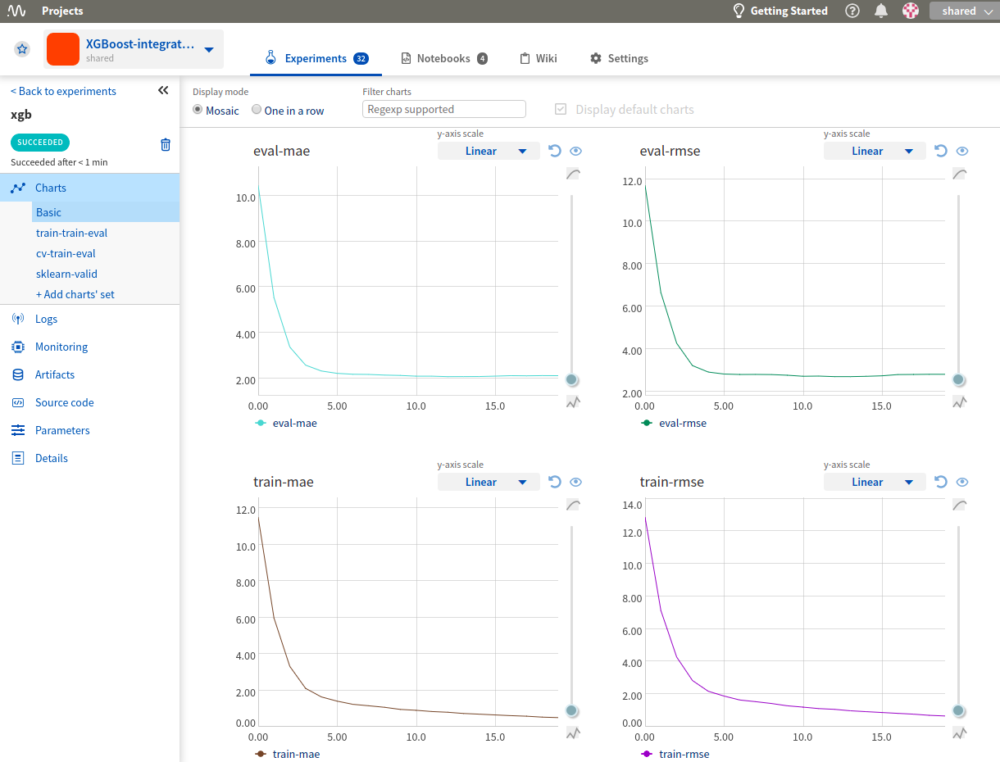
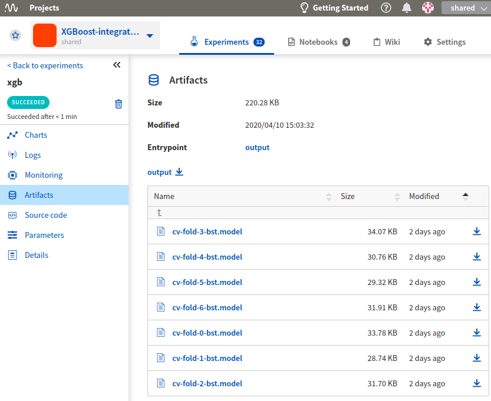
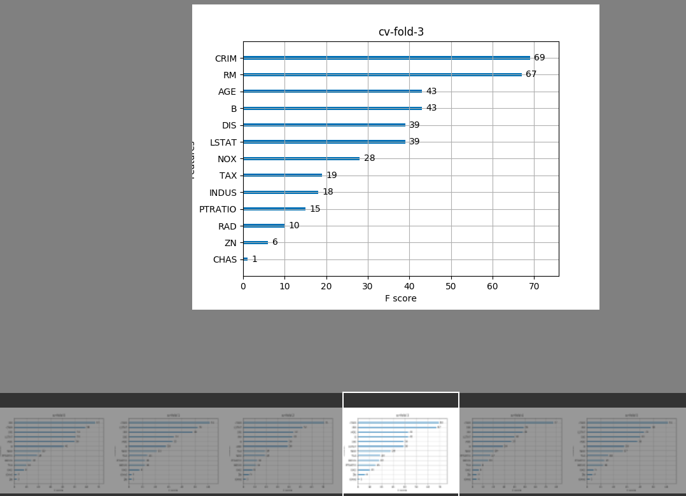
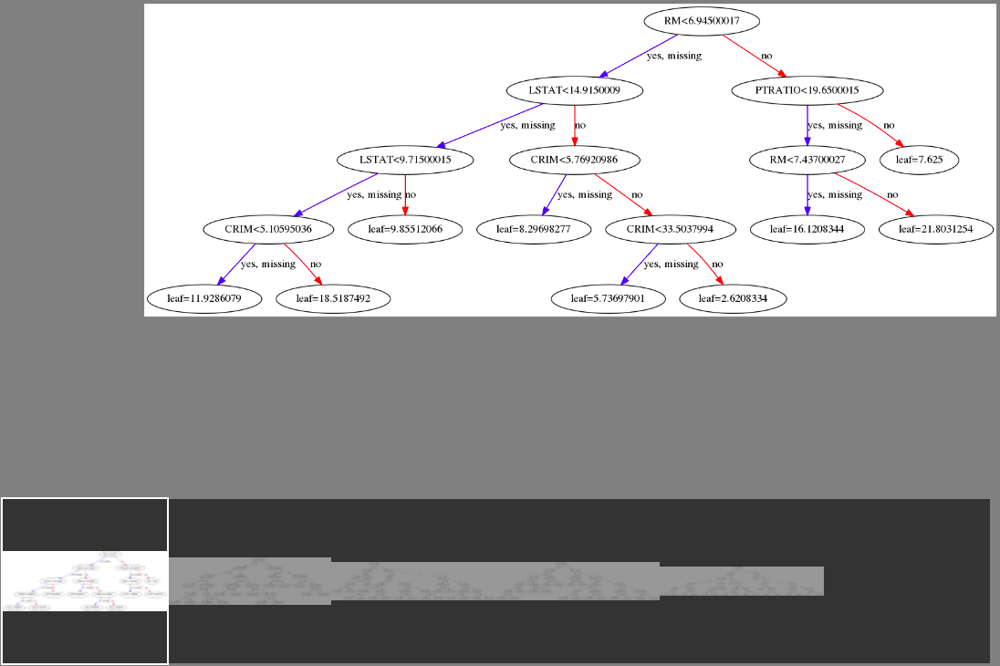

.. _integrations-xgboost:

Neptune-XGBoost Integration
===========================

What will you get?
------------------
|Youtube Video|

XGBoost is an optimized distributed gradient boosting library designed to be highly efficient, flexible and portable. The integration with Neptune lets you log multiple training artifacts with no further customization.

The integration is implemented as XGBoost callback and provides the following capabilities:

* |metrics| (train and eval) after each boosting iteration.
* |model| (Booster) to Neptune after the last boosting iteration.
* |feature| to Neptune as an image after the last boosting iteration.
* |tree| to Neptune as images after the last boosting iteration.

Where to start?
---------------
To get started with this integration, follow the :ref:`Quickstart <quickstart-xgb>` below.

If you want to try things out and focus only on the code you can either:

#. Open Colab notebook (badge-link below) with quickstart code and run it as a "`neptuner`" user - zero setup, it just works,
#. View quickstart code as a plain Python script on |script|.

|Run on Colab|

.. note::

    This integration is tested with ``xgboost==1.2.0`` and current latest, and ``neptune-client==0.4.124`` and current latest.

.. _quickstart-xgb:

Quickstart
----------
This quickstart will show you how to log XGBoost experiments to Neptune using XGBoost-Neptune integration.
Integration is implemented as XGBoost callback and made available in the ``neptune-contrib`` library.

As a result you will have an experiment logged to Neptune with metrics, model,
feature importances and (optionally, requires graphviz) visualized trees.
Have a look at this example |exp|.

Before you start
^^^^^^^^^^^^^^^^
You have ``Python 3.x`` and following libraries installed:

* ``neptune-client==0.4.124`` or newer: See :ref:`neptune-client installation guide <installation-neptune-client>`.
* ``neptune-contrib[monitoring]==0.24.3`` or newer: See :ref:`neptune-contrib installation guide <installation-neptune-contrib>`.
* ``xgboost==1.2.0``. See |xgboost-install|.
* ``pandas==1.0.5`` and ``scikit-learn==0.23.1``. See |pandas-install| and |scikit-learn-install|.

Example
^^^^^^^
Make sure you have created an experiment before you start XGBoost training. Use the :meth:`~neptune.projects.Project.create_experiment` method to do this.

Here is how to use the Neptune-XGBoost integration:

.. code-block:: python3

    import neptune
    ...
    # here you import `neptune_callback` that does the magic (the open source magic :)
    from neptunecontrib.monitoring.xgboost import neptune_callback

    ...

    # Use neptune callback
    neptune.create_experiment(name='xgb', tags=['train'], params=params)
    xgb.train(params, dtrain, num_round, watchlist,
              callbacks=[neptune_callback()])  # neptune_callback is here

Logged metrics
""""""""""""""
These are logged for train and eval (or whatever you defined in the watchlist) after each boosting iteration.

Logged model
""""""""""""
The model (Booster) is logged to Neptune after the last boosting iteration. If you run cross-validation, you get a model for each fold.

Logged feature importance
"""""""""""""""""""""""""
This is a very useful chart, as it shows feature importance. It is logged to Neptune as an image after the last boosting iteration. If you run cross-validation, you get a feature importance chart for each fold's model.

Logged visualized trees (requires graphviz)
"""""""""""""""""""""""""""""""""""""""""""
.. note::

    You need to install graphviz and graphviz Python interface for ``log_tree`` feature to work.
    Check |graphviz| and |graphviz-python| for installation info.

Log first 6 trees at the end of training (tree with indices 0, 1, 2, 3, 4, 5)

.. code-block:: python3

    xgb.train(params, dtrain, num_round, watchlist,
              callbacks=[neptune_callback(log_tree=[0,1,2,3,4,5])])

Selected trees are logged to Neptune as an image after the last boosting iteration. If you run cross-validation, you get a tree visualization for each fold's model, independently.

Explore Results
---------------
You just learned how to start logging XGBoost experiments to Neptune. Check this |exp| or view quickstart code as a plain Python script on |script|.

|Run on Colab|

How to ask for help?
--------------------
Please visit the :ref:`Getting help <getting-help>` page. Everything regarding support is there.

.. External links

.. |Neptune| raw:: html

    <a href="https://neptune.ai/" target="_blank">Neptune</a>

.. |metrics| raw:: html

    <a href="https://ui.neptune.ai/o/shared/org/XGBoost-integration/e/XGB-42/charts" target="_blank">Log metrics</a>

.. |model| raw:: html

    <a href="https://ui.neptune.ai/o/shared/org/XGBoost-integration/e/XGB-42/artifacts" target="_blank">Log model</a>

.. |feature| raw:: html

    <a href="https://ui.neptune.ai/api/leaderboard/v1/images/b15cefdc-7272-4ad8-85a9-2859c3841f6c/d53b5bb7-d75f-4d7c-bc6c-f878e66ef37f/15414e28-dde2-4c30-8dd9-4fbb2f71f22a.PNG" target="_blank">Log feature importance</a>

.. |tree| raw:: html

    <a href="https://ui.neptune.ai/api/leaderboard/v1/images/b15cefdc-7272-4ad8-85a9-2859c3841f6c/94dcef8f-b0a4-42a9-86df-4ea325757283/95b8c689-a2c5-47d6-bd17-4155dae1b189.PNG" target="_blank">Log visualized trees</a>

.. |github-project| raw:: html

    <a href="https://github.com/neptune-ai/neptune-contrib/blob/master/neptunecontrib/monitoring/xgboost_monitor.py" target="_blank">GitHub</a>

.. |neptune-project| raw:: html

    <a href="https://ui.neptune.ai/o/shared/org/XGBoost-integration/experiments" target="_blank">XGBoost-integration</a>

.. |xgboost-integration-demo| raw:: html

    <a href="https://ui.neptune.ai/shared/XGBoost-integration/n/demo-notebooks-code-8f65f556-37b8-48d9-b8e0-bde6286c749d/e6c0e2a0-994b-46ff-bb4b-ba615ff46d04" target="_blank">xgboost-integration-demo</a>

.. |exp| raw:: html

    <a href="https://ui.neptune.ai/o/shared/org/XGBoost-integration/e/XGB-41/charts" target="_blank">experiment</a>

.. |Youtube Video| raw:: html

    <iframe width="720" height="420" src="https://www.youtube.com/embed/xc5gsJvf5Wo" frameborder="0" allow="accelerometer; autoplay; encrypted-media; gyroscope; picture-in-picture" allowfullscreen></iframe>

.. |script| raw:: html

    <a href="https://github.com/neptune-ai/neptune-examples/blob/master/integrations/xgboost/docs/Neptune-XGBoost.py" target="_blank">GitHub</a>

.. |Run on Colab| raw:: html

    

.. |xgboost-install| raw:: html

    <a href="https://xgboost.readthedocs.io/en/latest/python/python_intro.html" target="_blank">XGBoost installation guide</a>

.. |scikit-learn-install| raw:: html

    <a href="https://scikit-learn.org/stable/install.html" target="_blank">scikit-learn installation guide</a>

.. |pandas-install| raw:: html

    <a href="https://pandas.pydata.org/pandas-docs/stable/getting_started/install.html" target="_blank">pandas installation guide</a>

.. |graphviz| raw:: html

    <a href="https://graphviz.org/download/" target="_blank">Graphviz</a>

.. |graphviz-python| raw:: html

    <a href="https://graphviz.readthedocs.io/en/stable/manual.html#installation" target="_blank">Graphviz Python interface</a>
