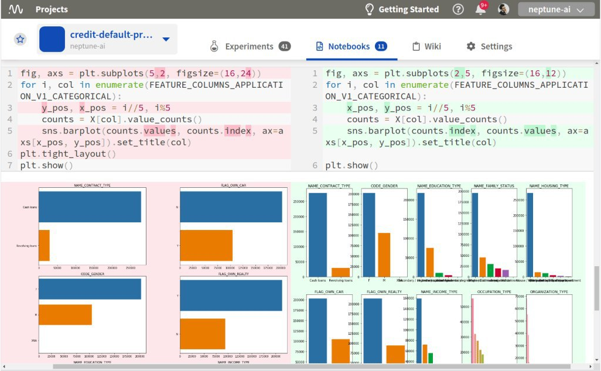
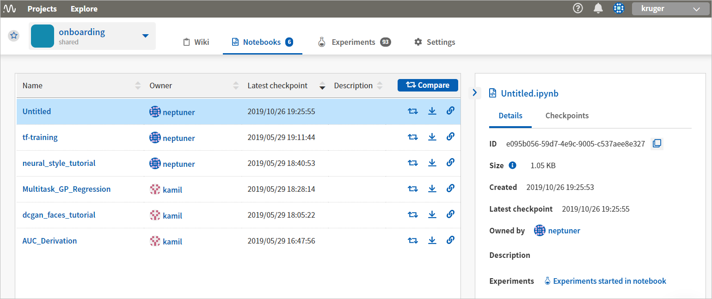
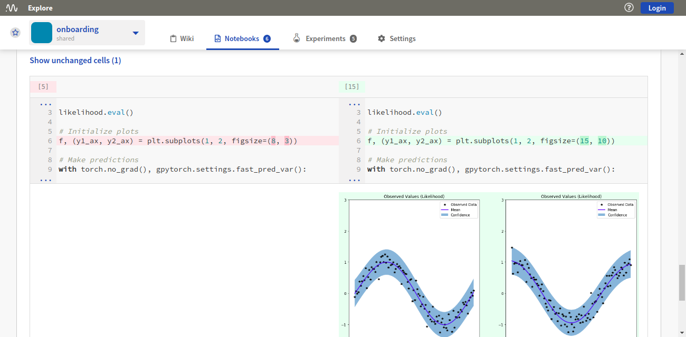

.. _guides-keep-track-jupyter-notebooks:

Keeping track of Jupyter Notebooks
==================================

|Youtube Video|

Jupyter Notebooks are a useful and popular tool for data scientists, regardless of their area of specialization.
They allow data scientists to work interactively, keeping code and results - like visualizations - in a single document.

While Neptune is essentially a platform for tracking experiments, it provides Jupyter and JupyterLab extensions that also let
you track Jupyter Notebooks.

.. contents::
    :local:
    :depth: 1
    :backlinks: top

Key Features
------------

* In Neptune, each Notebook consists of a collection of checkpoints that you upload directly from the Jupyter user interface.
* In any project, an unlimited number of Notebooks and checkpoints is allowed.
* You can browse checkpoints history across all |Notebooks in the project|.
* You can |share a Notebook| as a link.
* You can |compare two Notebooks| side-by-side, like source code.

Quick Start
-----------

To start working with Notebooks in Neptune, :ref:`Install and configure <installation-notebook-extension>` the open
source extension for Jupyter or JupyterLab. When you are done, you can start working with Notebooks immediately.

To try it now, without registering to Neptune, look at the sample Notebooks in the public |project onboarding|.
Use the public user's API token that appears below, and the username *neptuner* to upload some snapshots to this project.
You still need to :ref:`Install and configure <installation-notebook-extension>` Jupyter extension.

**Public user’s API token**:

.. code-block:: bash

    eyJhcGlfYWRkcmVzcyI6Imh0dHBzOi8vdWkubmVwdHVuZS5haSIsImFwaV9rZXkiOiJiNzA2YmM4Zi03NmY5LTRjMmUtOTM5ZC00YmEwMzZmOTMyZTQifQ==

Notebook UI
-----------
The Notebooks tab in the Neptune UI provides a table of all the Notebooks in the current project.

.. image:: ../_static/images/keep-track-of-jupyter-notebooks/nb-view-11.png
    :target: ../_static/images/keep-track-of-jupyter-notebooks/nb-view-11.png
    :alt: image

This view lets you see what your team members are working on, review details and checkpoints associated with a Notebook, as well as share or download a Notebook and compare two or more Notebooks.

The Notebook data is arranged in the following columns:

* Name
* Owner
* Latest checkpoint
* Description

In addition, for each Notebook, there are buttons for downloading the Notebook, comparing it with another Notebook, or for sharing a link to it.

A **Compare** button at the top right displays a Notebooks Comparison pane. See :ref:`Compare Notebooks <compare_notebooks>`.

Notebook contents
~~~~~~~~~~~~~~~~~
Once you select a Notebook, you can see all its contents, that is: code and markdown cells, outputs and execution count.

There are two tabs on the right:

- **Details**: Here are shown the ID, size, creation date, latest checkpoint, owner, description and associated experiments of the selected Notebook.
- **Checkpoints**: Here are listed all the checkpoints of the Notebook. Click a checkpoint to see the details in the main pane. From this tab, you can also access the experiments that are associated with the checkpoint.

You can also view snapshots of the work with the Notebook, as well as download, share or compare this checkpoint with another checkpoint.

.. _compare_notebooks:

Compare Notebooks
~~~~~~~~~~~~~~~~~

The Notebooks Comparison pane lets you compare Notebook checkpoints.

You display the pane by clicking the **Compare** button anywhere it is visible in the Notebooks pane.

In the Notebooks Comparison pane, select two Notebook checkpoints, then click **Compare** to see a side-by-side comparison, just like source code.

* Differences in code, markdown, output and execution count are highlighted.
* Summary information about the differences is displayed at the top of the pane.

.. _guides-uploading-download-notebook-checkpoints:

Uploading and Downloading Notebook Checkpoints
----------------------------------------------

Notebooks are stored as files on your computer.

Each Notebook file (.ipynb) is a JSON containing everything that the user can see in a Notebook and some metadata.

Neptune uses metadata to associate particular files with Notebook entities on Neptune servers. That means that after a Notebook
is uploaded to Neptune, the file on disk is changed to include the ID of the entity on the Neptune server.

**Name changes**

If you copy a Notebook file (let’s call it "Notebook A") and
edit it with the intention of creating something completely separate from Notebook A,
the association with Notebook A on the Neptune server remains. If the name of the Notebook changes from "Notebook A",
you will be warned.

**Global accessibility**

When you download a Notebook checkpoint, the ID in the metadata is preserved, so that when, after some work,
you click **Upload**, Neptune knows that this may be another checkpoint in a particular Notebook.
You can do some work, upload some intermediate snapshot, go to another computer
(or another SageMaker instance, and so on), download the Notebook and keep on working on it.

The capability is comparable to Google Docs in that there’s a place where you store your work and you can access

it easily from wherever you choose.

**Collaboration**

Depending on their roles, members of a project can view and download all Notebooks (and their checkpoints) in the project.

- Viewers can download Notebooks.
- Contributors and Owners can also upload them.

When uploading a new Notebook, a user becomes the owner of this Notebook. Only the owner of a Notebook can upload
new checkpoints of this Notebook.

Uploading a Notebook
~~~~~~~~~~~~~~~~~~~~

You can upload Notebook checkpoints from Jupyter to Neptune.

**To upload the current Notebook as a checkpoint**:

1. Click **Upload**.

    .. image:: ../_static/images/keep-track-of-jupyter-notebooks/upload_dialog.png
        :target: ../_static/images/keep-track-of-jupyter-notebooks/upload_dialog.png
        :width: 450
        :alt: Upload Notebook dialog

2. In the dialog that is displayed, select a project from the list.
3. (Optional) Type in a checkpoint name and description.
4. Click **Upload checkpoint**.

A confirmation message is displayed. You can click the link in the message to open the Notebook in Neptune.

Downloading a Notebook
~~~~~~~~~~~~~~~~~~~~~~

You can download a specific Notebook checkpoint from Neptune to Jupyter.

**To download a Notebook checkpoint**:

1. Click **Download**.

    .. image:: ../_static/images/keep-track-of-jupyter-notebooks/download_dialog.png
        :target: ../_static/images/keep-track-of-jupyter-notebooks/download_dialog.png
        :width: 450
        :alt: Download Notebook dialog

2. In the dialog that is displayed, select the following from the respective lists:

  - Project
  - Notebook
  - Checkpoint

3. Click **Download**.

Managing Notebooks in Neptune using the CLI
-------------------------------------------

You can create Notebooks and update Notebook checkpoints in Neptune from the command line, using Neptune's `notebook sync` command.

Using CLI commands is an alternative if you prefer not to use the neptune-notebooks extensions in Jupyter or JupyterLab.

.. tip:: Syncing Notebook checkpoints using the neptune-notebooks extension is highly recommended!

There is a single - yet powerful - CLI command:

.. code:: bash

    neptune notebook sync --project ENTITY_NAME/PROJECT_NAME your_notebook.ipynb

`ENTITY_NAME` is either your workspace name in the case of a team account or a username in the case of an individual account.

Parameters
~~~~~~~~~~

``--project`` *(optional)*

Project to which to log Notebook or checkpoint. If the `NEPTUNE_PROJECT` environment variable is set, then this command overwrites the environment variable.

``--new`` *(optional)*

* Takes the user's Notebook `user_notebook.ipynb` and creates a new Notebook object in Neptune.
* If the Notebook is not known to Neptune, it will be created. In such a case, you do not need to use this flag.

.. code-block:: bash

    neptune notebook sync --project ENTITY_NAME/PROJECT_NAME your_notebook.ipynb --new

``--update`` *(optional)*

* Updates the user's Notebook `user_notebook.ipynb` in Neptune by adding a new checkpoint to it.
* If the Notebook is known to Neptune it will be updated. In such a case, you do not need to use this flag.

.. code-block:: bash

    neptune notebook sync --project ENTITY_NAME/PROJECT_NAME your_notebook.ipynb --update

Setup
~~~~~

To use the CLI command, you must export your `NEPTUNE_API_TOKEN` as an environment variable. You can do this in either of two ways:

- Use this command:

    Linux/IOS:

    .. code:: bash

        export NEPTUNE_API_TOKEN='YOUR_LONG_API_TOKEN'

    Windows:

    .. code-block:: bat

        set NEPTUNE_API_TOKEN="YOUR_LONG_API_TOKEN"

OR

- Append the line above to your ``~/.bashrc`` or ``~/.bash_profile`` file.

.. warning:: Always keep your API token secret - it is like a password to the application. Appending the "export NEPTUNE_API_TOKEN='YOUR_LONG_API_TOKEN'" line to your ``~/.bashrc`` or ``~/.bash_profile`` file is the recommended method to ensure it remains secret.

.. External links

.. |Youtube Video| raw:: html

    <iframe width="720" height="420" src="https://www.youtube.com/embed/8qmz2yIndOw" frameborder="0" allow="accelerometer; autoplay; encrypted-media; gyroscope; picture-in-picture" allowfullscreen></iframe>

.. |Notebooks in the project| raw:: html

    <a href="https://ui.neptune.ai/shared/onboarding/notebooks" target="_blank">Notebooks in the project</a>

.. |share a Notebook| raw:: html

    <a href="https://ui.neptune.ai/shared/onboarding/n/Multitask-GP-Regression-e11f2bd6-6bb5-4269-b3d7-84453ad19ddb/60911a35-6ee2-40c7-af10-8a7c8a79e6cb" target="_blank">share a Notebook</a>

.. |compare two Notebooks| raw:: html

    <a href="https://ui.neptune.ai/o/shared/org/onboarding/compare-notebooks?sourceNotebookId=e11f2bd6-6bb5-4269-b3d7-84453ad19ddb&sourceCheckpointId=a4ed1ff3-0d5d-4d59-b1d7-60edc4f140b6&targetNotebookId=e11f2bd6-6bb5-4269-b3d7-84453ad19ddb&targetCheckpointId=60911a35-6ee2-40c7-af10-8a7c8a79e6cb" target="_blank">compare two Notebooks</a>

.. |project onboarding| raw:: html

    <a href="https://ui.neptune.ai/shared/onboarding/notebooks" target="_blank">project "onboarding"</a>
