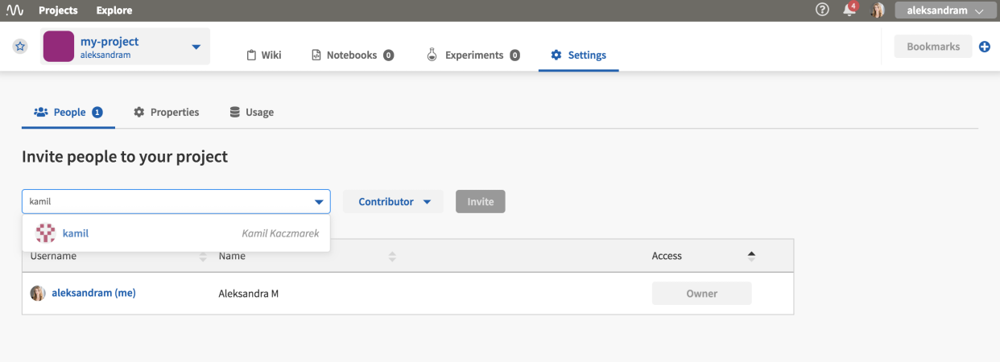

Core Concepts
=============
This page presents several key concepts as they are used in the Neptune UI and documentation set.

.. contents::
    :local:
    :depth: 1
    :backlinks: top

Organization Types
------------------

.. _core-concepts_organization-types:

An organization is a way to centrally manage projects, users and subscriptions.

Neptune has two organization types: individual and team.

Individual
^^^^^^^^^^
* Each user is assigned individual organization with ``username`` as an organization name.
* The user is the only member of this organization but may :ref:`invite collaborators <how-to_team-management_invite-to-project>` to projects.
* The user can create an unlimited number of projects in the individual organization.

Team
^^^^
* A team organization comes in handy when an entire team needs to be managed centrally.
* Once :ref:`created <how-to_team-management_create-organization>`, a team organization can be managed by the :ref:`organization Admin <core-concepts_user-roles_organization-admin>`. This include users and subscription.
* Only users who joined team organization can browse its content, subject to the assigned :ref:`role <core-concepts_user-roles>` in the organization or project.

Learn more about :ref:`project types <core-concepts_project-types>` and :ref:`user roles <core-concepts_user-roles>`.

=======

User Roles
----------

There are roles in projects and in organizations.

Roles in an organization
^^^^^^^^^^^^^^^^^^^^^^^^

Organization roles apply only to team organizations.

.. _core-concepts_user-roles_organization-admin:

If you have :ref:`created an organization <how-to_team-management_create-organization>`,
you can invite people to it. Two roles are available: Admin and Member.

The following table summarizes the permissions available for the organization roles.

.. csv-table::
   :header: "Permission","Admin","Member"
   :widths: 20, 20, 20

    Access level in subscription management,edit,none
    Access level in organization members,edit,none
    Access to invoice data,edit,none
    Access level for creating Projects,edit,none

You can access organization settings by clicking **Settings**.

.. figure:: ../_static/images/core-concepts/org-settings.png
   :target: ../_static/images/core-concepts/org-settings.png
   :alt: organization settings button

.. note::

    - An Admin of an organization is also the Owner of all projects, by default.
    - Project Owners can grant project ownership to anyone in the organization.
    - An organization must have at least one Admin, so the last remaining Admin cannot be removed from the organization.

Roles in a project
^^^^^^^^^^^^^^^^^^
.. _core-concepts_user-roles_project-owner:

The following table summarizes the permissions available for the three project roles: Owner, Contributor and Viewer.

.. csv-table::
   :header: "Permission","Owner","Contributor","Viewer"
   :widths: 20, 20, 20, 20

    Access level in project settings,edit,none,none
    Access level to all experiments Notebooks and Wiki,edit,edit,view
    Access level to people in project (under Settings tab),edit,view,view
    Can run experiments,yes,yes,no
    Can add notebooks and make checkpoints,yes,yes,no
    Can remove project,yes,no,no

====

Project Types
-------------
.. _core-concepts_project-types:

There are private and public projects.

Private
^^^^^^^
Only people added to the project can see it. The project :ref:`Owner <core-concepts_user-roles_project-owner>` can manage who has access to the project in the Settings view.

Here is an example view, where the project Owner can manage project members:

Public
^^^^^^
Public projects are freely available to view by everyone who has access to the Internet.

Also, in case of individual organizations, you can invite collaborators to public projects only.
Examples are: |credit-default-prediction| and |binary-classification-metrics|.

.. External links

.. |credit-default-prediction| raw:: html

    <a href="https://ui.neptune.ai/neptune-ai/credit-default-prediction" target="_blank">Credit default prediction</a>

.. |binary-classification-metrics| raw:: html

    <a href="https://ui.neptune.ai/neptune-ai/binary-classification-metrics" target="_blank">Binary classification metrics</a>
