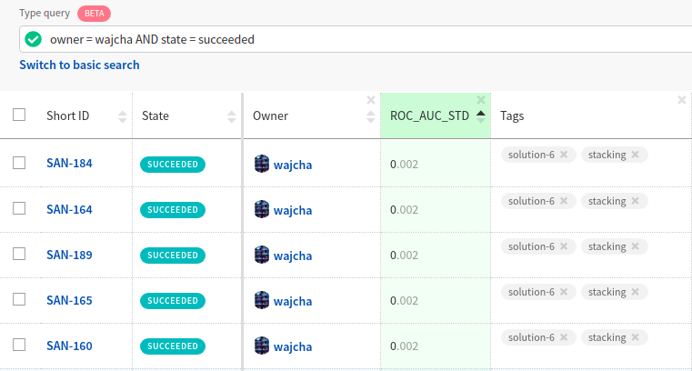

Neptune Query Language
======================
.. _core-concepts_nql:

Neptune Query Language (NQL) enables you to apply complex filters to your experiments view.
You can build NQL queries in the query editor inside the Neptune dashboard.



Examples
--------
Let's assume that you want to see experiments where the ``recall`` metric is higher than ``0.9``.
In other words, you are looking for experiments, where:

.. code-block:: mysql

    recall > 0.9

The statement above is called a *clause* and follows the following format:


.. code-block:: mysql

    field-name operator value

Note that a field name must be on the left side of an operator.

Now, imagine you are looking for experiments where the ``recall`` metric is higher than ``0.9``
and, at the same time, the ``learning_rate`` parameter is smaller or equal to ``0.005``.

In this example, two clauses are joined together using a logical operator. Specify:

.. code-block:: mysql

    recall > 0.9 AND learning_rate <= 0.005

In a similar way, you can build even more complex queries.

The example below yields experiments where the ``recall`` metric is higher than ``0.9`` and at least one of two conditions is satisfied:
either the ``learning_rate`` parameter is smaller or equal to ``0.005``, or ``encoder`` (a text log) is ``ResNet101``.
.. code-block:: mysql

    recall > 0.9 AND (learning_rate <= 0.005 OR encoder = ResNet101)

For more information, see :ref:`NQL reference <core-concepts_nql_reference>`.

Advanced examples
-----------------
- Fetching specific experiments by ids:

    .. code-block:: mysql

        id = SAN-3 OR id = SAN-5 OR id = SAN-43

- Fetching experiments by using a complex logical expression:

    .. code-block:: mysql

        ((param1 = 5 AND recall >= 0.9) OR (param1 < 5 AND param1 > 2 AND recall >= 0.7)) AND owner = Fred AND NOT status = Succeeded

- Fetching experiments that contain three specific tags:

    .. code-block:: mysql

        tags CONTAINS some_tag_1 AND tags CONTAINS some_tag_2 AND tags CONTAINS another_tag

- Fetching experiments that contain at least one of the specific tags:

    .. code-block:: mysql

        tags CONTAINS some_tag_1 OR tags CONTAINS some_tag_2 OR tags CONTAINS another_tag

- Fetching experiments that contain the tag ``expected`` but do not contain the tag ``unexpected``.
  Use either of the following queries:

    .. code-block:: mysql

        tags CONTAINS expected AND NOT tags CONTAINS unexpected

        tags CONTAINS expected AND tags NOT CONTAINS unexpected

- Fetching experiments with a name that contains a specific substring:

    .. code-block:: mysql

        name CONTAINS some_substring

- Fetching experiments containing channel, parameter or property with given name and non-null value:

    .. code-block:: mysql

        some_column_name EXISTS

- Fetching experiments not containing channel, parameter or property with given name:

    .. code-block:: mysql

        some_column_name NOT EXISTS

        NOT some_column_name EXISTS

- Fetching finished experiments:

    .. code-block:: mysql

        timeOfCompletion EXISTS

        finished EXISTS

- Fetching experiments created in notebook:

    .. code-block:: mysql

        notebookName EXISTS


NQL reference
-------------
.. _core-concepts_nql_reference:

Clause
^^^^^^
A clause can take one of the following forms:

1. A relation consisting of three elements:

.. code-block:: mysql

    field-name OPERATOR value

2. A search term consisting of a single string value (a few words in quotes are considered a single string):

.. code-block:: mysql

    some_string_value

    "some string value"

Relation clauses
""""""""""""""""

**Field-name**

Field-names are case insensitive, so you can write both *state* and *State* or even *STATE*.
It can be one of the following:

* ``metric`` name

  Only last value in the metric is taken into account.

  Example:

  .. code-block:: mysql

      recall > 0.9

* ``parameter`` name

  Example:

  .. code-block:: mysql

      learning_rate <= 0.005

* ``tags``

  Can be used only with the ``CONTAINS`` operator. Condition is fulfilled if experiment contains a specific tag.

  Example:

  .. code-block:: mysql

      tags CONTAINS example-tag

* ``property`` name

  Example:

  .. code-block:: mysql

      train_data_path = "data/train.csv"

      train_data_path = train.csv

      train_data_path CONTAINS .csv

* ``text log`` name

  Only last value in the log is taken into account.

  Example:

  .. code-block:: mysql

      stderr = "example text in log file"

      stderr CONTAINS error

* ``id``

  Example:

  .. code-block:: mysql

      id = SAN-12

      id CONTAINS 12

* ``state``

  The following values are possible for this field:

    - ``running``
    - ``succeeded``
    - ``aborted``
    - ``failed``

  Values of this field are case insensitive.

  Examples:

  .. code-block:: mysql

      state = running

      state = failed

      state = aborted

* ``owner``

  Example:

  .. code-block:: mysql

      owner = Fred

* ``name``

  Example:

  .. code-block:: mysql

      name = Approach-1

      name CONTAINS test

* ``description``

  Example:

  .. code-block:: mysql

      description = "My first experiment"

      description CONTAINS test

* ``size``

  Without any unit bytes are assumed, however following units are supported and are case insensitive: ``kb``, ``mb``, ``gb``.
  If there is a space between the number and its unit, the whole value needs to be enclosed in quotation marks.
  Comparison of this field works on its corresponding value, not on strings.

  Examples:

  .. code-block:: mysql

      size > 20MB

      size < 100

      size >= "35 kb"

* ``hostname``

  Example:

  .. code-block:: mysql

      hostname = my-server-1

      hostname CONTAINS server

      hostname EXISTS

* ``commitId``

  Example:

  .. code-block:: mysql

      commitId = 381ed1e25230cc1a08e0b901b90ecb00a8f5fd41

      commitId CONTAINS 381ed1e25

      commitId EXISTS

* ``notebookName``

  Example:

  .. code-block:: mysql

      notebookName = my_notebook

      notebookName CONTAINS note

      notebookName EXISTS

* ``checkpointName``

  Example:

  .. code-block:: mysql

      checkpointName = my_checkpoint

      checkpointName CONTAINS check

      checkpointName EXISTS

----

**Operator**

It is one of the relational operators that lets you specify what you are looking for.
See the :ref:`operators table <core-concepts_nql_operators_reference>` below for list of all operators.

.. note::

    Operator ``CONTAINS`` can be used only with text parameters, text logs, properties,
    tags, id, name, description, hostname, commitId, notebookName, checkpointName and owner.

----

**Value**

Value is a specific value within a given column, like ``0.95`` or ``ResNet101``. Values are case sensitive.
Two types of values are supported:

* Numbers
* Strings

Numbers are compared based on values, however strings are compared lexicographically basing on ASCII codes.
Some fields, like ``size`` and ``state`` are exceptions to this rule.

Search term clauses
"""""""""""""""""""

A clause consisting of a single string value will be treated as a search term.
Such query matches all experiments that contain a given string in their names, description or experiment id.
Search terms are case insensitive and some typos are automatically recognized.

Examples:

.. code-block:: mysql

          Untitled

          "Untitld"

          Untiitled

          "Untitlad"

          uNTItleD

          "untitled Test"

Complex query
^^^^^^^^^^^^^^^
**AND and OR operators**

An NQL query consists of a number of clauses connected with logical operators. For example:

.. code-block:: mysql

    recall > 0.9 AND learning_rate <= 0.005 AND encoder = ResNet101

Additionally, brackets can be used to control logical operators precedence:

.. code-block:: mysql

    recall > 0.9 AND (learning_rate <= 0.005 OR encoder = ResNet101)

Note: The ``AND`` operator has a higher precedence than ``OR``, so the following two queries are identical:


.. code-block:: mysql

    learning_rate <= 0.005 OR encoder = ResNet101 AND recall > 0.9

    learning_rate <= 0.005 OR (encoder = ResNet101 AND recall > 0.9)

**NOT operator**

The ``NOT`` operator can be used to negate a single clause or an entire sub-query.
For example, if you want to find all experiments that are not owned by Fred, you can use either of the following queries:

.. code-block:: mysql

    NOT owner = Fred
    owner != Fred

The ``NOT`` operator has a higher precedence than ``AND`` and ``OR`` but a lower precedence than relational operators.
So, the following queries are identical:

.. code-block:: mysql

    recall > 0.9 AND NOT learning_rate <= 0.005 OR encoder = ResNet101

    recall > 0.9 AND NOT (learning_rate <= 0.005) OR encoder = ResNet101

    recall > 0.9 AND (NOT learning_rate <= 0.005) OR encoder = ResNet101

but they are different from:

.. code-block:: mysql

    recall > 0.9 AND NOT (learning_rate <= 0.005 OR encoder = ResNet101)

In addition, you can use the ``NOT`` operator with the ``CONTAINS`` operator like this:

.. code-block:: sql

    description NOT CONTAINS test
    tags NOT CONTAINS test

Logical operators are case insensitive.

Operators reference
^^^^^^^^^^^^^^^^^^^
.. _core-concepts_nql_operators_reference:

==================== =============================================================================
Syntax elements
==================== =============================================================================
Logical operators    ``AND``, ``OR``, ``NOT``
Relational operators ``=``, ``==``, ``!=``, ``>``, ``>=``, ``<``, ``<=``, ``CONTAINS``, ``EXISTS``
Brackets             ``(``, ``)``
Quotation marks      ``""``, ``````
==================== =============================================================================

Precedence order
^^^^^^^^^^^^^^^^
If there are any field name collisions, the following order precedence is applied:

  * system column
  * parameter
  * metric
  * text log
  * property

For example, if there is a metric and a parameter called ``owner``, the following query will return only experiments
created by Fred, but no experiments of other users who have a parameter called ``owner`` with value ``Fred``:

.. code-block:: mysql

    owner = Fred


Quotes
^^^^^^

There are two types of quotation marks in NQL:

* A double quote (``""``) is used with values,
* back quote (``````) is used with field names.

While in most cases it is not required to use quotation marks, there are some cases when it is necessary.

**Special characters**

Typically, field name and string values can consist of letters of English alphabet, digits, dots (``.``), underscores (``_``) and dashes (``-``).
However, it is possible to write a query using strings containing any unicode character. For this purpose you will need to use quotation marks:

.. code-block:: mysql

    name = "my first experiment"

    `!@#$%^&*()_+` <= 0.005

    tags CONTAINS "Déjà vu"


.. note::

    If your field name contains a back quote character (`````) you will need to escape it using a backslash (``\``).
    Similarly, double quote character (``"``) has to be escaped in case of quote enclosed string value.
    Backslash character has to be preceded by another backslash in both cases - field names nad string values. For example:

    .. code-block:: mysql

        windows_path = "tmp\\dir\\file"

        text_with_quote = "And then he said: \"Hi!\""

        `\`backquoted_parameter_name\`` > 55

        `long\\parameter\\name\\with\\backslashes` > 55

**Keywords**

There are four reserved keywords in NQL: ``AND``, ``OR``, ``NOT`` and ``CONTAINS``.
They can not be simply used as fields or values.
Execution of one of the following queries will result in a syntax error:

.. code-block:: mysql

    AND = some_string

    name = CONTAINS

    tags CONTAINS CONTAINS

You can handle such situations by escaping the name of the column with back quotes (`````) and the value of the field with quotes (``"``).

.. code-block:: mysql

    `AND` = some_string

    name = "CONTAINS"

    tags CONTAINS "CONTAINS"