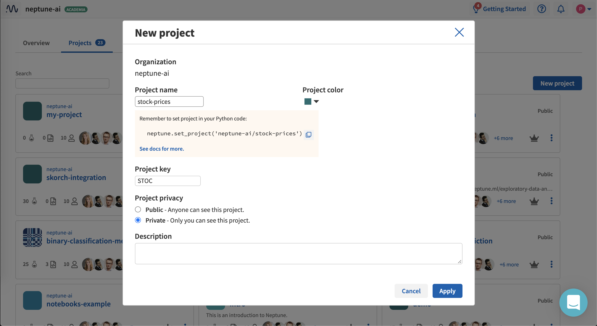

Team, project and user management
=================================

.. contents::
    :local:
    :depth: 1
    :backlinks: top

.. _how-to_team-management_create-organization:

Create an organization
----------------------
Neptune lets you create an :ref:`organization <core-concepts_organization-types>`.

1. Click the **Context Switcher** at the upper-right corner and click **Create new organization**.

.. image:: ../_static/images/how-to/team-management/create-org-1.png
   :target: ../_static/images/how-to/team-management/create-org-1.png
   :alt: create new organization

2. Type in a name and click **Create organization**.

.. image:: ../_static/images/how-to/team-management/create-org-2.png
   :target: ../_static/images/how-to/team-management/create-org-2.png
   :alt: type name for new organization

3. Once the organization has been created, you can :ref:`invite people <invite-to-organization>` to your organization.

.. image:: ../_static/images/how-to/team-management/create-org-3.png
   :target: ../_static/images/how-to/team-management/create-org-3.png
   :alt: type name for new organization

.. _invite-to-organization:

Invite users to an organization
-------------------------------
After you have :ref:`created an organization <how-to_team-management_create-organization>`, you can invite members to join it.

.. note::
    - Only :ref:`an organization Admin <core-concepts_user-roles_organization-admin>` can invite new users to an organization.
    - In case of a team organization, as soon as a user is added, s(he) is added automatically.
    - In case of an individual organization, users are explicitly invited and have to accept the invitation before they are added. Those users can leave the Projects which they joined at any time.
    - Only organization members can be added to Projects in team organizations.

1. Go to **Context Switcher** at the upper-right corner and click the **Settings** button for the relevant organization.

.. image:: ../_static/images/how-to/team-management/create-org-1.png
   :target: ../_static/images/how-to/team-management/create-org-1.png
   :alt: Go to settings to invite user to organization

2. In the panel that appears, click the **People** tab.

.. image:: ../_static/images/how-to/team-management/invite-to-org-2.png
   :target: ../_static/images/how-to/team-management/invite-to-org-2.png
   :alt: Invite user to organization

- The tab displays the list of users who already belong to the organization or whose membership is pending.
- Above the list is a field in which you can type an email or username  of people you want to invite. Neptune identifies names and emails for people who already have an account.

3. Specify a name, set a role (Admin or Member) and click **Invite**.

The users you invite will be invited via email to join your organization (in case of already registered users, through an in-app notification).
Until they join, their status is marked as "Pending invitation".

Create a project
----------------
Neptune lets you create a project.

1. Click **Project** at the top-left of the window.

2. In the pane that appears, click **New project**.

.. image:: ../_static/images/how-to/team-management/create-project-1.png
   :target: ../_static/images/how-to/team-management/create-project-1.png
   :alt: Go to new project panel

3. Set a name, color, description and :ref:`project type <core-concepts_project-types>` (Public or Private).

4. Click **Apply**.

The new project is created.

.. _how-to_team-management_invite-to-project:

Add users to a project
----------------------
.. note::

    Only a project Owner can invite new users to the project. Learn more about :ref:`project roles <core-concepts_user-roles_project-owner>`.

1. In the Project pane, click **Settings**, then click the **People** tab.

- The tab displays the list of project members who already belong to the project.
- Above the list is a field in which you can type an email or username of people you want to invite. Neptune identifies names and emails for people who already have an account.

2. Specify an email or username of a user you want to add.

3. Set a role and click **Invite**.

.. image:: ../_static/images/how-to/team-management/add-user-1.png
   :target: ../_static/images/how-to/team-management/add-user-1.png
   :alt: Add users to project

.. note::

    - If a user is registered in Neptune.ai, s(he) can be added from the UI, under **Project Settings** > **People**. If the user is not yet registered in Neptune.ai, s(he) can be invited by email. In any case, the user needs to accept the invitation, before s(he) appears in the list.
    - If the project is created in an individual organization, you can only invite users to a public project. The user is notified by email and must accept the invitation to be added. You cannot add users to a private project.