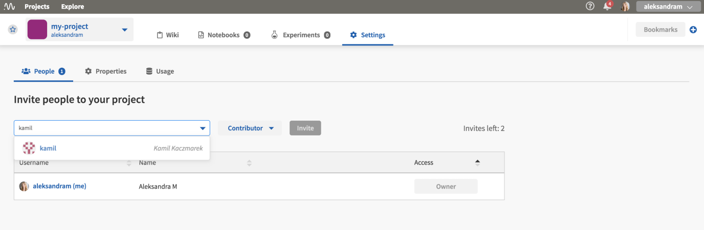

Team, Project and User Management
=================================

This page describes the concepts of team, project and user roles and permissions as they are used in Neptune. It also provides instructions for creating projects and organizations and adding users to them.

.. contents::
    :local:
    :depth: 1
    :backlinks: top

.. _how-to_team-management_create-organization:

Organization Types
------------------

.. _core-concepts_organization-types:

An organization is a way to centrally manage projects, users and subscriptions.

Neptune has two organization types: individual and team.

Individual
^^^^^^^^^^
* Each user is assigned individual organization with ``username`` as an organization name.
* The user is the only member of this organization but may :ref:`invite collaborators <how-to_team-management_invite-to-project>` to projects.
* The user can create an unlimited number of projects in the individual organization.

Team
^^^^
* A team organization comes in handy when an entire team needs to be managed centrally.
* Once :ref:`created <how-to_team-management_create-organization>`, a team organization can be managed by the :ref:`organization Admin <core-concepts_user-roles_organization-admin>`. This include users and subscription.
* Only users who joined team organization can browse its content, subject to the assigned :ref:`role <core-concepts_user-roles>` in the organization or project.

Learn more about :ref:`project types <core-concepts_project-types>` and :ref:`user roles <core-concepts_user-roles>`.

=======

User Roles
----------
.. _core-concepts_user-roles:

There are roles in projects and in organizations.

Roles in an organization
^^^^^^^^^^^^^^^^^^^^^^^^

Organization roles apply only to team organizations.

.. _core-concepts_user-roles_organization-admin:

If you have :ref:`created an organization <how-to_team-management_create-organization>`,
you can invite people to it. Two roles are available: Admin and Member.

The following table summarizes the permissions available for the organization roles.

.. csv-table::
   :header: "Permission","Admin","Member"
   :widths: 20, 20, 20

      Managing subscription (including invoice data),yes,no
      Managing organization members,yes,no
      Creating and deleting projects,yes,no

You can access organization settings by clicking **Settings**.

.. figure:: ../_static/images/core-concepts/org-settings.png
   :target: ../_static/images/core-concepts/org-settings.png
   :alt: organization settings button

.. note::

    - An Admin of an organization is also the Owner of all projects and can grant organization ownership to anyone in the organization.
    - Project Owners can grant project ownership to anyone in the organization.
    - An organization must have at least one Admin, so the last remaining Admin cannot be removed from the organization.

Roles in a project
^^^^^^^^^^^^^^^^^^
.. _core-concepts_user-roles_project-owner:

The following table summarizes the permissions available for the three project roles: Owner, Contributor and Viewer.

.. csv-table::
   :header: "Permission","Owner","Contributor","Viewer"
   :widths: 10, 10, 10, 10
   :delim: #

      Viewing project content#yes#yes#yes
      Editing project content (running experiments, creating Notebooks, modifying previously stored data)#yes#yes#no
      Viewing project members#yes#yes#yes
      Editing project members (inviting, changing roles)#yes#no#no
      Viewing or editing of project settings and properties (such as making projects private or public)#yes#no#no

====

Project Types
-------------
.. _core-concepts_project-types:

There are private and public projects.

Private projects
^^^^^^^^^^^^^^^^
Only people added to the project can see it. The project :ref:`Owner <core-concepts_user-roles_project-owner>` can manage who has access to the project in the Settings view.

Here is an example view, where the project Owner can manage project members:

.. image:: ../_static/images/core-concepts/invite-to-project.png
   :target: ../_static/images/core-concepts/invite-to-project.png
   :alt: Invite user to the project

Public projects
^^^^^^^^^^^^^^^
Public projects are freely available to view by everyone who has access to the Internet.

Also, in case of individual organizations, you can invite collaborators to public projects only.
Examples are: |credit-default-prediction| and |binary-classification-metrics|.

.. External links

.. |credit-default-prediction| raw:: html

    <a href="https://ui.neptune.ai/neptune-ai/credit-default-prediction" target="_blank">Credit default prediction</a>

.. |binary-classification-metrics| raw:: html

    <a href="https://ui.neptune.ai/neptune-ai/binary-classification-metrics" target="_blank">Binary classification metrics</a>

Create an Organization
----------------------
Neptune lets you create an :ref:`organization <core-concepts_organization-types>`.

1. Click the **Context Switcher** at the upper-right corner and click **Create new organization**.

.. image:: ../_static/images/how-to/team-management/create-org-1.png
   :target: ../_static/images/how-to/team-management/create-org-1.png
   :alt: create new organization

2. Type in a name and click **Create organization**.

.. image:: ../_static/images/how-to/team-management/create-org-2.png
   :target: ../_static/images/how-to/team-management/create-org-2.png
   :alt: type name for new organization

3. Once the organization has been created, you can :ref:`invite people <invite-to-organization>` to your organization.

.. image:: ../_static/images/how-to/team-management/create-org-3.png
   :target: ../_static/images/how-to/team-management/create-org-3.png
   :alt: type name for new organization

.. _invite-to-organization:

Invite Users to an Organization
-------------------------------
After you have :ref:`created an organization <how-to_team-management_create-organization>`, you can invite members to join it.

.. note::
    - Only :ref:`an organization Admin <core-concepts_user-roles_organization-admin>` can invite new users to an organization.
    - In case of a team organization, as soon as a user is added, s(he) is listed automatically.
    - In case of an individual organization, users are explicitly invited and have to accept the invitation before they are added. Those users can leave the Projects that they joined at any time.
    - Only organization members can be added to Projects in team organizations.

1. Go to **Context Switcher** at the upper-right corner and click the **Settings** button for the relevant organization.

.. image:: ../_static/images/how-to/team-management/create-org-1.png
   :target: ../_static/images/how-to/team-management/create-org-1.png
   :alt: Go to settings to invite user to organization

2. In the panel that appears, click the **People** tab.

.. image:: ../_static/images/how-to/team-management/invite-to-org-2.png
   :target: ../_static/images/how-to/team-management/invite-to-org-2.png
   :alt: Invite user to organization

- The tab displays the list of users who already belong to the organization or whose membership is pending.
- Above the list is a field in which you can type an email or username  of people you want to invite. Neptune identifies names and emails for people who already have an account.

3. Specify a name, set a role (Admin or Member) and click **Invite**.

The users you invite will be invited via email to join your organization (in case of already registered users, through an in-app notification).
Until they join, their status is marked as "Pending invitation".

Create a Project
----------------
Neptune lets you create a project.

1. Click **Project** at the top-left of the window.

2. In the pane that appears, click **New project**.

.. image:: ../_static/images/how-to/team-management/create-project-1.png
   :target: ../_static/images/how-to/team-management/create-project-1.png
   :alt: Go to new project panel

3. Set a name, color, description and :ref:`project type <core-concepts_project-types>` (Public or Private).

.. image:: ../_static/images/how-to/team-management/create-project-2.png
   :target: ../_static/images/how-to/team-management/create-project-2.png
   :alt: Create new project

4. Click **Apply**.

The new project is created.

.. _how-to_team-management_invite-to-project:

Add Users to a Project
----------------------
.. note::

    Only a project Owner can invite new users to the project. Learn more about :ref:`project roles <core-concepts_user-roles_project-owner>`.

1. In the Project pane, click **Settings**, then click the **People** tab.

- The tab displays the list of project members who already belong to the project.
- Above the list is a field in which you can type an email or username of people you want to invite. Neptune identifies names and emails for people who already have an account.

2. Specify an email or username of a user you want to add.

3. Set a role and click **Invite**.

.. note::

    - If a user is registered in Neptune.ai, s(he) can be added from the UI, under **Project Settings** > **People**. If the user is not yet registered in Neptune.ai, s(he) can be invited by email. In any case, the user needs to accept the invitation, before s(he) appears in the list.
    - If the project is created in an individual organization, you can only invite users to a public project. The user is notified by email and must accept the invitation to be added. You cannot add users to a private project.