.. _guides-logging-data-to-neptune:

Logging experiment data
=======================
[loom-placeholder]

During machine learning experimentation, you need to keep track of many different types of meta-data. Neptune helps you do that by logging, keeping track of and visualizing it.

You can track many different types of data to the experiment. It can be metric, loss, image, interactive visualization, model checkpoint, pandas DataFrame and many more.

Simply check :ref:`what you can log <what-you-can-log>` section below for a complete list.

**On this page:**

* :ref:`Basics of logging <basics-of-logging>`
* :ref:`What you can log <what-you-can-log>`
* :ref:`Advanced topics <logging-advanced>`

.. _basics-of-logging:

-----

Basics of logging
-----------------
Logging experiments data to Neptune is simple and straightforward.

Let's create minimal code snippet that logs single value to the experiment: ``'acc'=0.95``.

.. code-block:: python3

    import neptune

    # Set project
    neptune.init('my_workspace/my_project')

    # Create experiment
    neptune.create_experiment()

    # Log 'acc' value 0.95
    neptune.log_metric('acc', 0.95)

Above snippet sets project, creates experiment and log one value to it. When script ends, the experiment is closed automatically. As a result you have new experiment with one value in one metric ('acc'=0.95).

Everything that is evaluated after ``neptune.create_experiment()`` and before the end of the script or when you call ``neptune.stop`` (reference docs: :meth:`~neptune.experiments.Experiment.stop`) can be logged to the experiment.

.. _what-you-can-log:

-----

What objects can you log to Neptune
-----------------------------------
Neptune supports logging many different types of data. Here, you can find all of them listed and described.

.. note::

    Remember to set project using :meth:`~neptune.init` and :meth:`~neptune.projects.Project.create_experiment` before you start logging.

* :ref:`Metrics <logging-experiment-data-metrics>`
* :ref:`Parameters <logging-experiment-data-parameters>`
* :ref:`Code <logging-experiment-data-code>`

    * :ref:`Git <logging-experiment-data-code-git>`
    * :ref:`Code Snapshot <logging-experiment-data-code-code-snapshot>`
    * :ref:`Notebook Snapshot <logging-experiment-data-code-notebook-snapshot>`

* :ref:`Images <logging-experiment-data-images>`

    * :ref:`Image file <logging-experiment-data-images-file>`
    * :ref:`Matplotlib <logging-experiment-data-images-matplotlib>`
    * :ref:`PIL <logging-experiment-data-images-pil>`
    * :ref:`NumPy <logging-experiment-data-images-numpy>`

* :ref:`Interactive charts <logging-experiment-data-interactive-charts>`

    * :ref:`Matplotlib <logging-experiment-data-interactive-charts-matplotlib>`
    * :ref:`Altair <logging-experiment-data-interactive-charts-altair>`
    * :ref:`Bokeh <logging-experiment-data-interactive-charts-bokeh>`
    * :ref:`Plotly <logging-experiment-data-interactive-charts-plotly>`

* :ref:`Text <logging-experiment-data-text>`
* :ref:`Hardware consumption <logging-experiment-data-hardware-consumption>`
* :ref:`Experiment information <logging-experiment-data-experiment-information>`

    * :ref:`Experiment name <logging-experiment-data-experiment-information-name>`
    * :ref:`Experiment description <logging-experiment-data-experiment-information-description>`
    * :ref:`Experiment tags <logging-experiment-data-experiment-information-tags>`

* :ref:`Properties <logging-experiment-data-properties>`
* :ref:`Data versions <logging-experiment-data-data-versions>`
* :ref:`Files <logging-experiment-data-files>`

    * :ref:`Model checkpoints <logging-experiment-data-files-model-checkpoints>`
    * :ref:`HTML objects <logging-experiment-data-files-html-objects>`

* :ref:`Video <logging-experiment-data-video>`
* :ref:`Audio <logging-experiment-data-audio>`
* :ref:`Tables <logging-experiment-data-tables>`

    * :ref:`pandas <logging-experiment-data-pandas>`
    * :ref:`csv <logging-experiment-data-csv>`

* :ref:`Python objects <logging-experiment-data-python-objects>`

    * :ref:`Explainers (DALEX) <logging-experiment-data-python-objects-dalex>`
    * :ref:`Pickled object <logging-experiment-data-python-pickle>`

* :ref:`Logging with integrations <logging-with-integrations>`

    * :ref:`Deep learning frameworks <integrations-deep-learning-frameworks>`
    * :ref:`Machine learning frameworks <integrations-machine-learning-frameworks>`
    * :ref:`Hyperparameter optimization libraries <integrations-hyperparameter-optimization-frameworks>`
    * :ref:`Visualization libraries <integrations-visualization-tools>`
    * :ref:`Experiment tracking frameworks <integrations-experiment-tracking-frameworks>`
    * :ref:`Other integrations <integrations-other-integrations>`

+--------------------------------------------------------------------------------+------------------------------------------------------------------------------------------------------+
| Type od data                                                                   | Per-type category                                                                                    |
+================================================================================+======================================================================================================+
| :ref:`Metrics <logging-experiment-data-metrics>`                               | n.a.                                                                                                 |
+--------------------------------------------------------------------------------+------------------------------------------------------------------------------------------------------+
| :ref:`Parameters <logging-experiment-data-parameters>`                         | n.a.                                                                                                 |
+--------------------------------------------------------------------------------+------------------------------------------------------------------------------------------------------+
| :ref:`Code <logging-experiment-data-code>`                                     | * :ref:`Git <logging-experiment-data-code-git>`                                                      |
|                                                                                | * :ref:`Code Snapshot <logging-experiment-data-code-code-snapshot>`                                  |
|                                                                                | * :ref:`Notebook Snapshot <logging-experiment-data-code-notebook-snapshot>`                          |
+--------------------------------------------------------------------------------+------------------------------------------------------------------------------------------------------+
| :ref:`Images <logging-experiment-data-images>`                                 | * :ref:`Image file <logging-experiment-data-images-file>`                                            |
|                                                                                | * :ref:`Matplotlib <logging-experiment-data-images-matplotlib>`                                      |
|                                                                                | * :ref:`PIL <logging-experiment-data-images-pil>`                                                    |
|                                                                                | * :ref:`NumPy <logging-experiment-data-images-numpy>`                                                |
+--------------------------------------------------------------------------------+------------------------------------------------------------------------------------------------------+
| :ref:`Interactive charts <logging-experiment-data-interactive-charts>`         | * :ref:`Matplotlib <logging-experiment-data-interactive-charts-matplotlib>`                          |
|                                                                                | * :ref:`Altair <logging-experiment-data-interactive-charts-altair>`                                  |
|                                                                                | * :ref:`Bokeh <logging-experiment-data-interactive-charts-bokeh>`                                    |
|                                                                                | * :ref:`Plotly <logging-experiment-data-interactive-charts-plotly>`                                  |
+--------------------------------------------------------------------------------+------------------------------------------------------------------------------------------------------+
| :ref:`Text <logging-experiment-data-text>`                                     | n.a.                                                                                                 |
+--------------------------------------------------------------------------------+------------------------------------------------------------------------------------------------------+
| :ref:`Hardware consumption <logging-experiment-data-hardware-consumption>`     | n.a.                                                                                                 |
+--------------------------------------------------------------------------------+------------------------------------------------------------------------------------------------------+
| :ref:`Experiment information <logging-experiment-data-experiment-information>` | * :ref:`Experiment name <logging-experiment-data-experiment-information-name>`                       |
|                                                                                | * :ref:`Experiment description <logging-experiment-data-experiment-information-description>`         |
|                                                                                | * :ref:`Experiment tags <logging-experiment-data-experiment-information-tags>`                       |
+--------------------------------------------------------------------------------+------------------------------------------------------------------------------------------------------+
| :ref:`Properties <logging-experiment-data-properties>`                         | n.a.                                                                                                 |
+--------------------------------------------------------------------------------+------------------------------------------------------------------------------------------------------+
| :ref:`Data versions <logging-experiment-data-data-versions>`                   | n.a.                                                                                                 |
+--------------------------------------------------------------------------------+------------------------------------------------------------------------------------------------------+
| :ref:`Files <logging-experiment-data-files>`                                   | * :ref:`Model checkpoints <logging-experiment-data-files-model-checkpoints>`                         |
|                                                                                | * :ref:`HTML objects <logging-experiment-data-files-html-objects>`                                   |
+--------------------------------------------------------------------------------+------------------------------------------------------------------------------------------------------+
| :ref:`Video <logging-experiment-data-video>`                                   | n.a.                                                                                                 |
+--------------------------------------------------------------------------------+------------------------------------------------------------------------------------------------------+
| :ref:`Audio <logging-experiment-data-audio>`                                   | n.a.                                                                                                 |
+--------------------------------------------------------------------------------+------------------------------------------------------------------------------------------------------+
| :ref:`Tables <logging-experiment-data-tables>`                                 | * :ref:`pandas <logging-experiment-data-pandas>`                                                     |
|                                                                                | * :ref:`csv <logging-experiment-data-csv>`                                                           |
+--------------------------------------------------------------------------------+------------------------------------------------------------------------------------------------------+
| :ref:`Python objects <logging-experiment-data-python-objects>`                 | * :ref:`Explainers (DALEX) <logging-experiment-data-python-objects-dalex>`                           |
|                                                                                | * :ref:`Pickled object <logging-experiment-data-python-pickle>`                                      |
+--------------------------------------------------------------------------------+------------------------------------------------------------------------------------------------------+
| :ref:`Logging with integrations <logging-with-integrations>`                   | * :ref:`Deep learning frameworks <integrations-deep-learning-frameworks>`                            |
|                                                                                | * :ref:`Machine learning frameworks <integrations-machine-learning-frameworks>`                      |
|                                                                                | * :ref:`Hyperparameter optimization libraries <integrations-hyperparameter-optimization-frameworks>` |
|                                                                                | * :ref:`Visualization libraries <integrations-visualization-tools>`                                  |
|                                                                                | * :ref:`Experiment tracking frameworks <integrations-experiment-tracking-frameworks>`                |
|                                                                                | * :ref:`Other integrations <integrations-other-integrations>`                                        |
+--------------------------------------------------------------------------------+------------------------------------------------------------------------------------------------------+

+--------------------------------------------------------------------------------+------------------------------------------------------------------------------------------------------+
| :ref:`Metrics <logging-experiment-data-metrics>`                               |                                                                                                      |
+--------------------------------------------------------------------------------+------------------------------------------------------------------------------------------------------+
| :ref:`Parameters <logging-experiment-data-parameters>`                         |                                                                                                      |
+--------------------------------------------------------------------------------+------------------------------------------------------------------------------------------------------+
| :ref:`Code <logging-experiment-data-code>`                                     | * :ref:`Git <logging-experiment-data-code-git>`                                                      |
|                                                                                | * :ref:`Code Snapshot <logging-experiment-data-code-code-snapshot>`                                  |
|                                                                                | * :ref:`Notebook Snapshot <logging-experiment-data-code-notebook-snapshot>`                          |
+--------------------------------------------------------------------------------+------------------------------------------------------------------------------------------------------+
| :ref:`Images <logging-experiment-data-images>`                                 | * :ref:`Image file <logging-experiment-data-images-file>`                                            |
|                                                                                | * :ref:`Matplotlib <logging-experiment-data-images-matplotlib>`                                      |
|                                                                                | * :ref:`PIL <logging-experiment-data-images-pil>`                                                    |
|                                                                                | * :ref:`NumPy <logging-experiment-data-images-numpy>`                                                |
+--------------------------------------------------------------------------------+------------------------------------------------------------------------------------------------------+
| :ref:`Interactive charts <logging-experiment-data-interactive-charts>`         | * :ref:`Matplotlib <logging-experiment-data-interactive-charts-matplotlib>`                          |
|                                                                                | * :ref:`Altair <logging-experiment-data-interactive-charts-altair>`                                  |
|                                                                                | * :ref:`Bokeh <logging-experiment-data-interactive-charts-bokeh>`                                    |
|                                                                                | * :ref:`Plotly <logging-experiment-data-interactive-charts-plotly>`                                  |
+--------------------------------------------------------------------------------+------------------------------------------------------------------------------------------------------+
| :ref:`Text <logging-experiment-data-text>`                                     |                                                                                                      |
+--------------------------------------------------------------------------------+------------------------------------------------------------------------------------------------------+
| :ref:`Hardware consumption <logging-experiment-data-hardware-consumption>`     |                                                                                                      |
+--------------------------------------------------------------------------------+------------------------------------------------------------------------------------------------------+
| :ref:`Experiment information <logging-experiment-data-experiment-information>` | * :ref:`Experiment name <logging-experiment-data-experiment-information-name>`                       |
|                                                                                | * :ref:`Experiment description <logging-experiment-data-experiment-information-description>`         |
|                                                                                | * :ref:`Experiment tags <logging-experiment-data-experiment-information-tags>`                       |
+--------------------------------------------------------------------------------+------------------------------------------------------------------------------------------------------+
| :ref:`Properties <logging-experiment-data-properties>`                         |                                                                                                      |
+--------------------------------------------------------------------------------+------------------------------------------------------------------------------------------------------+
| :ref:`Data versions <logging-experiment-data-data-versions>`                   |                                                                                                      |
+--------------------------------------------------------------------------------+------------------------------------------------------------------------------------------------------+
| :ref:`Files <logging-experiment-data-files>`                                   | * :ref:`Model checkpoints <logging-experiment-data-files-model-checkpoints>`                         |
|                                                                                | * :ref:`HTML objects <logging-experiment-data-files-html-objects>`                                   |
+--------------------------------------------------------------------------------+------------------------------------------------------------------------------------------------------+
| :ref:`Video <logging-experiment-data-video>`                                   |                                                                                                      |
+--------------------------------------------------------------------------------+------------------------------------------------------------------------------------------------------+
| :ref:`Audio <logging-experiment-data-audio>`                                   |                                                                                                      |
+--------------------------------------------------------------------------------+------------------------------------------------------------------------------------------------------+
| :ref:`Tables <logging-experiment-data-tables>`                                 | * :ref:`pandas <logging-experiment-data-pandas>`                                                     |
|                                                                                | * :ref:`csv <logging-experiment-data-csv>`                                                           |
+--------------------------------------------------------------------------------+------------------------------------------------------------------------------------------------------+
| :ref:`Python objects <logging-experiment-data-python-objects>`                 | * :ref:`Explainers (DALEX) <logging-experiment-data-python-objects-dalex>`                           |
|                                                                                | * :ref:`Pickled object <logging-experiment-data-python-pickle>`                                      |
+--------------------------------------------------------------------------------+------------------------------------------------------------------------------------------------------+
| :ref:`Logging with integrations <logging-with-integrations>`                   | * :ref:`Deep learning frameworks <integrations-deep-learning-frameworks>`                            |
|                                                                                | * :ref:`Machine learning frameworks <integrations-machine-learning-frameworks>`                      |
|                                                                                | * :ref:`Hyperparameter optimization libraries <integrations-hyperparameter-optimization-frameworks>` |
|                                                                                | * :ref:`Visualization libraries <integrations-visualization-tools>`                                  |
|                                                                                | * :ref:`Experiment tracking frameworks <integrations-experiment-tracking-frameworks>`                |
|                                                                                | * :ref:`Other integrations <integrations-other-integrations>`                                        |
+--------------------------------------------------------------------------------+------------------------------------------------------------------------------------------------------+

.. _logging-experiment-data-metrics:

Metrics
^^^^^^^
Log metric to neptune using :meth:`~neptune.experiments.Experiment.log_metric`.

.. code-block:: python3

    # Single value
    neptune.log_metric('test_accuracy', 0.76)

    # Accuracy per epoch
    for epoch in range(epoch_nr):
        epoch_accuracy = ...
        neptune.log_metric('epoch_accuracy', epoch_accuracy)

.. image:: ../_static/images/integrations/lightning_adv_acc.png
   :target: ../_static/images/integrations/lightning_adv_acc.png
   :alt: Metrics visualized as line chart

Metric can be accuracy, MSE or any numerical value. All metrics are visualized as |charts| in the experiment. You can also check and download raw data from the |logs| section.

Also, you can log with explicit step number, like this:

.. code-block:: python3

    # Log batch accuracy per epoch
    for i, batch in enumerate(train_data):
        batch_acc = ...
        neptune.log_metric(name='batch_accuracy', x=i, y=epoch_accuracy)

In the above snippet, ``x`` argument must be strictly increasing.

|example-metrics|

.. note::

    You can create as many metrics as you wish.

.. note::

    Download metrics as pandas DataFrame for further analysis locally. Here is :ref:`how to do it <guides-download_data>`.

:ref:`back to top <what-you-can-log>`

.. _logging-experiment-data-parameters:

Parameters
^^^^^^^^^^
Define parameters as Python dictionary and pass to the :meth:`~neptune.projects.Project.create_experiment` method to log them.

.. code-block:: python3

    # Define parameters
    PARAMS = {'batch_size': 64,
              'dense_units': 128,
              'dropout': 0.2,
              'learning_rate': 0.001,
              'optimizer': 'Adam'}

    # Pass parameters to create experiment
    neptune.create_experiment(params=PARAMS)

+--------------------------------------------------------------------------------------------------------------+
| .. image:: ../_static/images/logging-and-managing-experiment-results/logging-experiment-data/parameters.png  |
|    :target: ../_static/images/logging-and-managing-experiment-results/logging-experiment-data/parameters.png |
|    :alt: Experiment parameters                                                                               |
+==============================================================================================================+
| Parameters in the experiment view                                                                            |
+--------------------------------------------------------------------------------------------------------------+

+------------------------------------------------------------------------------------------------------------------------+
| .. image:: ../_static/images/logging-and-managing-experiment-results/logging-experiment-data/parameters-dashboard.png  |
|    :target: ../_static/images/logging-and-managing-experiment-results/logging-experiment-data/parameters-dashboard.png |
|    :alt: Experiment parameters in dashboard                                                                            |
+========================================================================================================================+
| Parameters in the experiment dashboard                                                                                 |
+------------------------------------------------------------------------------------------------------------------------+

You can use them later to analyse or compare experiments. They are displayed in the |parameters| section of the experiment. Moreover every parameter can be displayed as a column on the |experiment-dashboard| (look for green columns).

|example-parameters|

.. note::

    Experiment parameters are read-only. You cannot change or update them during or after the experiment.

:ref:`back to top <what-you-can-log>`

.. _logging-experiment-data-code:

Code
^^^^
Neptune supports code versioning. There are a few ways to do that.

.. _logging-experiment-data-code-git:

Track your git information
""""""""""""""""""""""""""
If you start an experiment from a directory that is a part of the git repo, Neptune will automatically find the ``.git`` directory and log some information from it.

It creates a summary in the |details| section with:

* status if repo has uncommitted changed (dirty flag),
* commit information (id, message, author, date),
* branch,
* remote address to your experiment,
* git checkout command with commit.

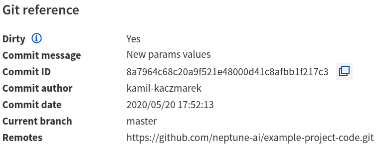

|example-code-git|

:ref:`back to top <what-you-can-log>`

.. _logging-experiment-data-code-code-snapshot:

Code Snapshot
"""""""""""""
Neptune automatically snapshots code when you :meth:`~neptune.projects.Project.create_experiment`.

By default, it will only save the entrypoint file (``main.py`` if you run ``python main.py``) but you can pass a list of files or regex (like: `'*.py'`) to specify more files.

.. code-block:: python3

    # Snapshot model.py and prep_data.py
    neptune.create_experiment(upload_source_files=['model.py', 'prep_data.py'])

    # Snapshot all python files and 'config.yaml' file
    neptune.create_experiment(upload_source_files=['*.py', 'config.yaml'])

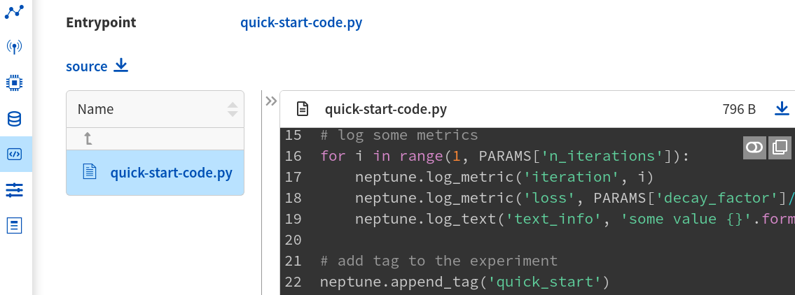

You will have all sources in the |source-code| section of the experiment. Neptune also logs the entrypoint file so that you have all the information about the run sources.

|example-code-snapshot|

:ref:`back to top <what-you-can-log>`

.. _logging-experiment-data-code-notebook-snapshot:

Notebook Code Snapshot
""""""""""""""""""""""
Neptune auto-snapshots your notebook every time you create experiment in that notebook.

Another option to log notebook checkpoint is by clicking a button in the Jupyter or JupyterLab UI. It is useful to log notebook with EDA or manual model analysis.

To get started, install :ref:`notebook extension <installation-notebook-extension>`, then go to the :ref:`Keeping track of Jupyter Notebooks <guides-keep-track-jupyter-notebooks>` guide that will explain everything.

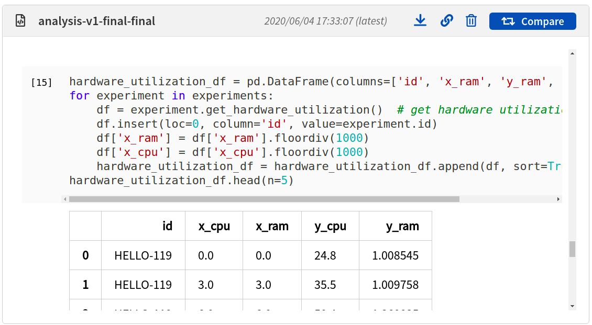

|example-notebook-snapshot|

:ref:`back to top <what-you-can-log>`

.. _logging-experiment-data-images:

Images
^^^^^^
Log images to Neptune. You can log either single image or series of them, using :meth:`~neptune.experiments.Experiment.log_image`. Several data formats are available:

* :ref:`Image files like png <logging-experiment-data-images-file>`,
* :ref:`Matplotlib figure <logging-experiment-data-images-matplotlib>`,
* :ref:`PIL image object <logging-experiment-data-images-pil>`,
* :ref:`NumPy array <logging-experiment-data-images-numpy>`.

In all cases you will have images in the |logs| section of the experiment, where you can browse and download them.

You can log unlimited number of images either in the single log or in the multiple image logs. Simply use the same log name, for example ``'misclassified_images'`` - first argument of the :meth:`~neptune.experiments.Experiment.log_image`.

.. note::

    Single image size limit is 15MB. If you work with larger files, you can log them using :meth:`~neptune.experiments.Experiment.log_artifact`. Check :ref:`Files section <logging-experiment-data-files>` for more info.

:ref:`back to top <what-you-can-log>`

.. _logging-experiment-data-images-file:

Image file
""""""""""
You can log image files directly from disk, by using :meth:`~neptune.experiments.Experiment.log_image`.

Log single image from disk.

.. code-block:: python3

    neptune.log_image('bbox_images', 'train-set/image.png')

Log series of images in ``for`` loop.

.. code-block:: python3

    for name in misclassified_images_names:
        y_pred = ...
        y_true = ...
        neptune.log_image('misclassified_images',
                          'misclassified_images/{name}.png`.format(name),
                          description='y_pred={}, y_true={}'.format(y_pred, y_true)

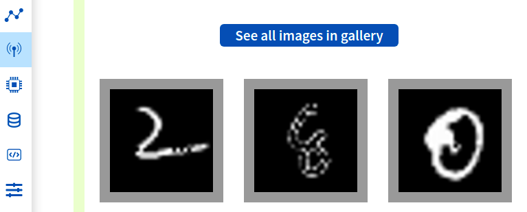

|example-images|

:ref:`back to top <what-you-can-log>`

.. _logging-experiment-data-images-matplotlib:

Matplotlib
""""""""""
Log Matplotlib figure (|matplotlib-fig-object|) as an image, by using :meth:`~neptune.experiments.Experiment.log_image`.

.. code-block:: python3

    # Import matplotlib
    import matplotlib.pyplot as plt

    # Generate figure
    fig = plt.figure(figsize=(7, 9))
    ...

    # Log figure to experiment
    neptune.log_image('matplotlib-fig', fig, image_name='streamplot')

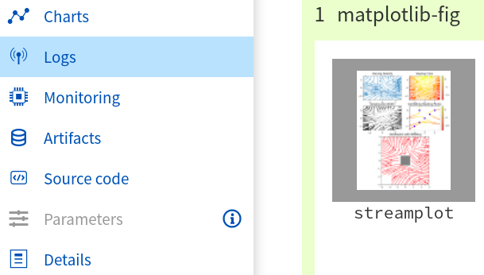

You will have Matplotlib figure in the |streamplot| section of the experiment, where you can browse and download them.

|example-images-matplotlib|

.. note::

    Check :ref:`Interactive Matplotlib logging <logging-experiment-data-interactive-charts-matplotlib>` to see how to log the same matplotlib figure and have it turned interactive in Neptune.

:ref:`back to top <what-you-can-log>`

.. _logging-experiment-data-images-pil:

PIL
"""
Log PIL image right from the memory, by using :meth:`~neptune.experiments.Experiment.log_image`.

.. code-block:: python3

    # Import PIL
    from PIL import Image

    # Load image
    image = Image.open('Representation-learning.jpg')

    # Log image to experiment
    neptune.log_image('PIL-image', image, image_name='representation learning', description='Example PIL image in experiment')

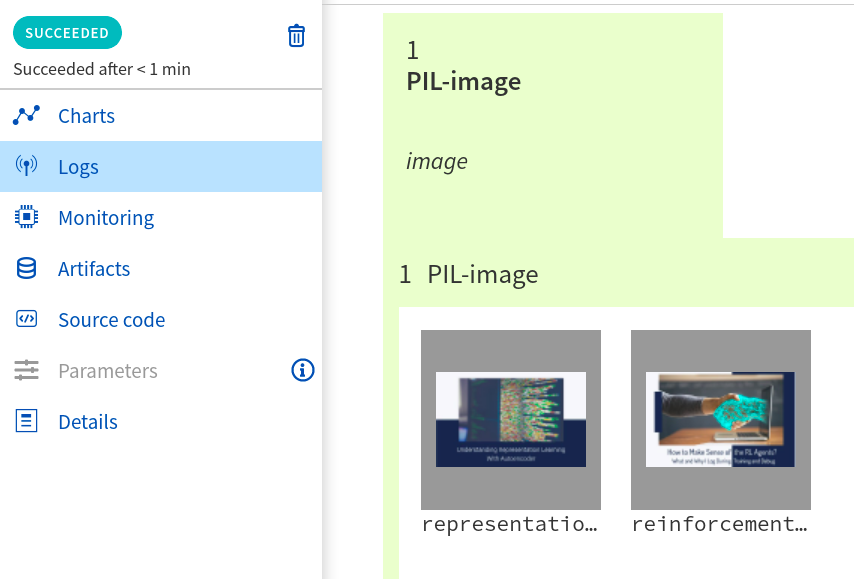

You will have images in the |logs| section of the experiment, where you can browse and download them.

|example-images-pil|

:ref:`back to top <what-you-can-log>`

.. _logging-experiment-data-images-numpy:

NumPy
"""""
Log NumPy array (2d or 3d) right from the memory, and have it visualized as image, by using :meth:`~neptune.experiments.Experiment.log_image`.

.. code-block:: python3

    # Import NumPy
    import numpy as np

    # Prepare some NumPy arrays
    for j in range(5):
        array = ...

        # Log them as images
        neptune.log_image('NumPy array as image',
                          array,
                          image_name='array-{}'.format(j), description='Example NumPy as image')

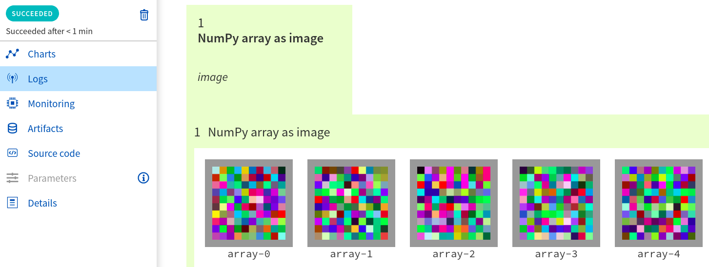

You will have NumPy images in the |logs| section of the experiment, where you can browse and download them.

|example-images-numpy|

:ref:`back to top <what-you-can-log>`

.. _logging-experiment-data-interactive-charts:

Interactive charts
^^^^^^^^^^^^^^^^^^
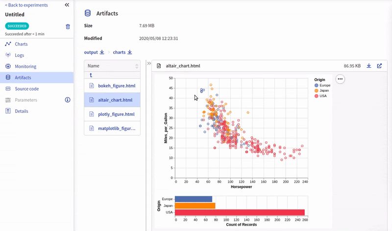

You can log interactive charts and they will be rendered interactively in the |artifacts| section under the ``charts/my_chart.html``. Common visualization libraries are supported:

* :ref:`Matplotlib <logging-experiment-data-interactive-charts-matplotlib>` -> we turn it interactive automatically
* :ref:`Altair <logging-experiment-data-interactive-charts-altair>`
* :ref:`Bokeh <logging-experiment-data-interactive-charts-bokeh>`
* :ref:`Plotly <logging-experiment-data-interactive-charts-plotly>`

|example-interactive-charts|

.. note::

    You need to install plotly to log any type of interactive chart. See: |plotly-installation-guide|.

.. note::

    For a full screen view, you can open visualization in the new browser tab, by clicking on the *"arrow-pointing-top-right"* icon, located right above your visualisation:

    .. image:: ../_static/images/logging-and-managing-experiment-results/logging-experiment-data/full-screen-icon.png
       :target: ../_static/images/logging-and-managing-experiment-results/logging-experiment-data/full-screen-icon.png
       :alt: Full screen icon

:ref:`back to top <what-you-can-log>`

.. _logging-experiment-data-interactive-charts-matplotlib:

Matplotlib
""""""""""
Log Matplotlib figure (|matplotlib-fig-object|) as an interactive chart, by using :meth:`~neptunecontrib.api.chart.log_chart`.

.. code-block:: python3

    # Import matplotlib and log_chart
    import matplotlib.pyplot as plt
    from neptunecontrib.api import log_chart

    # Generate figure
    fig = plt.figure(figsize=(7, 9))
    ...

    # Log figure to experiment
    log_chart('matplotlib-interactive', fig)

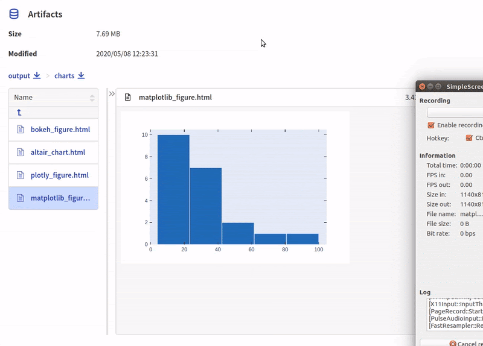

Interactive chart will appear in the |artifacts| section, with path ``charts/my_figure.html`` (in the snippet above: ``charts/matplotlib-interactive.html``) where you can explore, open in full screen and download it.

|example-interactive-charts-matplotlib|

.. note::

    Check :ref:`images logging <logging-experiment-data-images-matplotlib>` to see how to log matplotlib figure as an image.

:ref:`back to top <what-you-can-log>`

.. _logging-experiment-data-interactive-charts-altair:

Altair
""""""
Log Altair chart as an interactive chart, by using :meth:`~neptunecontrib.api.chart.log_chart`.

.. code-block:: python3

    # Import altair and log_chart
    import altair as alt
    from neptunecontrib.api import log_chart

    # Generate figure
    alt_chart = alt.Chart(...)
    ...

    # Log figure to experiment
    log_chart(name='altair-interactive', chart=alt_chart)

Interactive chart will appear in the |artifacts| section, with path ``charts/my_figure.html`` (in the snippet above: ``charts/altair-interactive.html``) where you can explore, open in full screen and download it.

|example-interactive-charts-altair|

:ref:`back to top <what-you-can-log>`

.. _logging-experiment-data-interactive-charts-bokeh:

Bokeh
"""""
Log Bokeh chart as an interactive chart, by using :meth:`~neptunecontrib.api.chart.log_chart`.

.. code-block:: python3

    # Import bokeh and log_chart
    from bokeh.plotting import figure
    from neptunecontrib.api import log_chart

    # Generate figure
    bokeh_chart = figure(...)
    ...

    # Log figure to experiment
    log_chart(name='bokeh-interactive', chart=bokeh_chart)

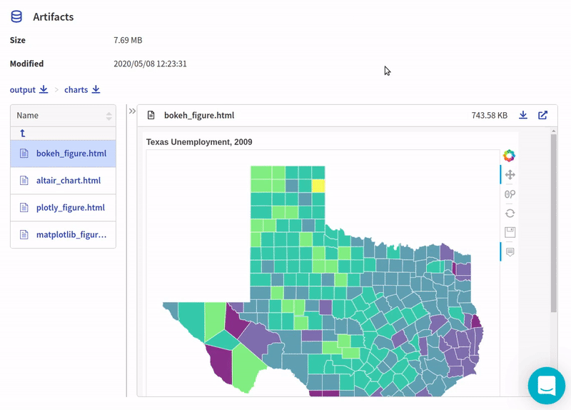

Interactive chart will appear in the |artifacts| section, with path ``charts/my_figure.html`` (in the snippet above: ``charts/bokeh-interactive.html``) where you can explore, open in full screen and download it.

|example-interactive-charts-bokeh|

:ref:`back to top <what-you-can-log>`

.. _logging-experiment-data-interactive-charts-plotly:

Plotly
""""""
Log plotly chart as an interactive chart, by using :meth:`~neptunecontrib.api.chart.log_chart`.

.. code-block:: python3

    # Import plotly and log_chart
    import plotly.express as px
    from neptunecontrib.api import log_chart

    # Generate figure
    plotly_fig = px.histogram(...)
    ...

    # Log figure to experiment
    log_chart(name='plotly-interactive', chart=plotly_fig)

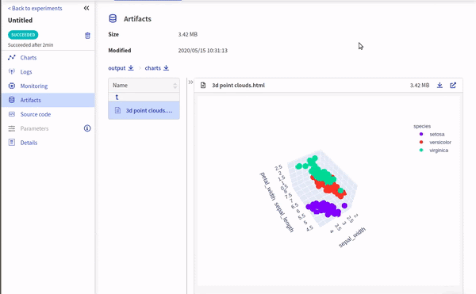

Interactive plotly chart will appear in the |artifacts| section, with path ``charts/my_figure.html`` (in the snippet above: ``charts/plotly-interactive.html``) where you can explore, open in full screen and download it.

|example-interactive-charts-plotly|

:ref:`back to top <what-you-can-log>`

.. _logging-experiment-data-text:

Text
^^^^
Log text information to the experiment by using :meth:`~neptune.experiments.Experiment.log_text`.

.. code-block:: python3

    neptune.log_text('my_text_data', 'text I keep track of, like query or tokenized word')

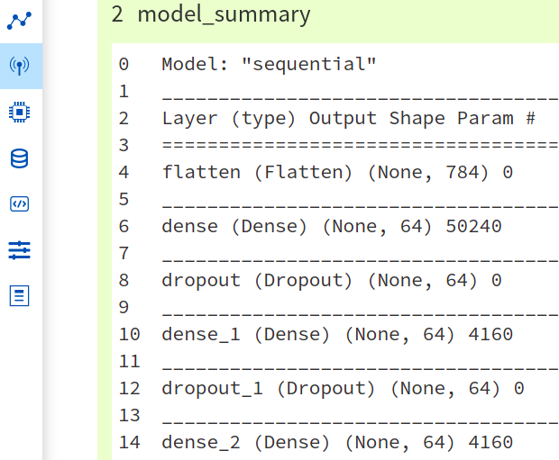

You will have it in the |logs| section of the experiment, where you can browse and download it.

|example-text|

.. note::

    Single line of text log is limited to 1k characters. At the same time number of lines is not limited.

:ref:`back to top <what-you-can-log>`

.. _logging-experiment-data-hardware-consumption:

Hardware consumption
^^^^^^^^^^^^^^^^^^^^
Automatically monitor hardware utilization for your experiments:

* CPU (average of all cores),
* memory,
* for each GPU unit - memory usage and utilization.

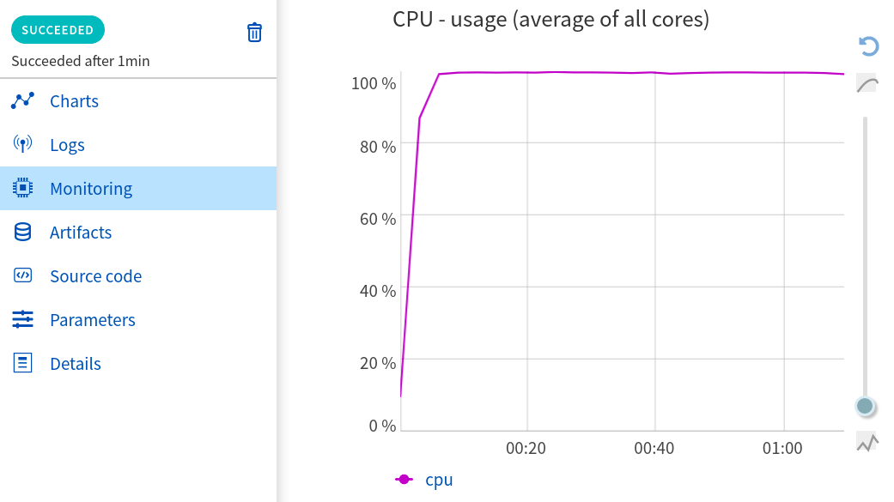

All that information is visualized in the |monitoring| section. You can turn off this feature when you :meth:`~neptune.projects.Project.create_experiment`.

.. code-block::

    # Turn off hardware monitoring
    neptune.create_experiment(send_hardware_metrics=False)

As a result hardware consumption is not being tracked.

|example-hardware-consumption|

.. note::

    To enable this feature you need to install ``psutil``. Check our :ref:`installation guide <installation-neptune-client>` for more info. It will take like 1 minute to install.

:ref:`back to top <what-you-can-log>`

.. _logging-experiment-data-experiment-information:

Experiment information
^^^^^^^^^^^^^^^^^^^^^^
To better describe an experiment you can use 'name', 'description' and 'tags'.

:ref:`back to top <what-you-can-log>`

.. _logging-experiment-data-experiment-information-name:

Experiment name
"""""""""""""""
You can add name to the experiment when you :meth:`~neptune.projects.Project.create_experiment`. Try to keep it short and descriptive.

.. code-block:: python3

    neptune.create_experiment(name='Mask R-CNN with data-v2')

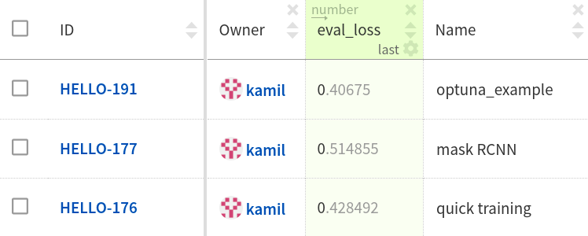

Experiment name appears in the |details| section and can be displayed as a column on the |experiment-dashboard|.

You can edit 'name' directly in the UI.

|example-information-name|

.. note::

    You can search for an experiment by it's name. Here is how: :ref:`Searching and filtering experiments <searching-and-filtering-experiments>`.

:ref:`back to top <what-you-can-log>`

.. _logging-experiment-data-experiment-information-description:

Experiment description
""""""""""""""""""""""
You can add longer note to the experiment when you :meth:`~neptune.projects.Project.create_experiment`.

.. code-block:: python3

    neptune.create_experiment(description='neural net trained on Fashion-MNIST with high LR and low dropout')

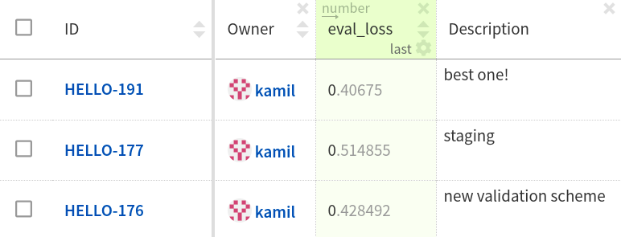

Experiment description appears in the |details| section and can be displayed as a column on the |experiment-dashboard|.

You can edit 'description' directly in the UI.

|example-information-description|

.. note::

    You can use info in the description to later search for an experiment in the UI. Here is how: :ref:`Searching and filtering experiments <searching-and-filtering-experiments>`.

:ref:`back to top <what-you-can-log>`

.. _logging-experiment-data-experiment-information-tags:

Experiment tags
"""""""""""""""
You can add tags to the experiment when you :meth:`~neptune.projects.Project.create_experiment` or during an experiment using :meth:`~neptune.experiments.Experiment.append_tag`.

.. code-block:: python3

    # Add tags at the beginning
    neptune.create_experiment(tags=['classification', 'pytorch', 'prod_v2.0.1'])

    # Append new tag during experiment (it must be running)
    neptune.append_tag('new-tag')

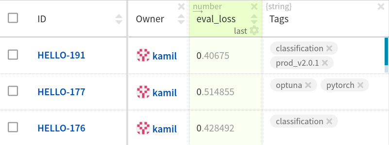

Tags are convenient way to organize or group experiments. They appear in the |details| section and can be displayed as a column on the |experiment-dashboard|. Tags are editable in the UI.

You can easily remove tags programmatically if you wish using :meth:`~neptune.experiments.Experiment.remove_tag`

.. code-block:: python3

    # Assuming experiment has tags: `['tag-1', 'tag-2']`.
    experiment.remove_tag('tag-1')

|example-information-tags|

.. note::

    You can quickly filter by tag by clicking on it in the experiments dashboard. Check :ref:`Searching and filtering experiments <searching-and-filtering-experiments>` guide for more options.

:ref:`back to top <what-you-can-log>`

.. _logging-experiment-data-properties:

Properties
^^^^^^^^^^
Log ``'key': 'value'`` pairs to the experiment. Those could be data versions, URL or path to the model on your filesystem, or anything else that fit the generic ``'key': 'value'`` scheme.

You can do it when you :meth:`~neptune.projects.Project.create_experiment`:

.. code-block:: python3

    # Pass Python dictionary
    neptune.create_experiment(properties={'data_version': 'fd5c084c-ff7c',
                                          'model_id': 'a44521d0-0fb8'})

Another option is to add property during an experiment (it must be running), by using :meth:`~neptune.experiments.Experiment.set_property`.

.. code-block:: python3

    # Single key-value pair at a time
    neptune.set_property('model_id', 'a44521d0-0fb8')

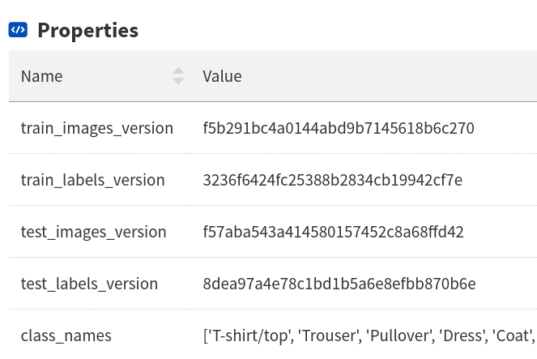

What distinguishes them from :ref:`parameters <logging-experiment-data-parameters>` is that they are editable after experiment is created.

They appear in the |details| section and can be displayed as a column on the |experiment-dashboard|.

|example-properties|

.. note::

    You can :meth:`~neptune.experiments.Experiment.remove_property` programmatically.

:ref:`back to top <what-you-can-log>`

.. _logging-experiment-data-data-versions:

Data versions
^^^^^^^^^^^^^
Log data version or dataset hash to Neptune as a :ref:`property <logging-experiment-data-properties>`.

.. code-block:: python3

    # Prepare dataset
    (train_images, train_labels), (test_images, test_labels) = tf.keras.datasets.fashion_mnist.load_data()
    train_images = train_images / 255.0
    test_images = test_images / 255.0

    # Log data version as experiment property
    neptune.set_property('train_images_version', hashlib.md5(train_images).hexdigest())
    neptune.set_property('test_images_version', hashlib.md5(test_images).hexdigest())

In this way you can keep track on what data given model was trained. Data version will appear in the |details| section and can be displayed as a column on the |experiment-dashboard|.

You can also use :meth`~neptunecontrib.versioning.data.log_data_version` to log data version from filepath:

.. code-block:: python3

    from neptunecontrib.versioning.data import log_data_version

    FILEPATH = '/path/to/data/my_data.csv'
    neptune.create_experiment()
    log_data_version(FILEPATH)

If your data is on AWS S3, use :meth:`~neptunecontrib.versioning.data.log_s3_data_version` to log data version of S3 bucket to Neptune:

.. code-block:: python3

    from neptunecontrib.versioning.data import log_s3_data_version

    BUCKET = 'my-bucket'
    PATH = 'train_dir/'
    neptune.create_experiment()
    log_s3_data_version(BUCKET, PATH)

|example-data-versions|

:ref:`back to top <what-you-can-log>`

.. _logging-experiment-data-files:

Files
^^^^^
Log any file you want, by using :meth:`~neptune.experiments.Experiment.log_artifact`. This include model_checkpoint, csv, binaries, or anything else.

.. code-block:: python3

    # Log file
    neptune.log_artifact('/data/auxiliary-data.zip')

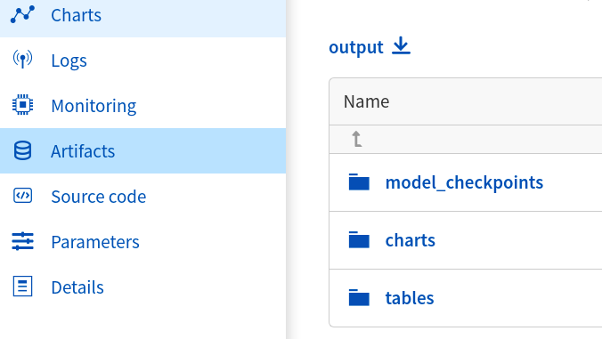

You can browse and download files in the |artifacts| section of the experiment.

|example-files|

.. note::

    Keep an eye on your artifacts as they may consume a lot of storage. You can always remove some by using :meth:`~neptune.experiments.Experiment.delete_artifacts`.

:ref:`back to top <what-you-can-log>`

.. _logging-experiment-data-files-model-checkpoints:

Model checkpoints
"""""""""""""""""
Log model checkpoints as artifacts, using :meth:`~neptune.experiments.Experiment.log_artifact`.

.. code-block:: python3

    # Log PyTorch model weights
    my_model = ...
    torch.save(my_model, 'my_model.pt')
    neptune.log_artifact('my_model.pt', 'model_checkpoints/my_model.pt')

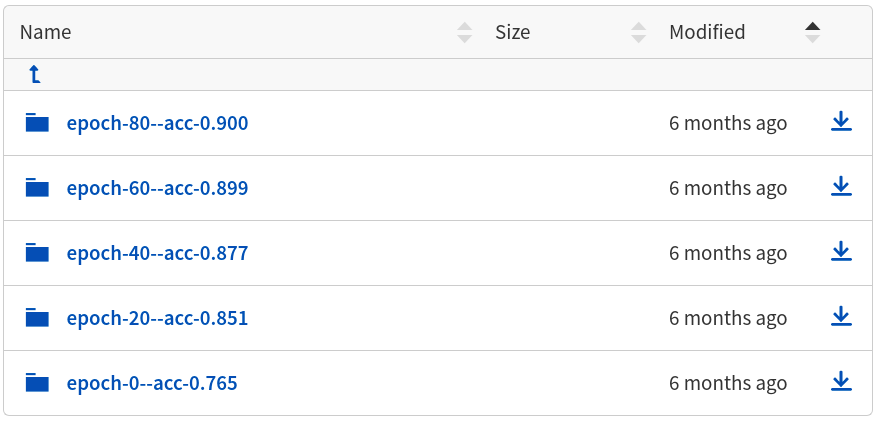

This technique lets you save model from any deep learning framework. Model checkpoint will appear in the |artifacts| section in the 'model_checkpoints' directory: |model-checkpoint|.

|example-model-checkpoints|

:ref:`back to top <what-you-can-log>`

.. _logging-experiment-data-files-html-objects:

HTML objects
""""""""""""
Log HTML files, using :meth:`~neptunecontrib.api.html.log_html`.

.. code-block:: python3

    # Import from neptune contrib
    from neptunecontrib.api import log_html

    # Log HTML to experiment
    # html is a valid HTML string
    html = str(...)
    log_html('go_to_docs_button', html)

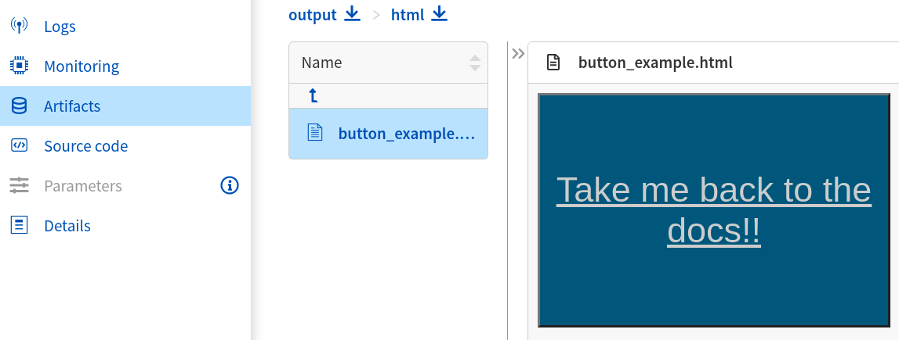

HTML will appear in the |artifacts| section, with path ``html/my_file.html``. They are interactive in Neptune.

|example-html-objects|

:ref:`back to top <what-you-can-log>`

.. _logging-experiment-data-video:

Video
^^^^^
Log video files and watch them right in the artifacts section of the experiment. Use :meth:`~neptunecontrib.api.video.log_video` to do it.

.. code-block:: python3

    # Import log_video
    from neptunecontrib.api.video import log_video

    # Log video file from disk
    log_video('/path/to/video-file.mp4')

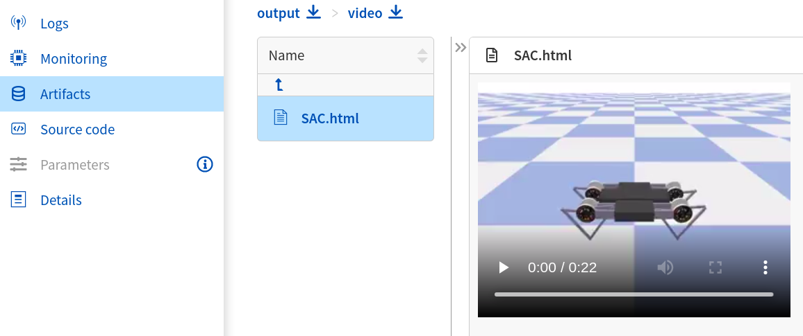

As a result, video player is rendered in the artifacts section under path ``video/my_video.html`` (in the snippet above: ``video/video-file.html``) where you can watch, open in full screen and download it.

|example-video|

:ref:`back to top <what-you-can-log>`

.. _logging-experiment-data-audio:

Audio
^^^^^
Log audio files and listen to them directly from the artifacts section of the experiment. Use :meth:`~neptunecontrib.api.audio.log_audio` to do it.

.. code-block:: python3

    # Import log_audio
    from neptunecontrib.api.audio import log_audio

    # Log audio file from disk
    log_audio('/path/to/audio-file.mp3')

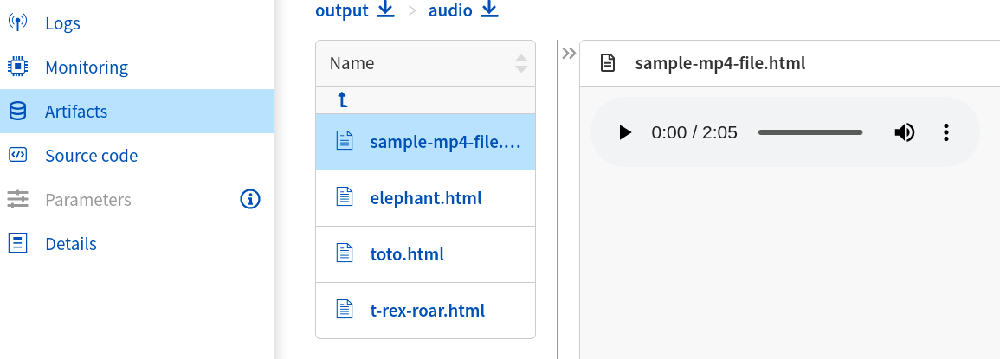

As a result, player is rendered in the artifacts section under path ``audio/my_audio.html`` (in the snippet above: ``audio/audio-file.html``) where you can listen to and download it.

|example-audio|

:ref:`back to top <what-you-can-log>`

.. _logging-experiment-data-tables:

Tables
^^^^^^
When you log tabular data, such as csv or DataFrame, Neptune will display it as table automatically.

* :ref:`pandas DataFrame <logging-experiment-data-pandas>`
* :ref:`csv file <logging-experiment-data-csv>`

:ref:`back to top <what-you-can-log>`

.. _logging-experiment-data-pandas:

pandas
""""""
Log pandas DataFrame and have it visualized as table. Use :meth:`~neptunecontrib.api.table.log_table` to do it.

.. code-block:: python3

    # Import log_table
    from neptunecontrib.api.table import log_table

    # Create pandas DataFrame
    df = pd.DataFrame(..)
    ...

    # Log DataFrame
    log_table('dataframe-in-experiment', df)

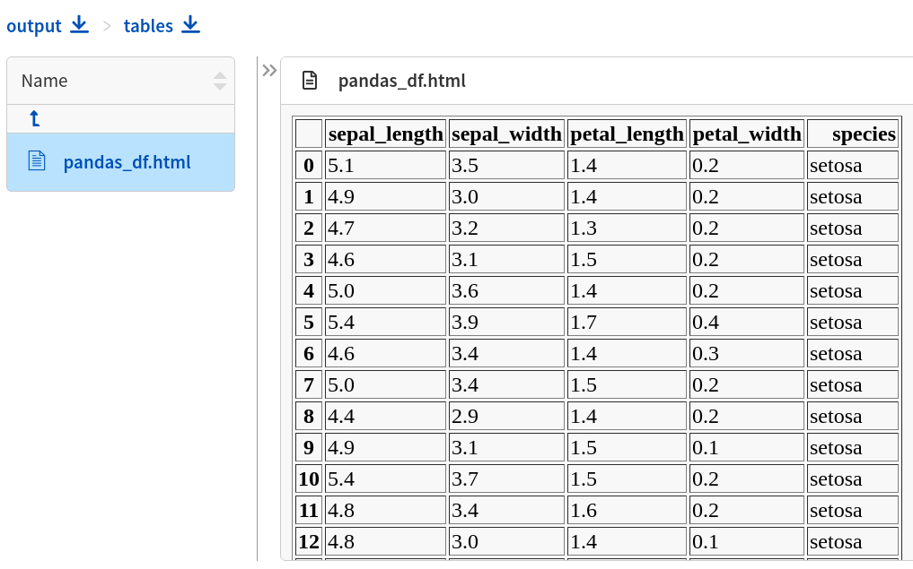

DataFrame is displayed in the |artifacts| section under path ``tables/my_dataframe.html`` (in the snippet above: ``tables/dataframe-in-experiment.html``) where you can inspect entries and download data.

|example-pandas|

:ref:`back to top <what-you-can-log>`

.. _logging-experiment-data-csv:

csv
"""
Log *csv* files and have them visualized as table. Use :meth:`~neptune.experiments.Experiment.log_artifact` to do it.

.. code-block:: python3

    # Log csv file
    neptune.log_artifact('/path/to/test_preds.csv')

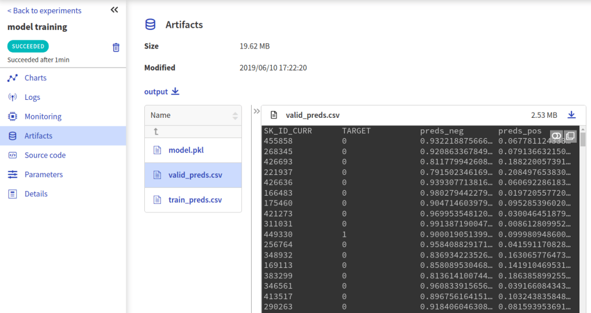

Table rendered from the csv data is displayed in the artifacts section where you can inspect entries and download data.

|example-csv|

:ref:`back to top <what-you-can-log>`

.. _logging-experiment-data-python-objects:

Python objects
^^^^^^^^^^^^^^
Some Python objects are handled automatically.

* :ref:`Pickled object <logging-experiment-data-python-pickle>`
* :ref:`DALEX Explainers <logging-experiment-data-python-objects-dalex>`

:ref:`back to top <what-you-can-log>`

.. _logging-experiment-data-python-pickle:

Pickled object
""""""""""""""
You can log pickled Python object, by using :meth:`~neptunecontrib.api.utils.log_pickle`. It gets an object, pickle it and log to Neptune as file.

Log pickled random forest:

.. code-block:: python3

    from neptunecontrib.api import log_pickle

    RandomForest = ...
    log_pickle('rf.pkl', RandomForest)

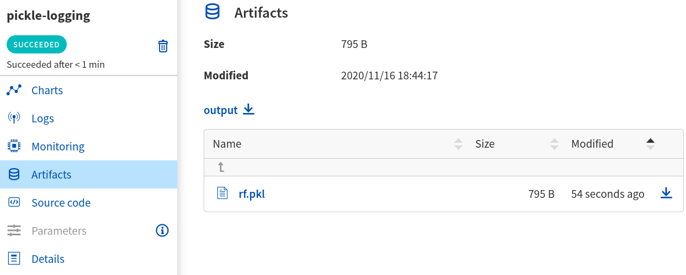

.. note::

    You can download picked file as Python object using :meth:`~neptunecontrib.api.utils.get_pickle`.

:ref:`back to top <what-you-can-log>`

.. _logging-experiment-data-python-objects-dalex:

Explainers (DALEX)
""""""""""""""""""
Log |dalex| explainer to Neptune and inspect them interactively. Use :meth:`~neptunecontrib.api.explainers.log_explainer` to do it.

.. code-block:: python3

    # Import dalex explainer
    neptunecontrib.api.explainers import log_explainer

    # Train your model
    clf = ...
    X = ...
    y = ...

    clf.fit(X, y)

    # Create dalex explainer
    expl = dx.Explainer(clf, X, y, label="Titanic MLP Pipeline")

    # Log explainer
    log_explainer('explainer.pkl', expl)

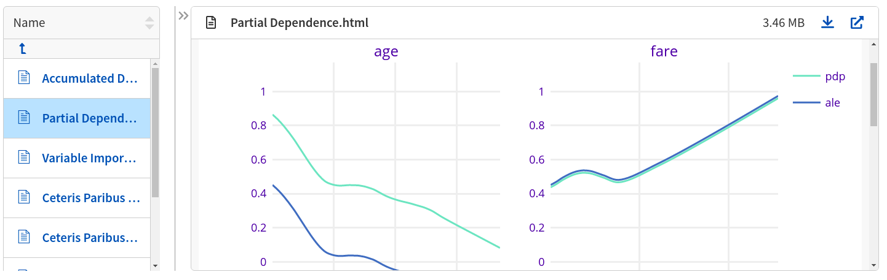

As a result, pickled explainer and charts will be available in the artifacts section of the experiment.

|example-python-objects-dalex|

:ref:`back to top <what-you-can-log>`

-----

.. _logging-with-integrations:

Logging with integrations
-------------------------
Besides logging using Neptune Python library, you can also use integrations that let you log relevant data with almost no code changes. Have a look at :ref:`Integrations page <integrations-index>` for more information or find your favourite library in one of the following categories:

* :ref:`Deep learning frameworks <integrations-deep-learning-frameworks>`
* :ref:`Machine learning frameworks <integrations-machine-learning-frameworks>`
* :ref:`Hyperparameter optimization libraries <integrations-hyperparameter-optimization-frameworks>`
* :ref:`Visualization libraries <integrations-visualization-tools>`
* :ref:`Experiment tracking frameworks <integrations-experiment-tracking-frameworks>`
* :ref:`Other integrations <integrations-other-integrations>`

.. _logging-advanced:

-----

Advanced
--------

.. _logging-advanced-using-experiment-object-explicitly:

Using Project and Experiment objects explicitly
^^^^^^^^^^^^^^^^^^^^^^^^^^^^^^^^^^^^^^^^^^^^^^^
[loom-placeholder]

If you work with large codebase, you may want to switch from using global ``neptune`` calls like ``neptune.create_experiment()`` or ``neptune.log_metric()`` to passing objects around, either :class:`~neptune.projects.Project` or :class:`~neptune.experiments.Experiment`.

Let's revisit minimal code snippet from the :ref:`basics section <basics-of-logging>`. Modify it to use :class:`~neptune.projects.Project` and :class:`~neptune.experiments.Experiment` objects and log a bit more data.

.. code-block:: python3

    # Import libraries
    import neptune
    from neptunecontrib.api.table import log_table

    # Set project
    project = neptune.init('my_workspace/my_project')

    # Use 'project' to create experiment
    my_exp = project.create_experiment(name='minimal-example-exp-proj',
                                       tags=['do-not-remove'])

    # Log using my_exp
    my_exp.log_metric(...)
    my_exp.log_image(...)
    my_exp.log_text(...)

    # Logging with neptunecontrib methods is a bit different
    df = ...
    fig = ...
    log_table(name='pandas_df', table=df, experiment=my_exp)
    log_chart('matplotlib-interactive', fig, my_exp)

**Few explanations**

* Use instance of the :class:`~neptune.projects.Project` object returned by the :meth:`~neptune.init` to create new experiment.
* Next, :meth:`~neptune.projects.Project.create_experiment` returns :class:`~neptune.experiments.Experiment` object that we use for logging purposes.
* Notice that logging with neptunecontrib :mod:`~neptunecontrib.api` is slightly different as you pass :class:`~neptune.experiments.Experiment` object as an argument.

|example-advanced-exp-object|

.. _logging-advanced-pass-experiment-object-around:

Pass Experiment object around to log from multiple Python files
^^^^^^^^^^^^^^^^^^^^^^^^^^^^^^^^^^^^^^^^^^^^^^^^^^^^^^^^^^^^^^^
[loom-placeholder]

You can pass :class:`~neptune.experiments.Experiment` object around and use it to populate functions' parameters and perform logging from multiple Python files.

Let's create a recipe for that:

**main.py**

.. code-block:: python3

    import neptune
    from utils import log_images_epoch, log_preds_as_table

    # Set project
    project = neptune.init('my_workspace/my_project')

    # Create experiment
    my_exp = project.create_experiment(...)

    # Log metrics in the same file
    my_exp.log_metric('acc', 0.95)
    my_exp.log_metric('acc', 0.99)

    # Log by using imported function, pass 'my_exp'
    log_images_epoch(experiment=my_exp)
    log_preds_as_table(experiment=my_exp)

**utils.py**

.. code-block:: python3

    from neptunecontrib.api.table import log_table

    # 'experiment' is an instance of the Experiment object
    def log_images_epoch(experiment):
        image1 = ...
        image2 = ...

        experiment.log_image('PIL-image', image1)
        experiment.log_image('NumPy-image', image2)

    # 'experiment' is an instance of the Experiment object
    def log_preds_as_table(experiment):
        preds_df = ...

        log_table(name='test_preds_df', table=preds_df, experiment=experiment)

In this way you can work with larger codebase and use logging from multiple Python files.

|example-advanced-pass-exp-object|

.. _logging-advanced-logging-to-multiple-experiments:

Logging to multiple experiments in one script
^^^^^^^^^^^^^^^^^^^^^^^^^^^^^^^^^^^^^^^^^^^^^
[loom-placeholder]

You can freely create multiple experiments in the single script and log to them separately. General recipe is very straightforward, as you simply create multiple :class:`~neptune.experiments.Experiment` objects - one for each experiment.

Create three experiments and log metric to each separately:

.. code-block:: python3

    import neptune

    # Set project
    project = neptune.init('my_workspace/my_project')

    # Create three experiments
    my_exp1 = project.create_experiment(name='1st')
    my_exp2 = project.create_experiment(name='2nd')
    my_exp3 = project.create_experiment(name='3rd')

    # Log metric to my_exp1
    for batch in data:
        loss = ...
        my_exp1.log_metric('mean_squared_error', loss)

    for batch in data:
        loss = ...
        my_exp2.log_metric('mean_squared_error', loss)

    for batch in data:
        loss = ...
        my_exp3.log_metric('mean_squared_error', loss)

    neptune.log_text('info', 'This goes to the most recently created experiment, here "my_exp3".')

Few remarks:

* We log MSE, by using the ``my_exp1``, ``my_exp2`` and ``my_exp3``. In this way you can log to many experiments from the same Python script.
* If you use global call ``neptune.log_X()``, then you only log to the most recently created experiment.

.. note::

    Organize experiments by adding :ref:`tags <logging-experiment-data-experiment-information-tags>` or short :ref:`name <logging-experiment-data-experiment-information-name>`.

|example-advanced-logging-to-multiple-experiments|

.. External links

.. |experiment-dashboard| raw:: html

    <a href="https://ui.neptune.ai/o/USERNAME/org/example-project/experiments?viewId=b845e2e9-0369-41da-954e-3f936e81c192" target="_blank">experiment dashboard</a>

.. |model-checkpoint| raw:: html

    <a href="https://ui.neptune.ai/o/USERNAME/org/example-project/e/HELLO-325/artifacts?path=model_checkpoints%2F" target="_blank">example checkpoints</a>

.. |charts| raw:: html

    <a href="https://ui.neptune.ai/o/USERNAME/org/example-project/e/HELLO-325/charts" target="_blank">charts</a>

.. |logs| raw:: html

    <a href="https://ui.neptune.ai/o/USERNAME/org/example-project/e/HELLO-325/logs" target="_blank">logs</a>

.. |parameters| raw:: html

    <a href="https://ui.neptune.ai/o/USERNAME/org/example-project/e/HELLO-325/parameters" target="_blank">parameters</a>

.. |details| raw:: html

    <a href="https://ui.neptune.ai/o/USERNAME/org/example-project/e/HELLO-325/details" target="_blank">details</a>

.. |source-code| raw:: html

    <a href="https://ui.neptune.ai/o/USERNAME/org/example-project/e/HELLO-325/source-code" target="_blank">source code</a>

.. |monitoring| raw:: html

    <a href="https://ui.neptune.ai/o/USERNAME/org/example-project/e/HELLO-325/monitoring" target="_blank">monitoring</a>

.. |artifacts| raw:: html

    <a href="https://ui.neptune.ai/o/USERNAME/org/example-project/e/HELLO-325/artifacts" target="_blank">artifacts</a>

.. |streamplot| raw:: html

    <a href="https://ui.neptune.ai/o/shared/org/showroom/e/SHOW-2027/logs" target="_blank">logs</a>

.. |matplotlib-fig-object| raw:: html

    <a href="https://matplotlib.org/3.1.1/api/_as_gen/matplotlib.figure.Figure.html#matplotlib-figure-figure" target="_blank">matplotlib.figure.Figure</a>

.. |dalex| raw:: html

    <a href="https://modeloriented.github.io/DALEX/" target="_blank">Dalex</a>

.. |plotly-installation-guide| raw:: html

    <a href="https://plotly.com/python/getting-started/#installation" target="_blank">plotly installation guide</a>

.. Buttons

.. |example-metrics| raw:: html

    

        <button><a target="_blank"
                   href="https://ui.neptune.ai/o/USERNAME/org/example-project/e/HELLO-325/logs">See example in Neptune</a>
        </button>
    

.. |example-parameters| raw:: html

    

        <button><a target="_blank"
                   href="https://ui.neptune.ai/o/USERNAME/org/example-project/e/HELLO-325/parameters">See example in Neptune</a>
        </button>
    

.. |example-code-git| raw:: html

    

        <button><a target="_blank"
                   href="https://ui.neptune.ai/o/USERNAME/org/example-project/e/HELLO-325/details">See example in Neptune</a>
        </button>
    

.. |example-code-snapshot| raw:: html

    

        <button><a target="_blank"
                   href="https://ui.neptune.ai/o/USERNAME/org/example-project/e/HELLO-325/source-code">See example in Neptune</a>
        </button>
    

.. |example-notebook-snapshot| raw:: html

    

        <button><a target="_blank"
                   href="https://ui.neptune.ai/USERNAME/example-project/n/analysis-of-top-70-experiments-final-final-82bf08ed-c442-4d62-8f41-bc39fcc6c272/d1d4ad24-25f5-4286-974c-c0b08450d5e1">See example in Neptune</a>
        </button>
    

.. |example-text| raw:: html

    

        <button><a target="_blank"
                   href="https://ui.neptune.ai/o/USERNAME/org/example-project/e/HELLO-325/logs">See example in Neptune</a>
        </button>
    

.. |example-hardware-consumption| raw:: html

    

        <button><a target="_blank"
                   href="https://ui.neptune.ai/o/USERNAME/org/example-project/e/HELLO-325/monitoring">See example in Neptune</a>
        </button>
    

.. |example-information-name| raw:: html

    

        <button><a target="_blank"
                   href="https://ui.neptune.ai/o/USERNAME/org/example-project/e/HELLO-325/details">See example in Neptune</a>
        </button>
    

.. |example-information-description| raw:: html

    

        <button><a target="_blank"
                   href="https://ui.neptune.ai/o/USERNAME/org/example-project/e/HELLO-325/details">See example in Neptune</a>
        </button>
    

.. |example-information-tags| raw:: html

    

        <button><a target="_blank"
                   href="https://ui.neptune.ai/o/USERNAME/org/example-project/experiments?viewId=6013ecbc-416d-4e5c-973e-871e5e9010e9">See example in Neptune</a>
        </button>
    

.. |example-properties| raw:: html

    

        <button><a target="_blank"
                   href="https://ui.neptune.ai/o/USERNAME/org/example-project/e/HELLO-325/details">See example in Neptune</a>
        </button>
    

.. |example-data-versions| raw:: html

    

        <button><a target="_blank"
                   href="https://ui.neptune.ai/o/USERNAME/org/example-project/e/HELLO-325/details">See example in Neptune</a>
        </button>
    

.. |example-files| raw:: html

    

        <button><a target="_blank"
                   href="https://ui.neptune.ai/o/USERNAME/org/example-project/e/HELLO-325/artifacts">See example in Neptune</a>
        </button>
    

.. |example-model-checkpoints| raw:: html

    

        <button><a target="_blank"
                   href="https://ui.neptune.ai/o/USERNAME/org/example-project/e/HELLO-325/artifacts?path=model_checkpoints%2F">See example in Neptune</a>
        </button>
    

.. |example-html-objects| raw:: html

    

        <button><a target="_blank"
                   href="https://ui.neptune.ai/o/shared/org/showroom/e/SHOW-988/artifacts?path=html%2F&file=button_example.html">
                See example in Neptune</a>
        </button>
    

.. |example-images| raw:: html

    

        <button><a target="_blank"
                   href="https://ui.neptune.ai/o/USERNAME/org/example-project/e/HELLO-325/logs">See example in Neptune</a>
        </button>
    

.. |example-images-matplotlib| raw:: html

    

        <button><a target="_blank"
                   href="https://ui.neptune.ai/o/shared/org/showroom/e/SHOW-2027/logs">See example in Neptune</a>
        </button>
    

.. |example-images-pil| raw:: html

    

        <button><a target="_blank"
                   href="https://ui.neptune.ai/o/shared/org/showroom/e/SHOW-2038/logs">See example in Neptune</a>
        </button>
    

.. |example-images-numpy| raw:: html

    

        <button><a target="_blank"
                   href="https://ui.neptune.ai/o/shared/org/showroom/e/SHOW-2039/logs">See example in Neptune</a>
        </button>
    

.. |example-interactive-charts| raw:: html

    

        <button><a target="_blank"
                   href="https://ui.neptune.ai/o/USERNAME/org/example-project/e/HELLO-325/artifacts?path=charts%2F&file=altair_chart.html">
                See example in Neptune</a>
        </button>
    

.. |example-interactive-charts-matplotlib| raw:: html

    

        <button><a target="_blank"
                   href="https://ui.neptune.ai/o/USERNAME/org/example-project/e/HELLO-325/artifacts?path=charts%2F&file=matplotlib_figure.html">
                See example in Neptune</a>
        </button>
    

.. |example-interactive-charts-altair| raw:: html

    

        <button><a target="_blank"
                   href="https://ui.neptune.ai/o/USERNAME/org/example-project/e/HELLO-325/artifacts?path=charts%2F&file=altair_chart.html">
                See example in Neptune</a>
        </button>
    

.. |example-interactive-charts-bokeh| raw:: html

    

        <button><a target="_blank"
                   href="https://ui.neptune.ai/o/USERNAME/org/example-project/e/HELLO-325/artifacts?path=charts%2F&file=bokeh_figure.html">
                See example in Neptune</a>
        </button>
    

.. |example-interactive-charts-plotly| raw:: html

    

        <button><a target="_blank"
                   href="https://ui.neptune.ai/o/USERNAME/org/example-project/e/HELLO-325/artifacts?path=charts%2F&file=plotly_figure.html">
                See example in Neptune</a>
        </button>
    

.. |example-video| raw:: html

    

        <button><a target="_blank"
                   href="https://ui.neptune.ai/o/shared/org/showroom/e/SHOW-1635/artifacts?path=video%2F&file=SAC.html">
                See example in Neptune</a>
        </button>
    

.. |example-audio| raw:: html

    

        <button><a target="_blank"
                   href="https://ui.neptune.ai/o/shared/org/showroom/e/SHOW-1485/artifacts?path=audio%2F&file=sample-mp4-file.html">
                See example in Neptune</a>
        </button>
    

.. |example-pandas| raw:: html

    

        <button><a target="_blank"
                   href="https://ui.neptune.ai/o/USERNAME/org/example-project/e/HELLO-325/artifacts?path=tables%2F&file=pandas_df.html">
                See example in Neptune</a>
        </button>
    

.. |example-csv| raw:: html

    

        <button><a target="_blank"
                   href="https://ui.neptune.ai/o/shared/org/showroom/e/SHOW-2040/artifacts?file=iris.csv">
                See example in Neptune</a>
        </button>
    

.. |example-python-objects-dalex| raw:: html

    

        <button><a target="_blank"
                   href="https://ui.neptune.ai/o/shared/org/dalex-integration/e/DAL-48/artifacts">
                See example in Neptune</a>
        </button>
    

.. |example-advanced-exp-object| raw:: html

    

        <button><a target="_blank"
                   href="https://ui.neptune.ai/o/shared/org/showroom/e/SHOW-2043/source-code?path=.&file=minimal-exp-proj.py">
                See example in Neptune</a>
        </button>
    

.. |example-advanced-pass-exp-object| raw:: html

    

        <button><a target="_blank"
                   href="https://ui.neptune.ai/o/shared/org/showroom/e/SHOW-2045/source-code?path=.&file=main.py">
                See example in Neptune</a>
        </button>
    

.. |example-advanced-logging-to-multiple-experiments| raw:: html

    

        <button><a target="_blank"
                   href="https://ui.neptune.ai/o/shared/org/showroom/experiments?viewId=205bf909-6f8f-40f8-be64-aa19f61f9b3b">
                See example in Neptune</a>
        </button>
    

