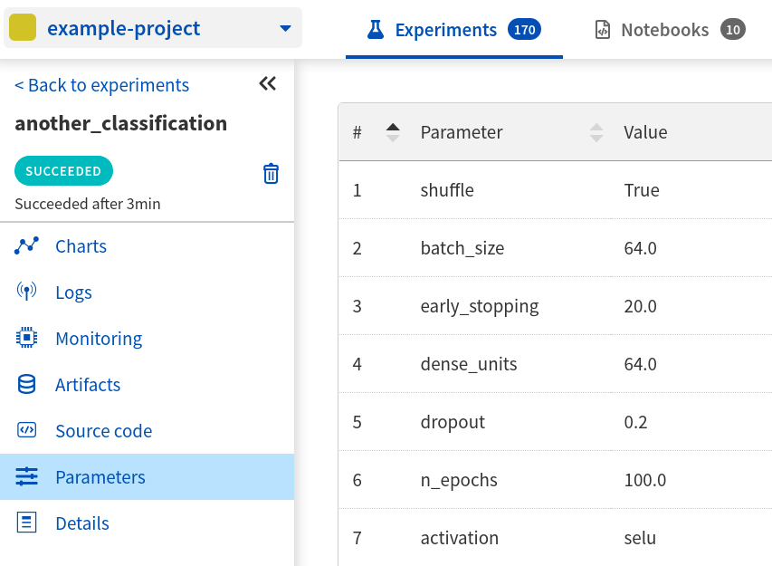
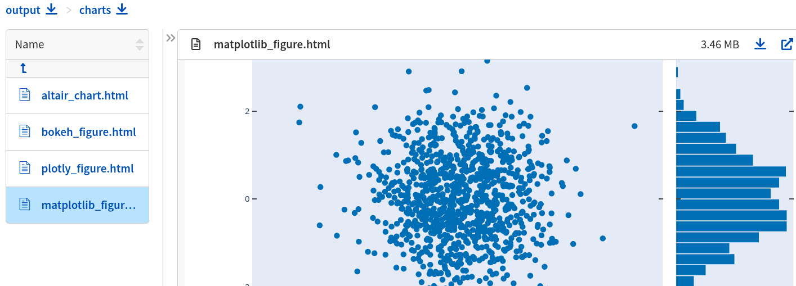

.. _guides-logging-data-to-neptune:

Logging experiment data
=======================
During machine learning experimentation, you need to keep track of many different types of (meta)-data. Neptune help you in this task by logging, keeping track of and visualizing experiment (meta)-data.

You can track many different types of (meta)-data to the experiment. It can be metric, loss, image, interactive visualization, model checkpoint, pandas DataFrame and many more. Simply check :ref:`what you can log <what-you-can-log>` section below for complete listing.

Basics of logging
-----------------
Logging experiments data to Neptune is simple and straightforward.

Minimal example
^^^^^^^^^^^^^^^
Let's create minimal code snippet that log single value to the experiment: 'acc'=0.95.

.. code-block:: python3

    import neptune

    neptune.init('my_workspace/my_project')
    neptune.create_experiment()

    # log 'acc' value 0.95
    neptune.log_metric('acc', 0.95)

Above snippet sets project, creates experiment and log one value to it. When script ends, the experiment is closed automatically. As a result you have new experiment with one value in one metric ('acc'=0.95).

Everything that is evaluated after ``neptune.create_experiment()`` and before the end of the script can be logged to the experiment.

**[loom-placeholder]**

.. _what-you-can-log:

What you can log
----------------
Neptune supports numerous types of data that you can log to the experiment. Here, you can find all of them listed and described.

.. note::

    Remember to set project using :meth:`~neptune.init` and :meth:`~neptune.projects.Project.create_experiment` before you start logging.

+----------------------------------------------------------------------------------------------+--------------------+
|                                       Data to log/track                                      | Video overview     |
+==============================================================================================+====================+
| :ref:`Metrics <logging-experiment-data-metrics>`                                             | [loom-placeholder] |
+----------------------------------------------------------------------------------------------+--------------------+
| :ref:`Parameters <logging-experiment-data-parameters>`                                       | [loom-placeholder] |
+----------------------------------------------------------------------------------------------+--------------------+
| :ref:`Code <logging-experiment-data-code>`                                                   | [loom-placeholder] |
|                                                                                              |                    |
| * :ref:`Git <logging-experiment-data-code-git>`                                              |                    |
| * :ref:`Code Snapshot <logging-experiment-data-code-code-snapshot>`                          |                    |
| * :ref:`Notebook Snapshot <logging-experiment-data-code-notebook-snapshot>`                  |                    |
+----------------------------------------------------------------------------------------------+--------------------+
| :ref:`Experiment information <logging-experiment-data-experiment-information>`               | [loom-placeholder] |
|                                                                                              |                    |
| * :ref:`Experiment name <logging-experiment-data-experiment-information-name>`               |                    |
| * :ref:`Experiment description <logging-experiment-data-experiment-information-description>` |                    |
| * :ref:`Experiment tags <logging-experiment-data-experiment-information-tags>`               |                    |
+----------------------------------------------------------------------------------------------+--------------------+
| :ref:`Hardware consumption <logging-experiment-data-hardware-consumption>`                   | [loom-placeholder] |
+----------------------------------------------------------------------------------------------+--------------------+
| :ref:`Text <logging-experiment-data-text>`                                                   | [loom-placeholder] |
+----------------------------------------------------------------------------------------------+--------------------+
| :ref:`Properties <logging-experiment-data-properties>`                                       | [loom-placeholder] |
+----------------------------------------------------------------------------------------------+--------------------+
| :ref:`Data versions <logging-experiment-data-data-versions>`                                 | [loom-placeholder] |
+----------------------------------------------------------------------------------------------+--------------------+
| :ref:`Files <logging-experiment-data-files>`                                                 | [loom-placeholder] |
|                                                                                              |                    |
| * :ref:`Model checkpoints <logging-experiment-data-files-model-checkpoints>`                 |                    |
| * :ref:`HTML objects <logging-experiment-data-files-html-objects>`                           |                    |
+----------------------------------------------------------------------------------------------+--------------------+
| :ref:`Images <logging-experiment-data-images>`                                               | [loom-placeholder] |
|                                                                                              |                    |
| * :ref:`Matplotlib <logging-experiment-data-images-matplotlib>`                              |                    |
| * :ref:`PIL <logging-experiment-data-images-pil>`                                            |                    |
| * :ref:`NumPy <logging-experiment-data-images-numpy>`                                        |                    |
+----------------------------------------------------------------------------------------------+--------------------+
| :ref:`Interactive charts <logging-experiment-data-interactive-charts>`                       | [loom-placeholder] |
|                                                                                              |                    |
| * :ref:`Matplotlib <logging-experiment-data-interactive-charts-matplotlib>`                  |                    |
| * :ref:`Altair <logging-experiment-data-interactive-charts-altair>`                          |                    |
| * :ref:`Bokeh <logging-experiment-data-interactive-charts-bokeh>`                            |                    |
| * :ref:`Plotly <logging-experiment-data-interactive-charts-plotly>`                          |                    |
+----------------------------------------------------------------------------------------------+--------------------+
| :ref:`Video <logging-experiment-data-images-video>`                                          | [loom-placeholder] |
|                                                                                              |                    |
| :ref:`Audio <logging-experiment-data-images-audio>`                                          |                    |
+----------------------------------------------------------------------------------------------+--------------------+
| :ref:`Tables <logging-experiment-data-images-tables>`                                        | [loom-placeholder] |
|                                                                                              |                    |
| * :ref:`pandas <logging-experiment-data-images-pandas>`                                      |                    |
| * :ref:`csv <logging-experiment-data-images-csv>`                                            |                    |
+----------------------------------------------------------------------------------------------+--------------------+
| :ref:`Python objects <logging-experiment-data-images-python-objects>`                        | [loom-placeholder] |
|                                                                                              |                    |
| * :ref:`Explainers (DALEX) <logging-experiment-data-images-python-objects-dalex>`            |                    |
+----------------------------------------------------------------------------------------------+--------------------+

.. _logging-experiment-data-metrics:

Metrics
^^^^^^^
.. image:: ../_static/images/integrations/lightning_adv_acc.png
   :target: ../_static/images/integrations/lightning_adv_acc.png
   :alt: Metrics visualized as line chart

Log metric to neptune using :meth:`~neptune.experiments.Experiment.log_metric`.

.. code-block:: python3

    # Single value
    neptune.log_metric('test_accuracy', 0.76)

    # Accuracy per epoch
    for epoch in range(epoch_nr):
        epoch_accuracy = ...
        neptune.log_metric('epoch_accuracy', epoch_accuracy)

Metric can be accuracy, MSE or any numerical value. All metrics are visualized as |charts| in the experiment. You can also check and download raw data from the |logs| section.

You can create as many metrics as you wish.

.. note::

    Organize your metrics into groups or display multiple curves on the single chart: :ref:`here is how <creating-custom-chart-sets>`.

.. note::

    Download metrics as pandas DataFrame for further analysis locally. Here is :ref:`how to do it <guides-download_data>`.

:ref:`back to list <what-you-can-log>`

.. _logging-experiment-data-parameters:

Parameters
^^^^^^^^^^

Define parameters as Python dictionary and pass to the :meth:`~neptune.projects.Project.create_experiment` method to log them.

.. code-block:: python3

    # Define parameters
    PARAMS = {'batch_size': 64,
              'dense_units': 128,
              'dropout': 0.2,
              'learning_rate': 0.001,
              'optimizer': 'Adam'}

    # Pass parameters to create experiment
    neptune.create_experiment(params=PARAMS)

You can use them later to analyse or compare experiments. They are displayed in the |parameters| section of the experiment. Moreover every parameter can be displayed as a column on the |experiment-dashboard| (look for green columns).

.. note::

    Experiment parameters are read-only. You cannot change or update them during or after the experiment.

:ref:`back to list <what-you-can-log>`

.. _logging-experiment-data-code:

Code
^^^^
You can version your code with Neptune. Few options in that regard are available.

:ref:`back to list <what-you-can-log>`

.. _logging-experiment-data-code-git:

Git
"""
.. image:: ../_static/images/logging-and-managing-experiment-results/logging-experiment-data/git.png
   :target: ../_static/images/logging-and-managing-experiment-results/logging-experiment-data/git.png
   :alt: Git summary in experiment

Neptune automatically discovers, if you start experiment from directory that is part of the git repo. Then, it creates summary in the |details| section with: commit information (id, message, author, date), branch, and remote address to your experiment.

:ref:`back to list <what-you-can-log>`

.. _logging-experiment-data-code-code-snapshot:

Code Snapshot
"""""""""""""
.. image:: ../_static/images/logging-and-managing-experiment-results/logging-experiment-data/source-code.png
   :target: ../_static/images/logging-and-managing-experiment-results/logging-experiment-data/source-code.png
   :alt: Source code snapshot

Snapshot code files or src folders when you :meth:`~neptune.projects.Project.create_experiment`. Pass list with filenames or regex strings or both.

.. code-block:: python3

    # Snapshot model.py and prep_data.py
    neptune.create_experiment(upload_source_files=['model.py', 'prep_data.py'])

    # Snapshot all python files and 'config.yaml' file
    neptune.create_experiment(upload_source_files=['*.py', 'config.yaml'])

You will have all sources in the |source-code| section of the experiment. Neptune also logs the entrypoint file so that you have all the information about the run sources.

.. note::

    Specify particular files (i.e. 'my_model.py') or use regex to capture many files at once (i.e. `'*.py'`).

:ref:`back to list <what-you-can-log>`

.. _logging-experiment-data-code-notebook-snapshot:

Notebook Code Snapshot
""""""""""""""""""""""
.. image:: ../_static/images/logging-and-managing-experiment-results/logging-experiment-data/notebook-snapshot.png
   :target: ../_static/images/logging-and-managing-experiment-results/logging-experiment-data/notebook-snapshot.png
   :alt: Notebook code snapshot

You can save code developed in notebook. With that you can log entire notebook by clicking a button or let Neptune auto-snapshot your experiments whenever you create a new one inside notebook.

To get started, install :ref:`notebook extension <installation-notebook-extension>`, then go to the :ref:`Keeping track of Jupyter Notebooks <guides-keep-track-jupyter-notebooks>` guide that will explain everything.

:ref:`back to list <what-you-can-log>`

.. _logging-experiment-data-text:

Text
^^^^
.. image:: ../_static/images/logging-and-managing-experiment-results/logging-experiment-data/text.png
   :target: ../_static/images/logging-and-managing-experiment-results/logging-experiment-data/text.png
   :alt: Text log

Log text information to the experiment by using :meth:`~neptune.experiments.Experiment.log_text`.

.. code-block:: python3

    some_item = ...
    neptune.log_text('my_text_data', str(some_item))

You will have it in the |logs| section of the experiment, where you can browse and download it.

.. note::

    Single line of text log is limited to 1k characters. At the same time number of lines is not limited.

:ref:`back to list <what-you-can-log>`

.. _logging-experiment-data-hardware-consumption:

Hardware consumption
^^^^^^^^^^^^^^^^^^^^
.. image:: ../_static/images/logging-and-managing-experiment-results/logging-experiment-data/hardware-consumption.png
   :target: ../_static/images/logging-and-managing-experiment-results/logging-experiment-data/hardware-consumption.png
   :alt: Hardware consumption charts

Automatically monitor hardware utilization for your experiments. You can see the utilization of the CPU (average of all cores), memory and - for each GPU unit - memory usage and utilization. All that information is visualized in the |monitoring| section.

You can turn off this feature when you :meth:`~neptune.projects.Project.create_experiment`.

.. code-block::

    # Turn off hardware monitoring
    neptune.create_experiment(send_hardware_metrics=False)

As a result hardware consumption is not being tracked.

.. note::

    To enable this feature you need to install ``psutil``. Check our :ref:`installation guide <installation-neptune-client>` for more info. It will take like 1 minute to install.

:ref:`back to list <what-you-can-log>`

.. _logging-experiment-data-experiment-information:

Experiment information
^^^^^^^^^^^^^^^^^^^^^^
To better describe an experiment you can use 'name', 'description' and 'tags'.

:ref:`back to list <what-you-can-log>`

.. _logging-experiment-data-experiment-information-name:

Experiment name
"""""""""""""""
.. image:: ../_static/images/logging-and-managing-experiment-results/logging-experiment-data/exp-name.png
   :target: ../_static/images/logging-and-managing-experiment-results/logging-experiment-data/exp-name.png
   :alt: Experiment name

You can add name to the experiment when you :meth:`~neptune.projects.Project.create_experiment`. Try to keep it short and descriptive.

.. code-block:: python3

    neptune.create_experiment(name='Mask R-CNN with data-v2')

Experiment name appears in the |details| section and can be displayed as a column on the |experiment-dashboard|.

You can edit 'name' directly in the UI.

.. note::

    You can search for an experiment by it's name. Here is how: :ref:`Searching and filtering experiments <searching-and-filtering-experiments>`.

:ref:`back to list <what-you-can-log>`

.. _logging-experiment-data-experiment-information-description:

Experiment description
""""""""""""""""""""""
.. image:: ../_static/images/logging-and-managing-experiment-results/logging-experiment-data/exp-description.png
   :target: ../_static/images/logging-and-managing-experiment-results/logging-experiment-data/exp-description.png
   :alt: Experiment description

You can add longer note to the experiment when you :meth:`~neptune.projects.Project.create_experiment`.

.. code-block:: python3

    neptune.create_experiment(description='neural net trained on Fashion-MNIST with high LR and low dropout')

Experiment description appears in the |details| section and can be displayed as a column on the |experiment-dashboard|.

You can edit 'description' directly in the UI.

.. note::

    You can use info in the description to later search for an experiment in the UI. Here is how: :ref:`Searching and filtering experiments <searching-and-filtering-experiments>`.

:ref:`back to list <what-you-can-log>`

.. _logging-experiment-data-experiment-information-tags:

Experiment tags
"""""""""""""""
.. image:: ../_static/images/logging-and-managing-experiment-results/logging-experiment-data/exp-tags.png
   :target: ../_static/images/logging-and-managing-experiment-results/logging-experiment-data/exp-tags.png
   :alt: Experiment tags

You can add tags to the experiment when you :meth:`~neptune.projects.Project.create_experiment` or during an experiment using :meth:`~neptune.experiments.Experiment.append_tag`.

.. code-block:: python3

    # Add tags at the beginning
    neptune.create_experiment(tags=['classification', 'pytorch', 'prod_v2.0.1'])

    # Append new tag during experiment (it must be running)
    neptune.append_tag('new-tag')

Tags are convenient way to organize or group experiments. They appear in the |details| section and can be displayed as a column on the |experiment-dashboard|. Tags are editable in the UI.

You can easily remove tags programmatically if you wish using :meth:`~neptune.experiments.Experiment.remove_tag`

.. code-block:: python3

    # Assuming experiment has tags: `['tag-1', 'tag-2']`.
    experiment.remove_tag('tag-1')

.. note::

    You can quickly filter by tag by clicking on it in the experiments dashboard. Check :ref:`Searching and filtering experiments <searching-and-filtering-experiments>` guide for more options.

:ref:`back to list <what-you-can-log>`

.. _logging-experiment-data-properties:

Properties
^^^^^^^^^^
.. image:: ../_static/images/logging-and-managing-experiment-results/logging-experiment-data/properties.png
   :target: ../_static/images/logging-and-managing-experiment-results/logging-experiment-data/properties.png
   :alt: Experiment properties

Log ``'key': 'value'`` pairs to the experiment. You can do it either when you :meth:`~neptune.projects.Project.create_experiment` or during an experiment, by using :meth:`~neptune.experiments.Experiment.set_property`.

Those could be data versions, URL or path to the model on your filesystem, or anything else that fit the generic ``'key': 'value'`` scheme.

.. code-block:: python3

    # Add properties at the beginning
    # Pass Python dictionary
    neptune.create_experiment(properties={'data_version': 'fd5c084c-ff7c',
                                          'model_id': 'a44521d0-0fb8'})

    # Add property during experiment (it must be running)
    # Single key-value pair at a time
    neptune.set_property('model_id', 'a44521d0-0fb8')

What distinguishes them from :ref:`parameters <logging-experiment-data-parameters>` is that they are editable after experiment is created.

They appear in the |details| section and can be displayed as a column on the |experiment-dashboard|.

.. note::

    You can :meth:`~neptune.experiments.Experiment.remove_property` programmatically.

:ref:`back to list <what-you-can-log>`

.. _logging-experiment-data-data-versions:

Data versions
^^^^^^^^^^^^^
.. image:: ../_static/images/logging-and-managing-experiment-results/logging-experiment-data/properties.png
   :target: ../_static/images/logging-and-managing-experiment-results/logging-experiment-data/properties.png
   :alt: Experiment properties

Log data version or dataset hash to Neptune as a :ref:`property <logging-experiment-data-properties>`.

.. code-block:: python3

    # Prepare dataset
    (train_images, train_labels), (test_images, test_labels) = tf.keras.datasets.fashion_mnist.load_data()
    train_images = train_images / 255.0
    test_images = test_images / 255.0

    # Log data version as experiment property
    neptune.set_property('train_images_version', hashlib.md5(train_images).hexdigest())
    neptune.set_property('test_images_version', hashlib.md5(test_images).hexdigest())

In this way you can keep track on what data given model was trained. Data version will appear in the |details| section and can be displayed as a column on the |experiment-dashboard|.

:ref:`back to list <what-you-can-log>`

.. _logging-experiment-data-files:

Files
^^^^^
.. image:: ../_static/images/logging-and-managing-experiment-results/logging-experiment-data/files.png
   :target: ../_static/images/logging-and-managing-experiment-results/logging-experiment-data/files.png
   :alt: Experiment files

Log any file you want, by using :meth:`~neptune.experiments.Experiment.log_artifact`. This include model_checkpoint, csv, binaries, or anything else.

.. code-block:: python3

    # Log file
    neptune.log_artifact('/file/on/disk.any')

You can browse and download files in the |artifacts| section of the experiment.

.. note::

    Keep an eye on your artifacts as they may consume a lot of storage. You can always remove some by using :meth:`~neptune.experiments.Experiment.delete_artifacts`.

:ref:`back to list <what-you-can-log>`

.. _logging-experiment-data-files-model-checkpoints:

Model checkpoints
"""""""""""""""""
.. image:: ../_static/images/logging-and-managing-experiment-results/logging-experiment-data/model-checkpoints.png
   :target: ../_static/images/logging-and-managing-experiment-results/logging-experiment-data/model-checkpoints.png
   :alt: Model checkpoints in experiment

Log model checkpoints as artifacts, using :meth:`~neptune.experiments.Experiment.log_artifact`.

.. code-block:: python3

    # Log PyTorch model weights
    my_model = ...
    torch.save(my_model, 'my_model.pt')
    neptune.log_artifact('my_model.pt', 'model_checkpoints/my_model.pt')

This technique let you save model from any deep learning framework. Model checkpoint will appear in the |artifacts| section in the 'model_checkpoints' directory: |model-checkpoint|.

:ref:`back to list <what-you-can-log>`

.. _logging-experiment-data-files-html-objects:

HTML objects
""""""""""""
.. image:: ../_static/images/logging-and-managing-experiment-results/logging-experiment-data/html.png
   :target: ../_static/images/logging-and-managing-experiment-results/logging-experiment-data/html.png
   :alt: HTML logged to the experiment

Log HTML files, using :meth:`~neptunecontrib.api.html.log_html`.

.. code-block:: python3

    # Import from neptune contrib
    from neptunecontrib.api import log_html

    # Log HTML to experiment
    # html is a valid HTML string
    html = str(...)
    log_html('go_to_docs_button', html)

HTML will appear in the |artifacts| section, with path ``html/my_file.html``. They are interactive in Neptune.

Here is |html-example|.

:ref:`back to list <what-you-can-log>`

.. _logging-experiment-data-images:

Images
^^^^^^
.. image:: ../_static/images/logging-and-managing-experiment-results/logging-experiment-data/images.png
   :target: ../_static/images/logging-and-managing-experiment-results/logging-experiment-data/images.png
   :alt: Images in experiment

Log images to Neptune. You can log either single image or series of them, using :meth:`~neptune.experiments.Experiment.log_image`.

.. code-block:: python3

    # Log single image from disk
    neptune.log_image('bbox_images', 'pictures/image.png')

    # Log numpy array as a single image
    array = numpy.random.rand(300, 200, 3)*255
    neptune.log_image('fig', array)

    # Log series of images:
    for batch in test_data_loader:
        y_pred = ...
        y_true = ...
        image_class = ...
        misclassified_image = ...
        neptune.log_image('misclassified_images',
                          misclassified_image,
                          description='y_pred={}, y_true={}'.format(y_pred, y_true)

You will have images in the |logs| section of the experiment, where you can browse and download them.

.. note::

    Single image size limit is 15MB. If you work with larger files, you can log them using :meth:`~neptune.experiments.Experiment.log_artifact`. Check :ref:`Files section <logging-experiment-data-files>` for more info.

.. note::

    You can log unlimited number of images either in the single log or in the multiple image logs.

:ref:`back to list <what-you-can-log>`

.. _logging-experiment-data-images-matplotlib:

Matplotlib
""""""""""
.. image:: ../_static/images/logging-and-managing-experiment-results/logging-experiment-data/matplotlib-image.png
   :target: ../_static/images/logging-and-managing-experiment-results/logging-experiment-data/matplotlib-image.png
   :alt: Matplotlib as an image in experiment

Log Matplotlib figure (|matplotlib-fig-object|) as an image, by using :meth:`~neptune.experiments.Experiment.log_image`.

.. code-block:: python3

    # Import matplotlib
    import matplotlib.pyplot as plt

    # Generate figure
    fig = plt.figure(figsize=(7, 9))
    ...

    # Log figure to experiment
    neptune.log_image('matplotlib-fig', fig, image_name='streamplot')

You will have Matplotlib figure in the |streamplot| section of the experiment, where you can browse and download them.

.. note::

    Check :ref:`Interactive Matplotlib logging <logging-experiment-data-interactive-charts-matplotlib>` to see how to log the same matplotlib figure and have it turned interactive in Neptune.

:ref:`back to list <what-you-can-log>`

.. _logging-experiment-data-images-pil:

PIL
"""
[text]

:ref:`back to list <what-you-can-log>`

.. _logging-experiment-data-images-numpy:

NumPy
"""""
[text]

:ref:`back to list <what-you-can-log>`

.. _logging-experiment-data-interactive-charts:

Interactive charts
^^^^^^^^^^^^^^^^^^
[text]

:ref:`back to list <what-you-can-log>`

.. _logging-experiment-data-interactive-charts-matplotlib:

Matplotlib
""""""""""

Log Matplotlib figure (|matplotlib-fig-object|) as an interactive chart, by using :meth:`~neptunecontrib.api.chart.log_chart`.

.. code-block:: python3

    # Import matplotlib and log_chart
    import matplotlib.pyplot as plt
    from neptunecontrib.api import log_chart

    # Generate figure
    fig = plt.figure(figsize=(7, 9))
    ...

    # Log figure to experiment
    log_chart('matplotlib-interactive', fig)

Interactive chart will appear in the |artifacts| section, with path ``charts/my_figure.html`` where you can explore and download it.

Here is |matplotlib-interactive|.

.. note::

    Check :ref:`Matplotlib logging <logging-experiment-data-images-matplotlib>` to see how to log the same matplotlib figure as an image.

:ref:`back to list <what-you-can-log>`

.. _logging-experiment-data-interactive-charts-altair:

Altair
""""""
[text]

:ref:`back to list <what-you-can-log>`

.. _logging-experiment-data-interactive-charts-bokeh:

Bokeh
"""""
[text]

:ref:`back to list <what-you-can-log>`

.. _logging-experiment-data-interactive-charts-plotly:

Plotly
""""""
[text]

:ref:`back to list <what-you-can-log>`

.. _logging-experiment-data-images-video:

Video
^^^^^
[text]

:ref:`back to list <what-you-can-log>`

.. _logging-experiment-data-images-audio:

Audio
^^^^^
[text]

:ref:`back to list <what-you-can-log>`

.. _logging-experiment-data-images-tables:

Tables
^^^^^^
[text]

:ref:`back to list <what-you-can-log>`

.. _logging-experiment-data-images-pandas:

pandas
""""""
[text]

:ref:`back to list <what-you-can-log>`

.. _logging-experiment-data-images-csv:

csv
"""
[text]

:ref:`back to list <what-you-can-log>`

.. _logging-experiment-data-images-python-objects:

Python objects
^^^^^^^^^^^^^^
[text]

:ref:`back to list <what-you-can-log>`

.. _logging-experiment-data-images-python-objects-dalex:

Explainers (DALEX)
""""""""""""""""""

Logging with integrations
-------------------------
Besides logging using Neptune Python library, you can also use integrations that let you log relevant data with almost no code changes. Have a look at :ref:`Integrations page <integrations-index>` for more information or find your favourite library in one of the following categories:

- :ref:`Deep learning frameworks <integrations-deep-learning-frameworks>`
- :ref:`Machine learning frameworks <integrations-machine-learning-frameworks>`
- :ref:`Hyperparameter optimization libraries <integrations-hyperparameter-optimization-frameworks>`
- :ref:`Visualization libraries <integrations-visualization-tools>`
- :ref:`Experiment tracking frameworks <integrations-experiment-tracking-frameworks>`
- :ref:`Other integrations <integrations-other-integrations>`

**[loom-placeholder]**

Advanced
--------
Minimal example revisited
^^^^^^^^^^^^^^^^^^^^^^^^^
Let's create minimal code snippet that log single value to the experiment: 'acc'=0.96.

.. code-block:: python3

    import neptune

    neptune.init('my_workspace/my_project')
    exp = neptune.create_experiment()

    # log 'acc' value 0.96
    exp.log_metric('acc', 0.96)

``neptune.create_experiment()`` returns :class:`~neptune.experiments.Experiment` object, that allows you to pass it around your code base and perform logging from multiple Python files to the single experiment.

**[loom-placeholder]**

.. External links

.. |experiment-dashboard| raw:: html

    <a href="https://ui.neptune.ai/o/USERNAME/org/example-project/experiments?viewId=b845e2e9-0369-41da-954e-3f936e81c192" target="_blank">experiment dashboard</a>

.. |model-checkpoint| raw:: html

    <a href="https://ui.neptune.ai/o/USERNAME/org/example-project/e/HELLO-325/artifacts?path=model_checkpoints%2F" target="_blank">example checkpoints</a>

.. |charts| raw:: html

    <a href="https://ui.neptune.ai/o/USERNAME/org/example-project/e/HELLO-325/charts" target="_blank">charts</a>

.. |logs| raw:: html

    <a href="https://ui.neptune.ai/o/USERNAME/org/example-project/e/HELLO-325/logs" target="_blank">logs</a>

.. |parameters| raw:: html

    <a href="https://ui.neptune.ai/o/USERNAME/org/example-project/e/HELLO-325/parameters" target="_blank">parameters</a>

.. |details| raw:: html

    <a href="https://ui.neptune.ai/o/USERNAME/org/example-project/e/HELLO-325/details" target="_blank">details</a>

.. |source-code| raw:: html

    <a href="https://ui.neptune.ai/o/USERNAME/org/example-project/e/HELLO-325/source-code" target="_blank">source code</a>

.. |monitoring| raw:: html

    <a href="https://ui.neptune.ai/o/USERNAME/org/example-project/e/HELLO-325/monitoring" target="_blank">monitoring</a>

.. |artifacts| raw:: html

    <a href="https://ui.neptune.ai/o/USERNAME/org/example-project/e/HELLO-325/artifacts" target="_blank">artifacts</a>

.. |html-example| raw:: html

    <a href="https://ui.neptune.ai/o/shared/org/showroom/e/SHOW-988/artifacts?path=html%2F&file=button_example.html" target="_blank">html example</a>

.. |streamplot| raw:: html

    <a href="https://ui.neptune.ai/o/shared/org/showroom/e/SHOW-2027/logs" target="_blank">logs</a>

.. |matplotlib-fig-object| raw:: html

    <a href="https://matplotlib.org/3.1.1/api/_as_gen/matplotlib.figure.Figure.html#matplotlib-figure-figure" target="_blank">matplotlib.figure.Figure</a>

.. |matplotlib-interactive| raw:: html

    <a href="https://ui.neptune.ai/o/USERNAME/org/example-project/e/HELLO-325/artifacts?path=charts%2F&file=matplotlib_figure.html" target="_blank">example visualization</a>
