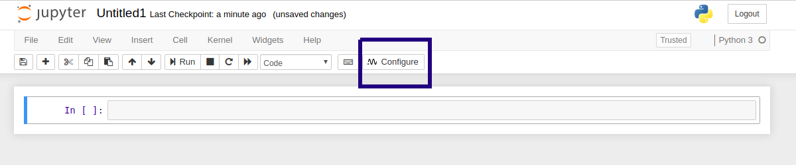
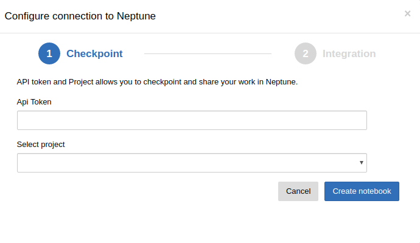
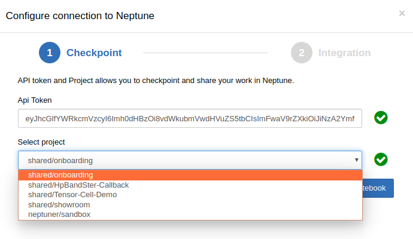
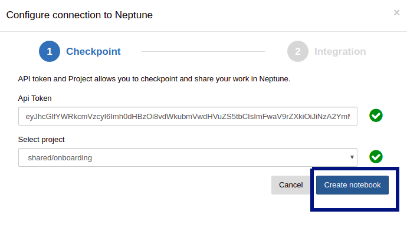
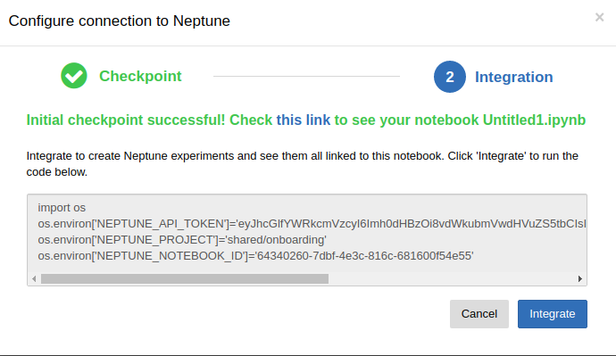

Installation and configuration
==============================

Install
-------
Install the notebook extension:

.. code-block:: bash

   pip install neptune-notebooks

Then enable extension for your Jupyter:

.. code-block:: bash

   jupyter nbextension enable --py neptune-notebooks

Remember to install Neptune-client, if you did not do so already:

.. code-block:: bash

   pip install neptune-client

Configure
---------
Simple configuration wizard lets you to setup your work with Neptune.

Step 1
~~~~~~
Click **Configure** button (if you cannot see it, just hit **F5**).

Step 2
~~~~~~
You see **Configure connection to Neptune**. Paste API Token first, then select project:

* *API Token* - take one from your account. `Check this <troubleshoot.html#t-004>`_\, if you do not know where *API Token* is located. This field is validated automatically.
* *Select project* - pick one from the drop down list.
* Click **Create notebook**.

.. warning:: Your *API Token* is private and unique. Never share it. It's like sharing password.

.. note:: Success! You just created new notebook with first checkpoint in the project you selected.

Step 3
~~~~~~
* You can use *this link* at the top, to go directly to this notebook in Neptune.
* Click **Integrate** button to run environment variables export. It allows Neptune to checkpoint your work correctly. Moreover, you will be able to run Neptune experiments directly from notebook.

.. note:: Re-run **Integrate** each time you reset or restart your kernel.
