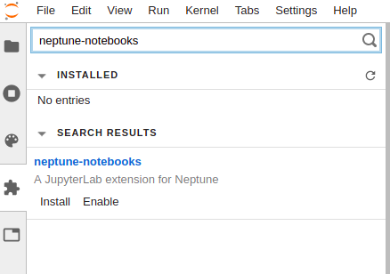

Installation for Jupyter and JupyterLab
=======================================

Jupyter
-------
Install `neptune-notebooks extension <https://github.com/neptune-ai/neptune-notebooks>`_:

.. code-block:: bash

   pip install neptune-notebooks

Then enable extension for your Jupyter:

.. code-block:: bash

   jupyter nbextension enable --py neptune-notebooks

Remember to install Neptune-client, if you did not do so already:

.. code-block:: bash

   pip install neptune-client

JupyterLab
----------

Requirements
^^^^^^^^^^^^
`Node.js <https://nodejs.org/en>`_ and `npm <https://www.npmjs.com/get-npm>`_ are required.

To check if you have Node.js installed, run this command in your terminal:

.. code-block:: bash

    node -v

To confirm that you have npm installed you can run this command in your terminal:

.. code-block:: bash

    npm -v

If you do not have them, please refer to: `installation instructions <https://www.npmjs.com/get-npm>`_.

Using command line
^^^^^^^^^^^^^^^^^^
Install `neptune-notebooks <https://www.npmjs.com/package/neptune-notebooks>`_ for your JupyterLab. In terminal run:

.. code-block:: bash

    jupyter labextension install neptune-notebooks

Remember to install Neptune-client, if you did not do so already:

.. code-block:: bash

   pip install neptune-client

Using JupyterLab extension manager (alternative)
^^^^^^^^^^^^^^^^^^^^^^^^^^^^^^^^^^^^^^^^^^^^^^^^

**Step 1**

Enable extension manager. Select "Commands" (third icon on left panel), then click on "Enable Extension Manager (experimental)"

**Step 2**

Go to "Extension Manager" (third icon on left panel) and search for "neptune-notebooks". Click "Install", then "Enable".

