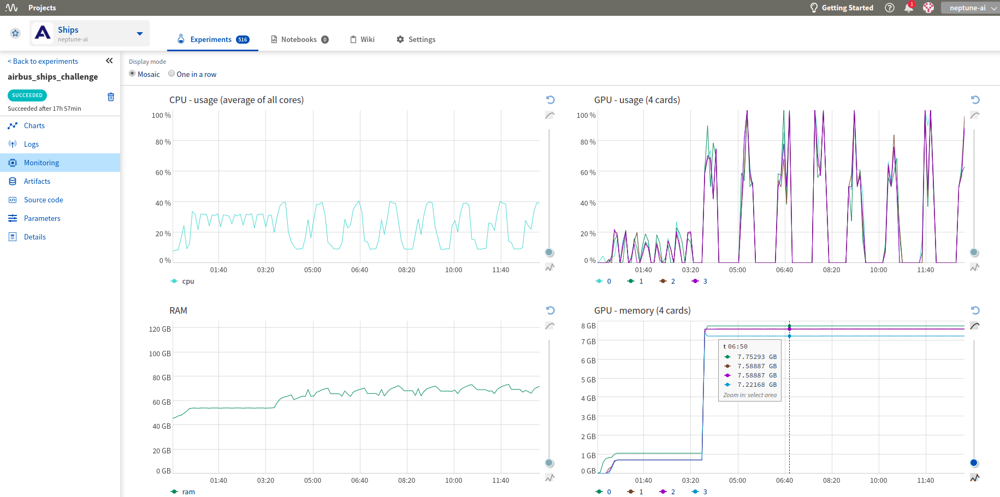

Integrations with AWS and SageMaker
===================================

Setting up a Neptune-enabled JupyterLab on AWS
----------------------------------------------
You can run Neptune and track experiments that you run on AWS cloud.

1. Register to AWS.

    Follow the `instructions <https://aws.amazon.com/premiumsupport/knowledge-center/create-and-activate-aws-account/>`_ to create your AWS account.

2. Start an EC2 instance.

    Select ``ubuntu`` as your instance type and choose the worker type you need.
    You can use ``t2.micro`` just to test it out.

3. SSH to your instance.

    From the terminal, run:

    .. code-block:: Bash

        ssh -i /path_to_key/my_key.pem ubuntu@public_dns_name

    Make sure that you specify the correct key and public_dns_name.

4. Install Docker.

    a. Create a new file ``install_docker.sh``:

    .. code-block:: Bash

        nano install_docker.sh

    b. Copy the following commands to it:

    .. code-block:: Bash

        sudo apt-get update
        sudo apt-get install \
            apt-transport-https \
            ca-certificates \
            curl \
            gnupg-agent \
            software-properties-common
        curl -fsSL https://download.docker.com/linux/ubuntu/gpg | sudo apt-key add -
        sudo apt-key fingerprint 0EBFCD88
        sudo add-apt-repository \
        "deb [arch=amd64] https://download.docker.com/linux/ubuntu \
        $(lsb_release -cs) \
        stable"
        sudo apt-get update
        sudo apt-get install docker-ce docker-ce-cli containerd.io

    c. Run the installation script:

    .. code-block:: Bash

        source install_docker.sh

5. Define your secrets.

    a. Go to Neptune, `get your NEPTUNE_API_TOKEN <troubleshoot.html#where-is-neptune-api-token>`_ and copy it to the clipboard.
    b. Create a password for your JupyterLab server.
    c. Set the following two secrets to your environment variables, ``NEPTUNE_API_TOKEN`` and ``JUPYTERLAB_PASSWORD``:

        .. code-block:: Bash

            export NEPTUNE_API_TOKEN='your_api_token=='
            export JUPYTERLAB_PASSWORD='difficult_password'

6. Build the Docker image.

    a. Create a new file ``Dockerfile``:

    .. code-block:: Bash

        nano Dockerfile

    b. Copy insights of the following Dockerfile to your newly created file:

    .. code-block:: Docker

        # Use a miniconda3 as base image
        FROM continuumio/miniconda3

        # Installation of jupyterlab and extensions
        RUN pip install jupyterlab==1.2.6  && \
            pip install jupyterlab-server==1.0.6  && \
            conda install -c conda-forge nodejs

        # Installation of Neptune and enabling neptune extension
        RUN pip install neptune-client  && \
            pip install neptune-notebooks  && \
            jupyter labextension install neptune-notebooks

        # Setting up Neptune API token as env variable
        ARG NEPTUNE_API_TOKEN
        ENV NEPTUNE_API_TOKEN=$NEPTUNE_API_TOKEN

        # Adding current directory to container
        ADD . /mnt/workdir
        WORKDIR /mnt/workdir

    If you want to run on a GPU, make sure to change your Dockerfile to start from Nvidia Docker images.

    c. Run the following command to build your Docker image:

    .. code-block:: Bash

        sudo docker build -t jupyterlab --build-arg NEPTUNE_API_TOKEN=$NEPTUNE_API_TOKEN .

7. Spin up a JupyterLab server with Docker:

    .. code-block:: Bash

        sudo docker run --rm -v `pwd`:/work/output -p 8888:8888 jupyterlab:latest \
        /opt/conda/bin/jupyter lab --allow-root --ip=0.0.0.0 --port=8888 --NotebookApp.token=$JUPYTERLAB_PASSWORD

8. Forward ports via SSH tunnel. Open a new terminal on your local machine and run:

    .. code-block:: Bash

        ssh -L 8888:localhost:8888 ubuntu@public_dns_name &

    Make sure that you specify the correct public_dns_name.

9. Open the JupyterLab server in your browser.

    Go to `localhost:8888`.

Enjoy your JupyterLab server with Neptune.

Neptune extensions are enabled and ``NEPTUNE_API_TOKEN`` is already in the environment variable so you can work with
Notebooks and run experiments with no problem.

Setting up a Neptune-enabled AWS SageMaker Jupyter instance
-----------------------------------------------------------
You can use Neptune to track experiments that you run on AWS SageMaker.

.. image:: ../_static/images/others/sagemaker_neptuneml.png
   :target: ../_static/images/others/sagemaker_neptuneml.png
   :alt: Amazon SageMaker neptune.ai integration

1. Register to AWS.

    Follow the `instructions <https://aws.amazon.com/premiumsupport/knowledge-center/create-and-activate-aws-account/>`_ to create your AWS account.

2. Create Lifecycle configuration.

    a. Go to SageMaker **Lifecycle configurations** and click **Create configuration**.

    .. image:: ../_static/images/how-to/ht-sagemaker-create_configuration.png
       :target: ../_static/images/how-to/ht-sagemaker-create_configuration.png
       :alt: image

    |

         You can choose whatever name you want -- just make sure to remember it.

    b. Modify the **Create Notebook** script to run it only once at the creation of your SageMaker Notebook instance.

    .. image:: ../_static/images/how-to/ht-sagemaker-config_specs.png
       :target: ../_static/images/how-to/ht-sagemaker-config_specs.png
       :alt: image

    |

    c. Copy and paste the script below to your **Create Notebook** tab.

        In the **PARAMETERS** section, choose in which environments you want to install neptune-client.

    .. code-block:: Bash

        #!/bin/bash

        set -e

        sudo -u ec2-user -i <<'EOF'

        # PARAMETERS
        ENVS=(
        python3
        pytorch_p36
        )

        # Install Neptune client library
        for env in $ENVS; do
            source /home/ec2-user/anaconda3/bin/activate $env
            pip install neptune-client
            source /home/ec2-user/anaconda3/bin/deactivate
        done

        # Install jupyter extension
        source /home/ec2-user/anaconda3/bin/activate JupyterSystemEnv
        pip install neptune-notebooks
        jupyter nbextension enable --py neptune-notebooks --sys-prefix
        jupyter labextension install neptune-notebooks
        source /home/ec2-user/anaconda3/bin/deactivate
        EOF

3. Create a Notebook instance.

    a. Go to SageMaker **Notebook instances** and click **Create notebook instance**.

    .. image:: ../_static/images/how-to/ht-sagemaker-create_instance.png
         :target: ../_static/images/how-to/ht-sagemaker-create_instance.png
         :alt: image

    |

    b. Type in an instance name and click **Additional configuration** to add the Lifecycle configuration you have just created.

    .. image:: ../_static/images/how-to/ht-sagemaker-create_instance_specs.png
         :target: ../_static/images/how-to/ht-sagemaker-create_instance_specs.png
         :alt: image

    |

    c. Click **Create notebook instance** at the bottom to start your instance.

    .. image:: ../_static/images/how-to/ht-sagemaker-create_notebook_run.png
         :target: ../_static/images/how-to/ht-sagemaker-create_notebook_run.png
         :alt: image

4. Start Notebook.

    If everything went well, your AWS SageMaker instance should have *InService* status and you can open a Jupyter Notebook or JupyterLab
    with Neptune Notebook versioning enabled.

    .. image:: ../_static/images/how-to/ht-sagemaker-notebook_run.png
          :target: ../_static/images/how-to/ht-sagemaker-notebook_run.png
          :alt: image

You can now version your Notebooks and track experiments in Amazon SageMaker with Neptune.

    .. image:: ../_static/images/how-to/ht-sagemaker-notebook_runs_01.png
          :target: ../_static/images/how-to/ht-sagemaker-notebook_runs_01.png

          :alt: image