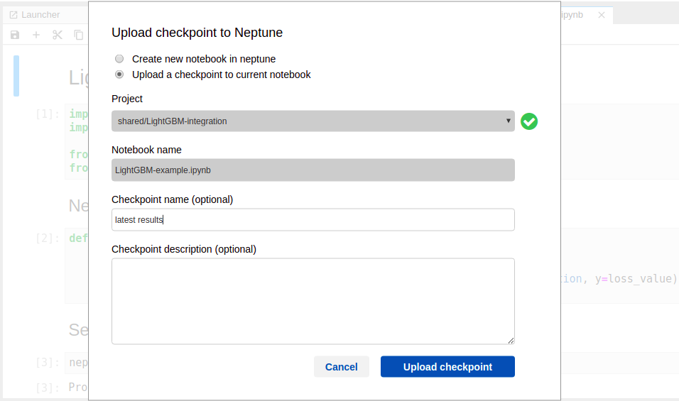

Notebooks in Neptune
====================

   
Introduction
------------
Notebooks are essential tool for data scientists, regardless their area of specialization. They allow data scientists to work interactively, keeping code and results - like visualizations - in a single document. Neptune builds on top of this experience and comes with Jupyter and JupyterLab extensions that let you track Notebooks in Neptune.

Notebooks in Neptune - key features:

* In Neptune, each notebook consist of collection of checkpoints that you upload directly from the Jupyter User interface.
* In the project, unlimited number of notebooks and checkpoints is allowed.
* Browse checkpoints history across all `notebooks in the project <https://ui.neptune.ai/shared/onboarding/notebooks>`_,
* `Share <https://ui.neptune.ai/shared/onboarding/n/neural-style-tutorial-c96dce51-409a-4b1b-8dbf-c47d52868d9b/9a7f6736-8794-44f0-9060-cf1b451d92d9>`_ notebook as a link,
* `Compare <https://ui.neptune.ai/o/shared/org/onboarding/compare-notebooks?sourceNotebookId=e11f2bd6-6bb5-4269-b3d7-84453ad19ddb&sourceCheckpointId=a4ed1ff3-0d5d-4d59-b1d7-60edc4f140b6&targetNotebookId=e11f2bd6-6bb5-4269-b3d7-84453ad19ddb&targetCheckpointId=60911a35-6ee2-40c7-af10-8a7c8a79e6cb>`_ two notebooks side-by-side like source code.

Quick-start
-----------
* To start working with notebooks in Neptune, `install <installation.html>`_ and `configure <configuration.html>`_ open source extension for Jupyter or JupyterLab. When you have it done, you can start working with notebooks immediately.
* To try it now, without registering to Neptune, look at example notebooks in public project `onboarding <https://ui.neptune.ai/shared/onboarding/notebooks>`_. Use public user's API token (username: *neptuner*) to upload some snapshots to this project (you still need to `install <installation.html>`_ and `configure <configuration.html>`_ Jupyter extension).

.. code-block:: bash

    eyJhcGlfYWRkcmVzcyI6Imh0dHBzOi8vdWkubmVwdHVuZS5tbCIsImFwaV9rZXkiOiJiNzA2YmM4Zi03NmY5LTRjMmUtOTM5ZC00YmEwMzZmOTMyZTQifQ==

Tour
----
`Notebooks view <https://ui.neptune.ai/shared/onboarding/notebooks>`_ is a collection of all notebooks in the project - each can have multiple checkpoints.

Notebooks view
~~~~~~~~~~~~~~
* See what your team members are working on now.
* Review details and checkpoints associated with Notebook.
* Share, compare or download notebook.

Notebook contents
~~~~~~~~~~~~~~~~~
Once you entered notebook, you can see all its content, that is: code and markdown cells, outputs and execution count.

* Look at the snapshot of the work with notebook.
* Download, share or compare this checkpoint.

Notebooks comparison
~~~~~~~~~~~~~~~~~~~~
Select two notebooks and compare their contents - code and markdown cells, outputs and execution count - side-by-side just like source code. `Compare view <https://ui.neptune.ai/shared/onboarding/compare-notebooks>`_ let you look at diff between checkpoints of the same notebook, or two entirely different notebooks (Try yourself `here <https://ui.neptune.ai/shared/onboarding/compare-notebooks>`_).

.. image:: ../_static/images/notebooks/nb-view-cmp-1.png
    :target: ../_static/images/notebooks/nb-view-cmp-1.png
    :alt: image

* Code, markdown, output and execution count differences highlighted.
* Top bar displays summary information about diff.

Upload notebook checkpoint
--------------------------
Once `configured <configuration.html>`_\ , you can see two Neptune buttons.

* - **n** button is for configuration changes
* - **Upload** button is for making checkpoint in Neptune (*see below*)

.. image:: ../_static/images/notebooks/buttons_02_1.png
    :target: ../_static/images/notebooks/buttons_02_1.png
    :alt: image

* - Click **Upload**\ , whenever you want to create new checkpoint in Neptune.
* - You will see tooltip with link as a confirmation.

.. image:: ../_static/images/notebooks/buttons_03_1.png
    :target: ../_static/images/notebooks/buttons_03_1.png
    :alt: image
