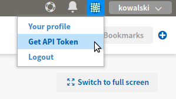
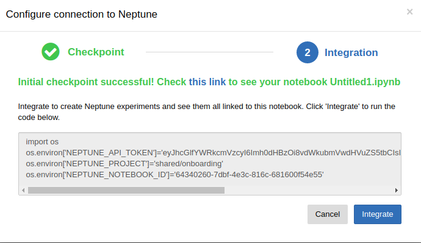

Troubleshoot
============
Typical problems with notebooks, together with their solutions are listed here.

#. :ref:`I can't see 'configure' button. What to do? <t-001>`
#. :ref:`How to enable notebook extension in my jupyter? <t-002>`
#. :ref:`I do not know where my notebook is being uploaded. How to check it? <t-003>`
#. :ref:`Where is 'NEPTUNE_API_TOKEN'? <t-004>`
#. :ref:`My integration does not work, but it worked well previously. What do to? <t-005>`

.. _t-001:

I can't see 'configure' button. What to do?
-------------------------------------------
Make sure to install notebook extension:

.. code-block:: bash

   pip install neptune-notebooks

then enable extension for your Jupyter:

.. code-block:: bash

   jupyter nbextension enable --py neptune-notebooks

Don't forget to install Neptune client: 

.. code-block:: bash

   pip install neptune-client

.. _t-002:

How to enable notebook extension in my jupyter?
-----------------------------------------------
Enable extension for your jupyter:

.. code-block:: bash

   jupyter nbextension enable --py neptune-notebooks

.. _t-003:

I do not know where my notebook was uploaded. How to check it?
--------------------------------------------------------------
#. Click on the **n** button in your jupyter menu.
#. Click on **Checkpoint**.
#. Bottom drop-down is your current project.

.. _t-004:

Where is *NEPTUNE_API_TOKEN*?
-----------------------------
#. Log in to `neptune <https://neptune.ml/login>`_.
#. Click on your avatar (top-right part of the screen) and select **Get API Token**

.. _t-005:

My integration does not work, but it worked well previously. What do to?
------------------------------------------------------------------------
Most likely, you restarted kernel. Here is a solution:
#. Go to configuration (**n** button).
#. Click **Integrate**.

