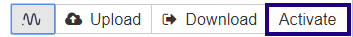

Troubleshoot
============

You may experience issues while working with Jupyter Notebooks and Neptune.

The following presents possible solutions to some of the issues.

.. contents::
    :local:
    :depth: 1
    :backlinks: top

I can't see the **Connect to Neptune** button. What do I do?
------------------------------------------------------------
Make sure you have installed the Notebook extension:

.. code-block:: bash

   pip install neptune-notebooks

then enable the extension for your Jupyter:

.. code-block:: bash

   jupyter nbextension enable --py neptune-notebooks

Don't forget to install Neptune client:

.. code-block:: bash

   pip install neptune-client

For more details, see  `Installing neptune-notebooks <installation.html>`_.

How do I enable the Notebook extension in my Jupyter?
-----------------------------------------------------
Enable extension for your Jupyter:

.. code-block:: bash

   jupyter nbextension enable --py neptune-notebooks

I do not know where my Notebook was uploaded. How do I check it?
----------------------------------------------------------------
#. In Jupyter, click **Connect to Neptune**.
#. Click **Checkpoint**.
#. Bottom drop-down is your current project.

.. _token-location:

Where is *NEPTUNE_API_TOKEN*?
-----------------------------
#. `Log in <https://neptune.ai/login>`_ to Neptune.
#. In the upper right corner of the UI, click the avatar, and then click **Get API Token** to copy the token to the clipboard.

.. image:: ../_static/images/notebooks/token.png
   :target: ../_static/images/notebooks/token.png
   :alt: image

My integration does not work, but it worked well previously. What do I do?
--------------------------------------------------------------------------
Most likely, you restarted the kernel.

If that is the case, the experiments are not associated with the notebook.

In Jupyter, click **Activate**.

