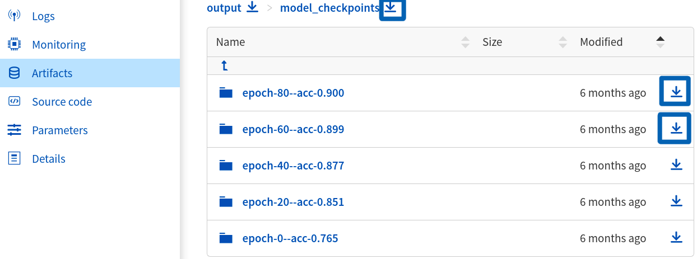
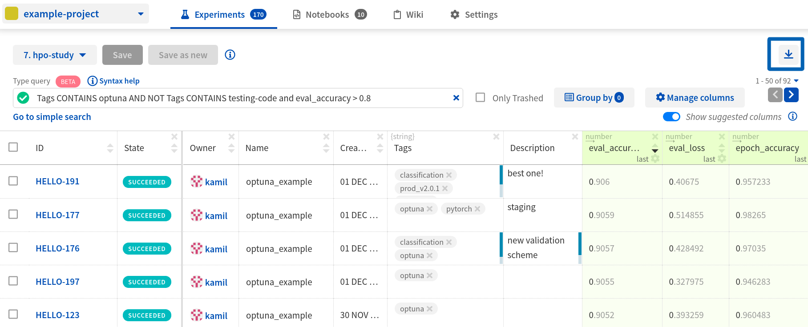
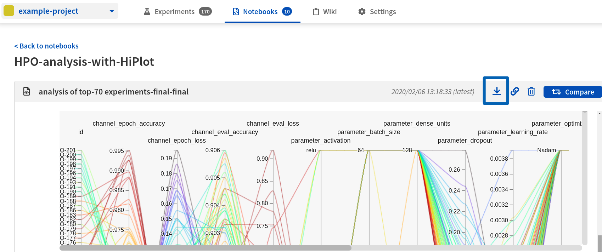
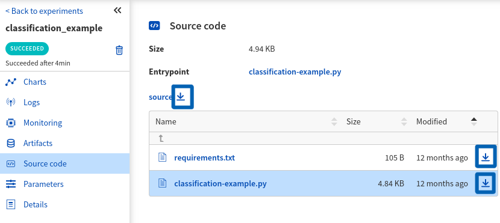

.. _download-from-neptune-ui:

Downloading from Neptune UI
===========================
When in Neptune, simply look for the download icon. It's located in multiple places in the application and allows you to download various parts of the experiments or notebooks. Below are some examples:

Download model checkpoints
--------------------------

Download experiments dashboard as csv
-------------------------------------

Download notebook checkpoint
----------------------------

Download experiment source code
-------------------------------

Download images in full size
----------------------------
|video-download-images|

.. Videos

.. |video-download-images| raw:: html

    
<iframe src="https://www.loom.com/embed/67845d4bb7a141fbbd40c0674cd2dd4a" frameborder="0" webkitallowfullscreen mozallowfullscreen allowfullscreen style="position: absolute; top: 0; left: 0; width: 100%; height: 100%;"></iframe>

