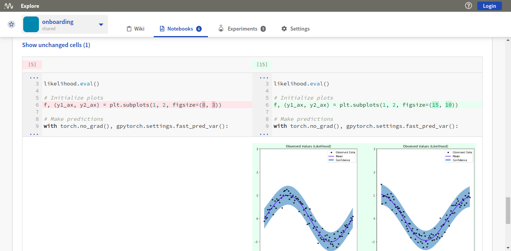

.. _guides-ui-notebooks:

Notebooks
=========

Key Features
------------

* In Neptune, each Notebook consists of a collection of checkpoints that you upload directly from the Jupyter user interface.
* In any project, an unlimited number of Notebooks and checkpoints is allowed.
* You can browse checkpoints history across all |Notebooks in the project|.
* You can |share a Notebook as a link| a Notebook as a link.
* You can |compare two Notebooks side-by-side|, like source code.

Viewing Notebook Checkpoints
----------------------------

|Youtube Video viewing|

The |Notebooks tab| in the Neptune UI provides a table of all the Notebooks in the current project.

This view lets you see what your team members are working on, review details and checkpoints associated with a Notebook, as well as share or download a Notebook and compare two or more Notebooks.

The Notebook data is arranged in the following columns:

* Name
* Owner
* Latest checkpoint
* Description

In addition, for each Notebook, there are buttons for downloading the Notebook, comparing it with another Notebook, or for sharing a link to it.

A **Compare** button at the top right displays a Notebooks Comparison pane. See :ref:`Compare Notebooks <guides-notebook-compare>`.

Notebook contents
~~~~~~~~~~~~~~~~~
Once you select a Notebook, you can see all its contents, that is: code and markdown cells, outputs and execution count.

There are two tabs on the right:

- **Details**: Here are shown the ID, size, creation date, latest checkpoint, owner, description and associated experiments of the selected Notebook.
- **Checkpoints**: Here are listed all the checkpoints of the Notebook. Click a checkpoint to see the details in the main pane. From this tab, you can also access the experiments that are associated with the checkpoint.

You can also view snapshots of the work with the Notebook, as well as download, share or compare this checkpoint with another checkpoint.

.. image:: ../_static/images/organizing-and-exploring-results-in-the-ui/notebooks/nb-view-22.png
    :target: ../_static/images/organizing-and-exploring-results-in-the-ui/notebooks/nb-view-22.png
    :alt: image

.. _guides-notebook-compare:

Compare Notebooks
-----------------

|Youtube Video comparing|

The Notebooks Comparison pane lets you compare Notebook checkpoints.

You display the pane by clicking the **Compare** button anywhere it is visible in the Notebooks pane.

In the Notebooks Comparison pane, select two Notebook checkpoints, then click **Compare** to see a side-by-side comparison, just like source code.

* Differences in code, markdown, output and execution count are highlighted.
* Summary information about the differences is displayed at the top of the pane.

.. External links

.. |Notebooks in the project| raw:: html

    <a href="https://ui.neptune.ai/shared/onboarding/notebooks" target="_blank">Notebooks in the project</a>

.. |Notebooks tab| raw:: html

    <a href="https://ui.neptune.ai/shared/onboarding/notebooks" target="_blank">Notebooks tab</a>

.. |share a Notebook as a link| raw:: html

    <a href="https://ui.neptune.ai/shared/onboarding/n/neural-style-tutorial-c96dce51-409a-4b1b-8dbf-c47d52868d9b/9a7f6736-8794-44f0-9060-cf1b451d92d9" target="_blank">share a Notebook as a link</a>

.. |compare two Notebooks side-by-side| raw:: html

    <a href="https://ui.neptune.ai/o/shared/org/onboarding/compare-notebooks?sourceNotebookId=e11f2bd6-6bb5-4269-b3d7-84453ad19ddb&sourceCheckpointId=a4ed1ff3-0d5d-4d59-b1d7-60edc4f140b6&targetNotebookId=e11f2bd6-6bb5-4269-b3d7-84453ad19ddb&targetCheckpointId=60911a35-6ee2-40c7-af10-8a7c8a79e6cb" target="_blank"> compare two Notebooks side-by-side</a>

.. |Youtube Video viewing| raw:: html

    <iframe width="720" height="420" src="https://www.youtube.com/embed/8qmz2yIndOw" frameborder="0" allow="accelerometer; autoplay; clipboard-write; encrypted-media; gyroscope; picture-in-picture" allowfullscreen></iframe>

.. |Youtube Video comparing| raw:: html

    <iframe width="720" height="420" src="https://www.youtube.com/embed/5xeqcq_9fpE" frameborder="0" allow="accelerometer; autoplay; encrypted-media; gyroscope; picture-in-picture" allowfullscreen></iframe>