.. _guides-experiment-dashboard:

Organizing Experiments in a Dashboard
=====================================

|Youtube Video dashboard|

Neptune is a browser-enabled app that lets you visualize and browse experiments.

   .. image:: ../_static/images/organizing-and-exploring-results-in-the-ui/experiment-dashboard/experiment_general_view.png
      :target: ../_static/images/organizing-and-exploring-results-in-the-ui/experiment-dashboard/experiment_general_view.png
      :alt: Experiments view

The **Experiments** space displays all the experiments in a specific Project in table form.

There are several ways to organize your experiments, by using:

* tags,
* dashboard views,
* columns customizations,
* experiments grouping.

Using tags
----------
You can create tag(s), which you assign to experiments. Later, you can quickly filter by these tags.

   .. image:: ../_static/images/organizing-and-exploring-results-in-the-ui/experiment-dashboard/tag_chooser.png
      :target: ../_static/images/organizing-and-exploring-results-in-the-ui/experiment-dashboard/tag_chooser.png
      :alt: Tag chooser
      :width: 250

Using dashboard views
---------------------
Experiment dashboard view is a saved setup of columns configuration and experiment filters.

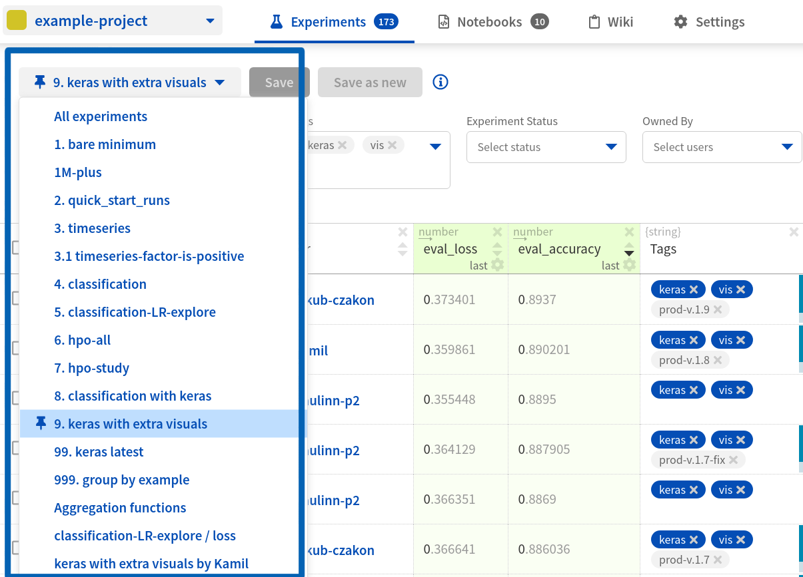

For example, you can filter rows (experiments) by metric value and select a subset of useful columns that represent relevant experiments meta-data. You can create many views in the project. Thanks to this you can quickly jump between different aspects of the project.

Notice, that one view "`keras with extra visuals`" has a pin icon |pin| next to it. Use pin to set the default view.

|example-view|

.. note::

    Every saved view is visible for everybody in the project.

When dashboard views are useful?
^^^^^^^^^^^^^^^^^^^^^^^^^^^^^^^^
There are few situation when you may want to create custom dashboard view:

* You work on separate idea or task within a project, and you want to see only relevant information.
* Your team explores separate ideas in the project and for each idea you want to have separate dashboard.
* You want to create separate view that contains only your experiments.
* You want to have a separate view for experiments that have model weights that was pushed to production.

What can be customized in view?
^^^^^^^^^^^^^^^^^^^^^^^^^^^^^^^
A view is a saved setup of experiments filter and arrangement of columns.

* Experiments filter, either basic or advanced, can be saved in view. Learn more about it here: :ref:`Searching and filtering experiments <searching-and-filtering-experiments>`.
* Every setup of columns can be saved in view. Check section :ref:`customizing columns <customizing-columns>` below to learn more about it.

How to create dashboard view?
^^^^^^^^^^^^^^^^^^^^^^^^^^^^^
loom-placeholder

In this short tutorial you will learn how to customize experiment dashboard and save it as a new view.

.. note::

    To save view, you need to be project's "`contributor`" or "`owner`". Learn more about it here: :ref:`Roles in project <administration-user-roles-project>`.

Step 1: Go to experiment dashboard
""""""""""""""""""""""""""""""""""
Open experiments dashboard in your project. In this tutorial we use |example-project|.

Step 2: Apply filter
""""""""""""""""""""
Apply filter, for example filter by tag.

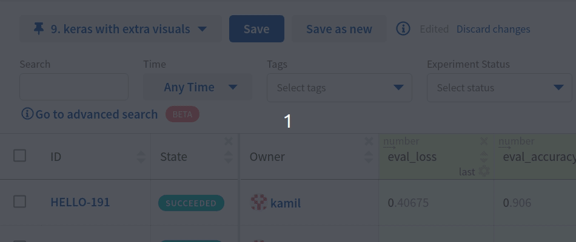

Step 3: Arrange columns
"""""""""""""""""""""""
Add some columns to the dashboard and customize them.

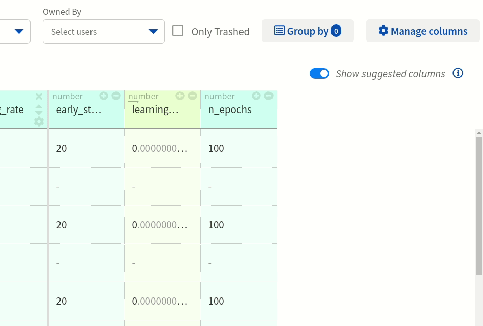

Step 4: Save new view
"""""""""""""""""""""
Save filtered experiments and arrangement of columns as new view.

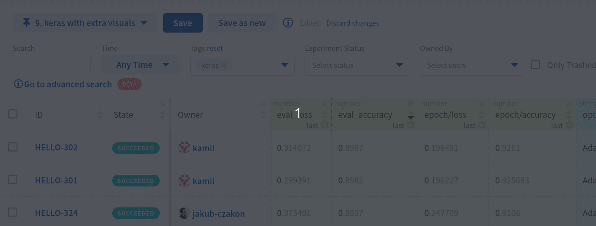

Step 5: Access saved view
"""""""""""""""""""""""""
Saved view is appended to the list of views:

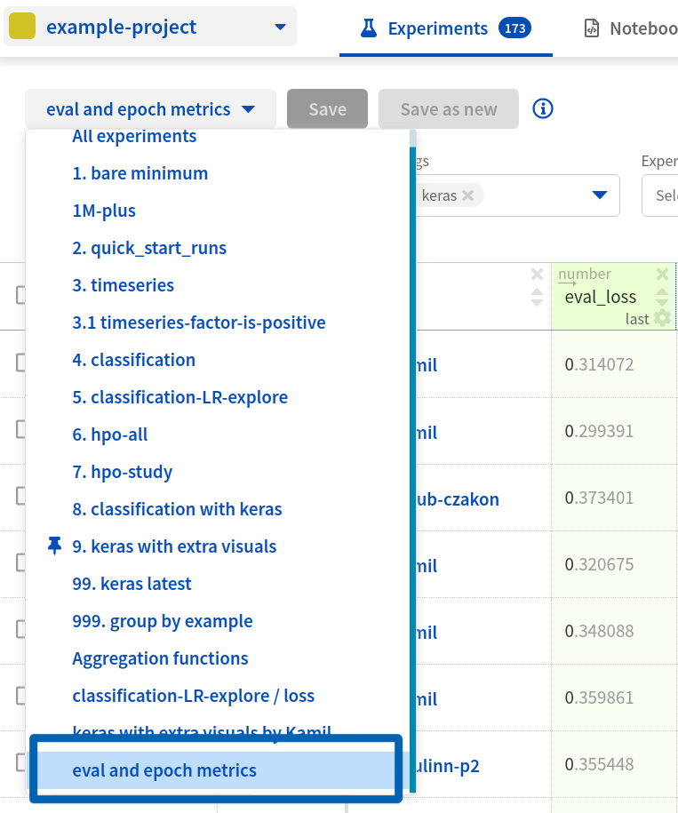

.. _customizing-columns:

Result
""""""
In this short tutorial you learned how to create new view that consist of experiments filter and arrangement of columns. You learned how to save new view and access it later from the list of views.

Continue to the section below "`Customizing columns`" to learn more about what you can do with dashboard columns.

Customizing columns
-------------------
You can configure what data logged to Neptune is displayed as columns in the dashboard. Experiments meta-data that you can display are:

* metrics,
* parameters,
* text logs,
* properties,
* system parameters.

Use "`manage columns`" button to decide what to display:

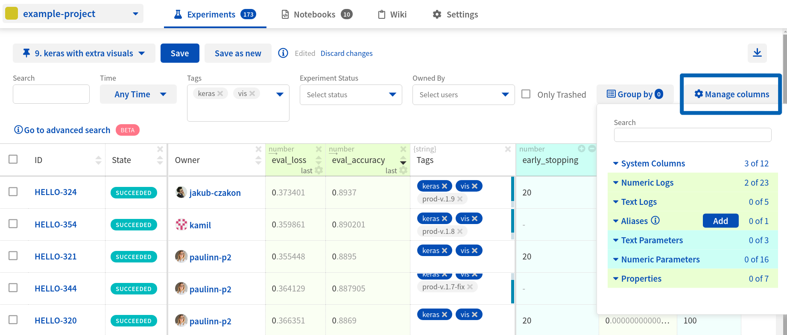

.. note::

    Learn more how to log different types of meta-data: :ref:`What objects can you log to Neptune <what-you-can-log>`.

Auto-proposed columns
^^^^^^^^^^^^^^^^^^^^^
Note, that neptune automatically proposes columns based on what is different between experiments. This helps you see what changed quickly. Suggested columns are the right-most columns in the dashboard. See example below:

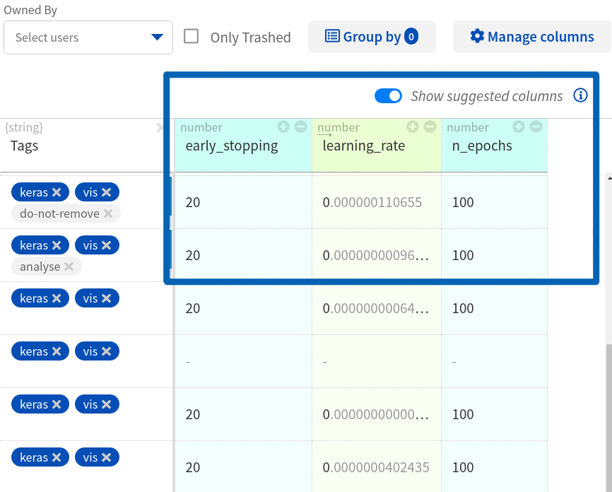

Sort dashboard by column
^^^^^^^^^^^^^^^^^^^^^^^^
You can decide over which column to sort the dashboard. Use arrows in the column header to do it:

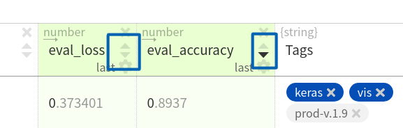

Decide how to display column data
^^^^^^^^^^^^^^^^^^^^^^^^^^^^^^^^^
For each column individually, you can decide how its data is displayed. Click on the cog icon |cog| and select display format:

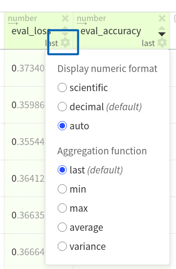

Reorder columns and adjust their width
^^^^^^^^^^^^^^^^^^^^^^^^^^^^^^^^^^^^^^
Moreover, you can reorder columns and adjust their width.

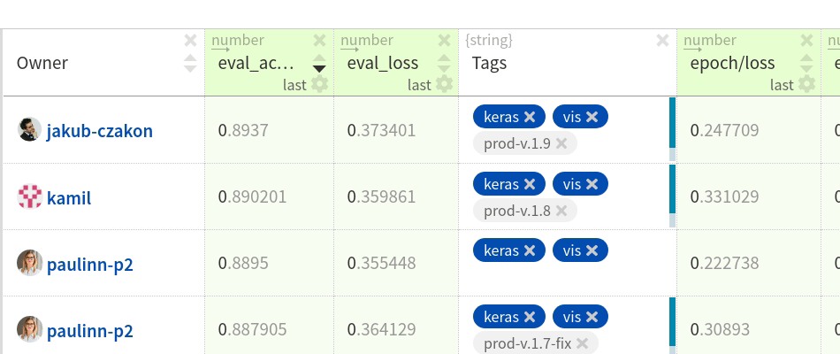

Grouping experiments
--------------------
You can group experiments by one or more column(s).

The dashboard displays the selected columns, allowing you to make in-group and across-groups analysis of the experiments. Each group is represented by the first experiment that appears according to the sorting order. After opening it, each group shows at most 10 experiments - all experiments can be viewed by clicking **Show all**.

   .. image:: ../_static/images/organizing-and-exploring-results-in-the-ui/experiment-dashboard/group_by.png
      :target: ../_static/images/organizing-and-exploring-results-in-the-ui/experiment-dashboard/group_by.png
      :alt: Group columns

.. Link to images

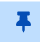

.. External links

.. |Youtube Video dashboard| raw:: html

    <iframe width="720" height="420" src="https://www.youtube.com/embed/QppF5CR_J1E" frameborder="0" allow="accelerometer; autoplay; encrypted-media; gyroscope; picture-in-picture" allowfullscreen></iframe>

.. |example-project| raw:: html

    <a href="https://ui.neptune.ai/o/USERNAME/org/example-project/experiments?viewId=b845e2e9-0369-41da-954e-3f936e81c192" target="_blank">example project</a>

.. Buttons

.. |example-view| raw:: html

    

        <button><a target="_blank"
                   href="https://ui.neptune.ai/o/USERNAME/org/example-project/experiments?viewId=b845e2e9-0369-41da-954e-3f936e81c192">
                See "keras with extra visuals" view in neptune</a>
        </button>
    

.. Videos

.. |video-view| raw:: html

    
<iframe src="https://www.loom.com/embed/b07ffb868c784cd58b7b90e133a44187" frameborder="0" webkitallowfullscreen mozallowfullscreen allowfullscreen style="position: absolute; top: 0; left: 0; width: 100%; height: 100%;"></iframe>

