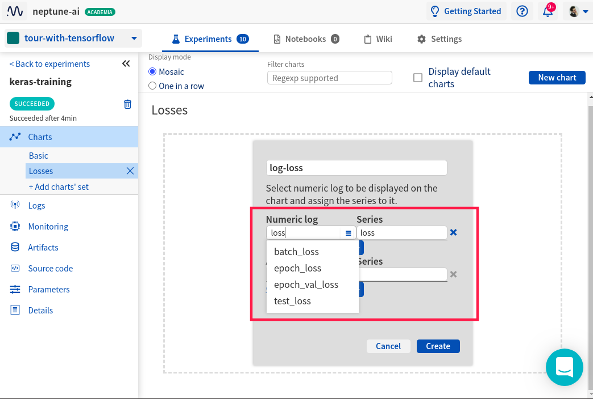

.. _exploring-a-single-experiment:

Exploring a single experiment
=============================

|Youtube Video|

Click on the experiment ID (leftmost column) to enter single experiment view.

   .. image:: ../_static/images/organizing-and-exploring-results-in-the-ui/experiment-dashboard/single_experiment.png
      :target: ../_static/images/organizing-and-exploring-results-in-the-ui/experiment-dashboard/single_experiment.png
      :alt: Single experiment

Inside the experiment, there are tabs in the left sidebar. Each displays specific content that is logged to Neptune for the specific experiment. Each tab has a unique URL.

- **Charts**: All metrics (numeric type of data) are visualized as charts.
- **Logs**: Logs are data that can be logged or tracked to the experiment. There are multiple types: Numeric, text, and images.
- **Monitoring**: Displays information about utilization of the memory, CPU and GPU, as well as stdout and stderr.
- **Artifacts**: Displays files uploaded to the experiment.
- **Source code**: Displays sources uploaded to the experiment.
- **Parameters**: Displays parameters uploaded to the experiment during experiment creation.
- **Details**: Displays additional metadata information.

For more information about the experiment data that is logged, see :ref:`Logging to Neptune <guides-logging-data-to-neptune>`.

.. _organizing-experiments-charts:

Organizing experiments charts
-----------------------------

In Neptune UI charts are organized in "chart sets".

The "Basic" chart set contains all metrics and losses you logged with one metric or loss per chart.

There are many situations where creating charts sets helps a lot.
Most common situations are:

- you have a lot of metrics and you would like to group them into something meaningful. For example one group for metrics other for losses, or gradient norms.
- you have mutliple metrics that you would like to put on a single chart. For example you want to group epoch loss and validation loss into a one learning curve.

If that is the case you should create a chart set.

.. _creating-custom-chart-sets:

Creating custom chart sets
^^^^^^^^^^^^^^^^^^^^^^^^^^

Let's go over creating a chart set step-by-step.

You can follow steps below or watch this quick video.

|Video creating chart sets|

**Step 1: Create a new chart set**

To create a chart set you first need to go to the "Charts" section.

Once there you can create a chart set by clicking "+ Add charts' set" button right below the "Basic" chart set.

Now you should give your chart set some name.
Naming chart sets could be helpful later when you have many of them. For example one for losses, one for metrics, and another one for gradient norms.

I will name mine "Losses".

**Step 2: create a new chart**

You can have many charts in a chart set. To create it click on the "New chart".

This will open a window like this.

Now you should add a chart name. I'll name mine "log-loss"

You also need to add metrics that you would like to see on this chart.
I will put "epoch_loss" and "epoch_val_loss" to create a nice learning curve.

You can add as many series (metrics or losses) you want to a chart. Just click on the "+" button.

Now you click on the "create" button and you have your chart set done.

If everything went well you should see the following chart.

**Step 3: add more charts and create more chart sets**

To add new charts to your existing chart set you can click on the "New chart" button.

You can also create new chart sets by clicking "+ Add charts' set"

Check out multiple chart sets in this |example experiment|.

.. External links

.. |Youtube Video| raw:: html

    <iframe width="720" height="420" src="https://www.youtube.com/embed/5lwCvyC9hqw" frameborder="0" allow="accelerometer; autoplay; encrypted-media; gyroscope; picture-in-picture" allowfullscreen></iframe>

.. |example experiment|  raw:: html

    <a href="https://ui.neptune.ai/o/neptune-ai/org/credit-default-prediction/e/CRED-93/charts" target="_blank">example experiment</a>

.. |Video creating chart sets| raw:: html

    
<iframe src="https://www.loom.com/embed/bb0a7577ff294f08b21f565afc809ced" frameborder="0" webkitallowfullscreen mozallowfullscreen allowfullscreen style="position: absolute; top: 0; left: 0; width: 100%; height: 100%;"></iframe>

