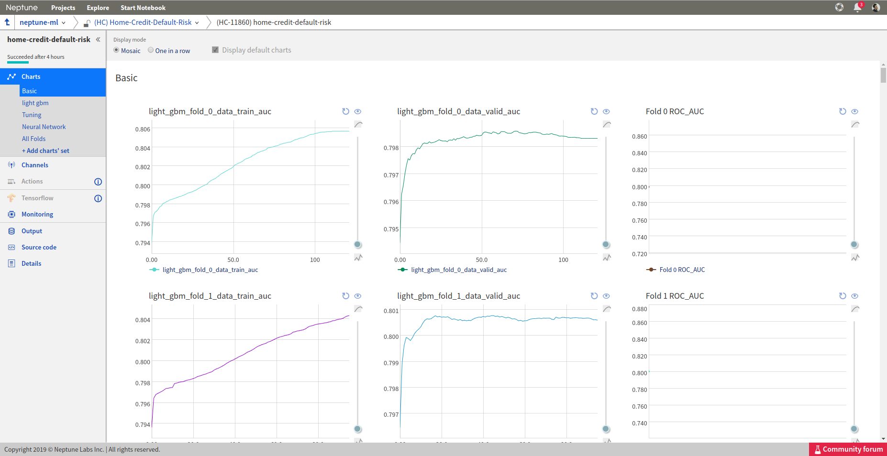
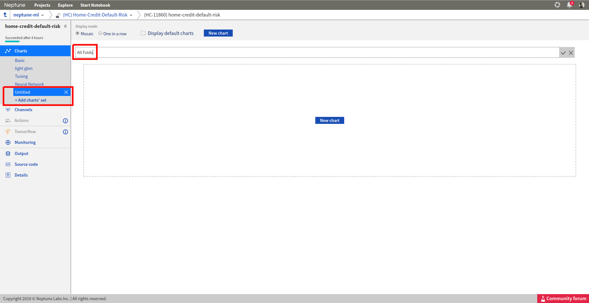
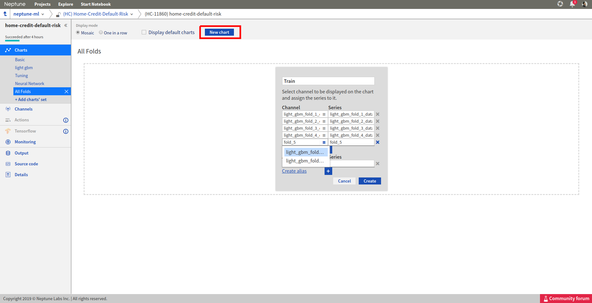
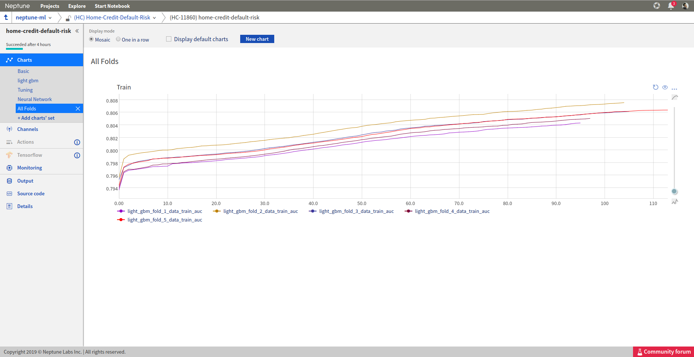
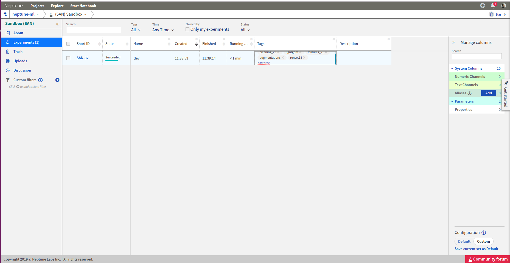
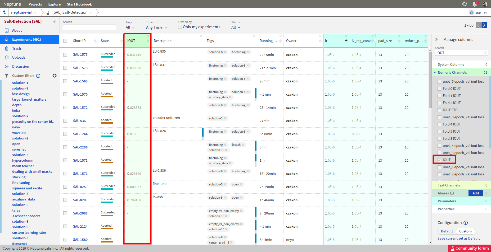
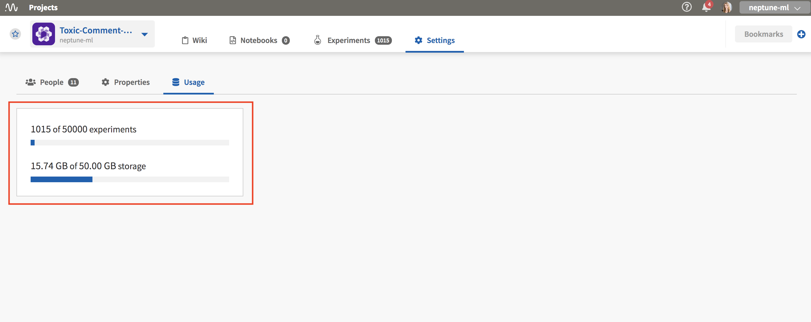

Organize
========

.. contents::
    :local:
    :depth: 1
    :backlinks: top

Organize charts
---------------
I am creating many charts for my experiments but they all end up in the ``Basic`` group like this:

How can I organize my charts?

Solution
^^^^^^^^
You can organize your charts by creating different groups/views of charts, called chart-sets.

**Step 1**

Click on ``+ Add charts' set`` on the left and choose a name for it.

**Step 2**

Click on ``New chart`` button on the top and choose series which you want to plot on one chart.

**Step 3**

Click on ``create`` and you have your first chart ready!

**Step 4**

You can always add new charts by clicking on the ``New chart`` button on the top.

.. image:: ../../_static/images/how-to/ht-chartsets-basic-5.png
   :target: ../../_static/images/how-to/ht-chartsets-basic-5.png
   :alt: image

Neptune will remember your chart set for this project so all your experiments charts can be now organized in the same way!

Download experiment output
--------------------------
I ran an experiment and send some data. How can I download it to my local computer?

Solution
^^^^^^^^
**Using web application**

Go to you experiment and click on the ``Output`` section on the left. Then download the data by clicking on the icon next to the file you are interested in.

.. image:: ../../_static/images/how-to/ht-output-download-1.png
   :target: ../../_static/images/how-to/ht-output-download-1.png
   :alt: image

**Using Neptune client library**

Use ``download_artifact('output_file', 'destination/path')`` like presented below:

.. code-block::

   import neptune

   with neptune.create_experiment():
       ...
       neptune.download_artifact('forest_results.pkl', '.')

Add tags to experiments
-----------------------
I want to add tags to the experiments. What are the options?

Solution
^^^^^^^^
**In the code**

You can add or remove tags directly from your script.

.. code-block::

   import neptune

   # This function assumes that NEPTUNE_API_TOKEN environment variable is defined.
   neptune.init(project_qualified_name='shared/onboadring')

   with neptune.create_experiment() as exp:
       exp.append_tag('resnet18')
       exp.append_tag('dev_mode')

**Web application**

Finally, you can always go to your project dashboard, and add/remove tags by clicking on a chosen cell.

Sort experiments dashboard
--------------------------
How can I sort experiments dashboard by a chosen metric?

Solution
^^^^^^^^
**Step 1**

Add a column for the chosen metric by searching for it in the ``Manage columns`` section on the right.

**Step 2**

Sort the chosen column by using the arrow buttons:

.. image:: ../../_static/images/how-to/ht-sorting-metric-2.png
   :target: ../../_static/images/how-to/ht-sorting-metric-2.png
   :alt: image

You can now explore the best/worst experiments.

Change project in Python code
-----------------------------
I created new project in Neptune, now I want to switch to it. How can I change that in my Python code?

Solution
^^^^^^^^

Use ``project_qualified_name`` - it consist of two pieces: *organization_name* and *project_name* like in example below:

.. code-block::

   import neptune

   # This function assumes that NEPTUNE_API_TOKEN environment variable is defined.
   neptune.init(project_qualified_name='username/my_project')

   with neptune.create_experiment() as exp:
       ...

Check usage limits
------------------
I’m interested in knowing how much of storage and experiments I have used already. Is it close to the limit? Where can I check that?

Solution
^^^^^^^^
| Open project **Settings** and enter Usage tab. There you can see number of experiments and storage used in a project.
| Learn more about `limits <https://neptune-client.readthedocs.io/en/latest/limits.html#limits>`_.

Find my Neptune API Token
-------------------------
I don't know where to find my Neptune API token. How can I get it?

Solution
^^^^^^^^
Neptune API Token is located under your User menu (top right side of the screen, like on the image below):

.. image:: https://gist.githubusercontent.com/kamil-kaczmarek/b3b939797fb39752c45fdadfedba3ed9/raw/410d2db447ab852aca99f22c565f665b297c4a6f/token.png

.. warning:: Always keep your API token secret - it is like password to the application.

**Important note**

For the best experience, it is recommended to put token in the ``NEPTUNE_API_TOKEN`` environmental variable. Assign your API token to the bash environment variable:

.. code:: bash

    export NEPTUNE_API_TOKEN='YOUR_API_TOKEN'

or append this line to your ``~/.bashrc`` or ``~/.bash_profile`` files.
