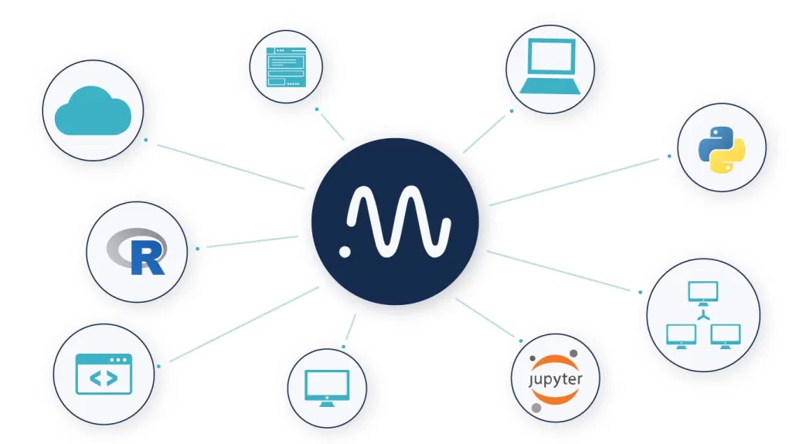

See what everyone on your team is doing
=======================================

|Youtube Video|

Neptune lets you have every piece of every experiment or notebook of every teammate in one place

You can execute experiment code on your laptop, cloud environment, or a cluster and every information will be logged to the central storage hosted by us or deployed on-premises.

How does Neptune help different people on your team?
----------------------------------------------------

**Data Scientist:**

- See ML experiments your teammates run
- See and download notebooks that your teammates are creating
- Share anything you want with a link

**Machine learning engineer:**

- Have a central registry for the models, experiments, and notebooks
- Find and fetch everything you need programmatically

**Team leader:**

- See what your team is doing, any time, anywhere without logging to a remote server
- Find the information that you want to check quickly
- Save dashboard or experiment views for later and link to them from other tools

.. |Youtube Video| raw:: html

    <iframe width="720" height="420" src="https://www.youtube.com/embed/KGdXLWqNquQ" frameborder="0" allow="accelerometer; autoplay; encrypted-media; gyroscope; picture-in-picture" allowfullscreen></iframe>

