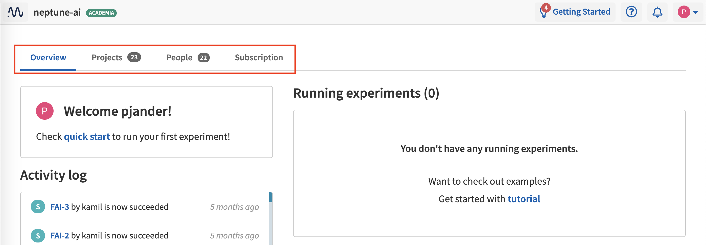

Team, Project and User Management
=================================

This page describes the concepts of team, project and user roles and permissions as they are used in Neptune. It also
provides instructions for creating projects and workspaces and adding users to them.

.. contents::
    :local:
    :depth: 1
    :backlinks: top

Workspace Types
------------------

.. _core-concepts_workspace-types:

A *workspace* is a way to centrally manage projects, users and subscriptions.

Neptune has two workspace types: *individual* and *team*.

Individual
^^^^^^^^^^
* Each user is assigned an individual workspace with their ``username`` as the workspace name.
* The user is the only member of this workspace but may :ref:`invite collaborators <how-to_team-management_invite-to-project>` to projects.
* The user can create an unlimited number of projects in their individual workspace.

Team
^^^^
* A team workspace comes in handy when an entire team needs to be managed centrally.
* Once :ref:`created <how-to_team-management_create-workspace>`, a team workspace can be managed by the :ref:`workspace Admin <core-concepts_user-roles_workspace-admin>`. The admin can manage users and subscription settings.
* Only users who joined team workspace can browse its content, subject to the assigned :ref:`role <core-concepts_user-roles>` in the workspace or project.

Learn more about :ref:`project types <core-concepts_project-types>` and :ref:`user roles <core-concepts_user-roles>`.

=======

User Roles
----------
.. _core-concepts_user-roles:

There are roles in projects and in workspaces.

Roles in a workspace
^^^^^^^^^^^^^^^^^^^^

Workspace roles apply only to team workspaces.

.. _core-concepts_user-roles_workspace-admin:

If you have :ref:`created a workspace <how-to_team-management_create-workspace>`,
you can invite people to it. Two roles are available: Admin and Member.

The following table summarizes the permissions available for the workspace roles.

.. csv-table::
   :header: "Permission","Admin","Member"
   :widths: 20, 20, 20

      Managing subscription (including invoice data),yes,no
      Managing workspace members,yes,no
      Creating and deleting projects,yes,no

You can access workspace settings by clicking the workspace name on the top bar.

.. figure:: ../../_static/images/core-concepts/workspace-settings.png
   :target: ../../_static/images/core-concepts/workspace-settings.png
   :alt: workspace settings button

Workspace settings can be viewed under the *Overview*, *Projects*, *People*, and *Subscription* tabs.

.. note::

    - An Admin of a workspace is also the Owner of all projects and can grant workspace ownership to anyone in the workspace.
    - Project Owners can grant project ownership to anyone in the workspace.
    - A workspace must have at least one Admin, so the last remaining Admin cannot be removed from the workspace.

Roles in a project
^^^^^^^^^^^^^^^^^^
.. _core-concepts_user-roles_project-owner:

The following table summarizes the permissions available for the three project roles: Owner, Contributor and Viewer.

- **Content** permissions refer to running experiments, creating Notebooks, and modifying previously stored data.
- **Project member** permissions are those for inviting members and change their roles.
- **Project settings** permissions refer to the definition of a project as private or public.

.. csv-table::
   :header: "Permission","Owner","Contributor","Viewer"
   :widths: 25, 15, 15, 15
   :delim: #

      Viewing project content#yes#yes#yes
      Editing project content#yes#yes#no
      Viewing project members#yes#yes#yes
      Editing project members#yes#no#no
      Viewing or editing of project settings and properties#yes#no#no

====

Project Types
-------------
.. _core-concepts_project-types:

There are private and public projects.

Private projects
^^^^^^^^^^^^^^^^
Only people added to the project can see it. The project :ref:`Owner <core-concepts_user-roles_project-owner>` can manage who has access to the project in the Settings view.

Here is an example view, where the project Owner can manage project members:

.. image:: ../../_static/images/how-to/team-management/invite-to-project.png
   :target: ../../_static/images/how-to/team-management/invite-to-project.pn
   :alt: Invite user to the project

Public projects
^^^^^^^^^^^^^^^
Public projects are freely available to view by everyone who has access to the Internet.

Also, in case of individual workspaces, you can invite collaborators to public projects only.
Examples are: |credit-default-prediction| and |binary-classification-metrics|.

.. External links

.. |credit-default-prediction| raw:: html

    <a href="https://ui.neptune.ai/neptune-ai/credit-default-prediction" target="_blank">Credit default prediction</a>

.. |binary-classification-metrics| raw:: html

    <a href="https://ui.neptune.ai/neptune-ai/binary-classification-metrics" target="_blank">Binary classification metrics</a>

.. _how-to_team-management_create-workspace:

