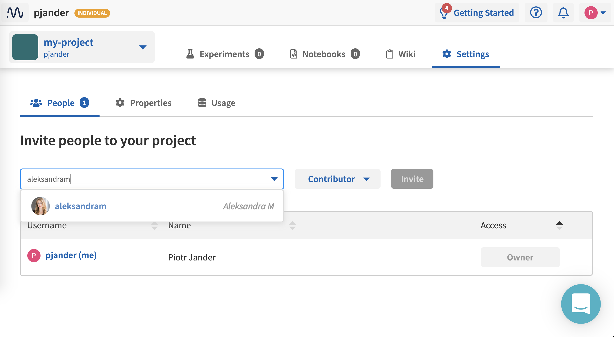

Projects
========

Project Types
-------------
.. _core-concepts_project-types:

There are private and public projects.

Private projects
^^^^^^^^^^^^^^^^

Only people added to the project can see it. The project :ref:`Owner <core-concepts_user-roles_project-owner>` can manage who has access to the project in the Settings view.

Here is an example view, where the project Owner can manage project members:

Public projects
^^^^^^^^^^^^^^^

Public projects are freely available to view by everyone who has access to the Internet.

Also, in case of individual workspaces, you can invite collaborators to public projects only.
Examples are: |credit-default-prediction| and |binary-classification-metrics|.

.. toctree::
   :maxdepth: 1

    Create a project <create-project.rst>
    Add people to project <add-people-to-project.rst>

.. |credit-default-prediction| raw:: html

    <a href="https://ui.neptune.ai/neptune-ai/credit-default-prediction" target="_blank">Credit default prediction</a>

.. |binary-classification-metrics| raw:: html

    <a href="https://ui.neptune.ai/neptune-ai/binary-classification-metrics" target="_blank">Binary classification metrics</a>