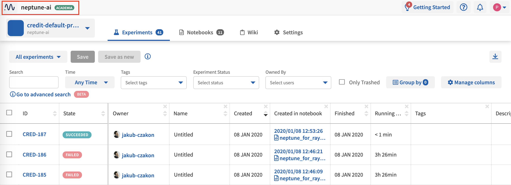
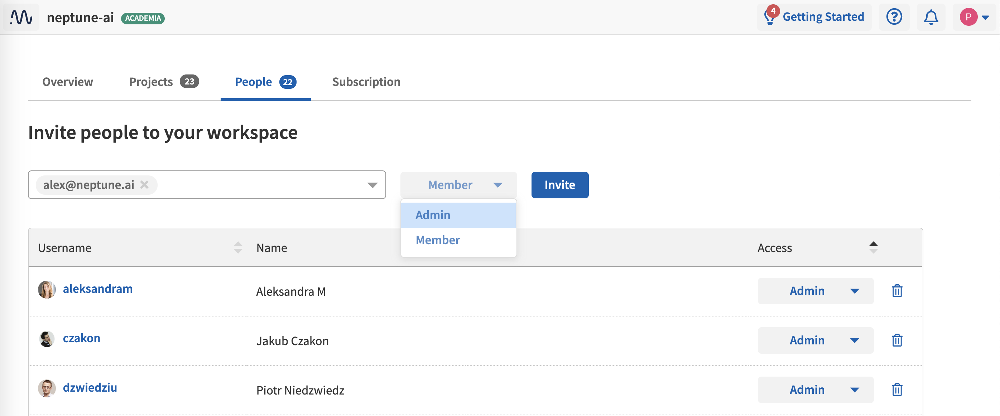

Invite Users to a Workspace
===========================

After you have :ref:`created a workspace <how-to_team-management_create-workspace>`, you can invite members to join it.

.. note::
    - Only :ref:`a workspace Admin <core-concepts_user-roles_workspace-admin>` can invite new users to a workspace.
    - In case of a team workspace, as soon as a user is added, s(he) is listed automatically.
    - In case of an individual workspace, users are explicitly invited and have to accept the invitation before they are added. Those users can leave the Projects that they joined at any time.
    - Only workspace members can be added to Projects in team workspaces.

1. Click the name of the current workspace on the top bar.

2. In the panel that appears, click the **People** tab.

- The tab displays the list of users who already belong to the workspace or whose membership is pending.
- Above the list is a field in which you can type an email or username  of people you want to invite. Neptune identifies names and emails for people who already have an account.

3. Specify a name, set a role (Admin or Member) and click **Invite**.

The users you invite will be invited via email to join your workspace (in case of already registered users, through an in-app notification).
Until they join, their status is marked as "Pending invitation".