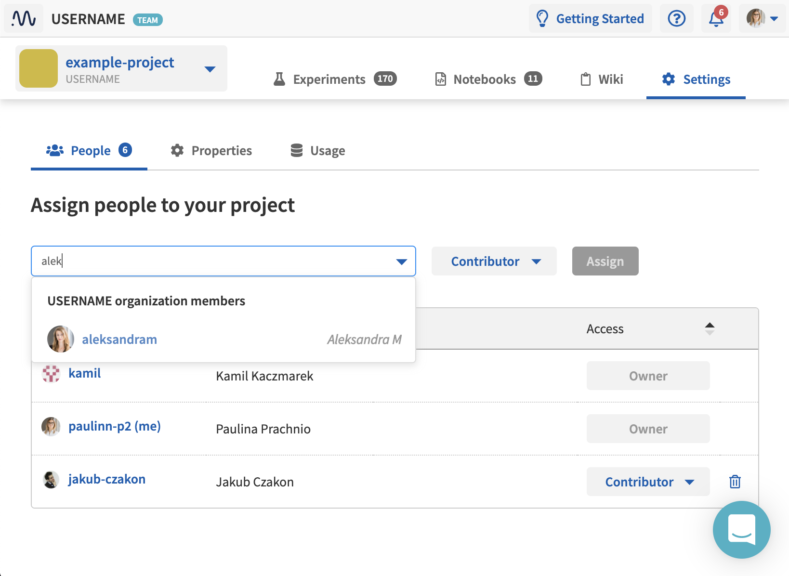

Assign People to a Project
==========================

.. note::

    Note that you can only collaborate on your private projects in a Team workspace.
    Try Team workspace with 1 project and 10 GB for free.

    Read how to set up a :ref:`Team workspace <administration-team-workspace>`.

.. note::

    Only a project Owner can assign people to the project. Learn more about :ref:`project roles <administration-user-roles>`.

1. In the Project panel, click **Settings**, then click the **People** tab.

- The tab displays the list of project members who already belong to the project.
- Above the list is a field in which you can type an email or username of people you want to assign to a project. Neptune identifies names and emails for people who already have an account.

2. Specify an email or username of a user you want to add.

3. Set a role and click **Invite**.

.. note::

    - If a user is registered in Neptune.ai, s(he) can be added from the UI, under **Project Settings** > **People**. If the user is not yet registered in Neptune.ai, s(he) can be invited by email. In any case, the user needs to accept the invitation, before s(he) appears in the list.
    - If the project is created in an individual workspace, you can only invite users to a public project. The user is notified by email and must accept the invitation to be added. You cannot add users to a private project.
