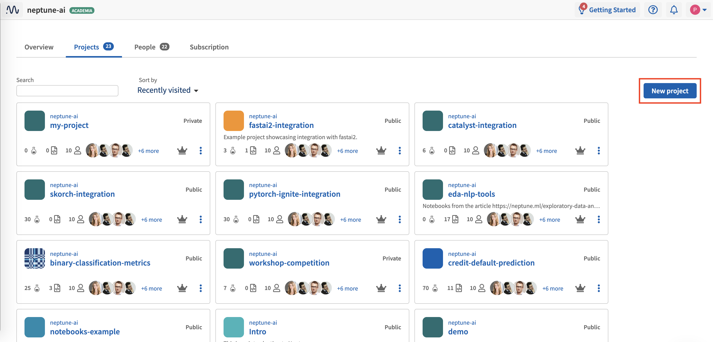
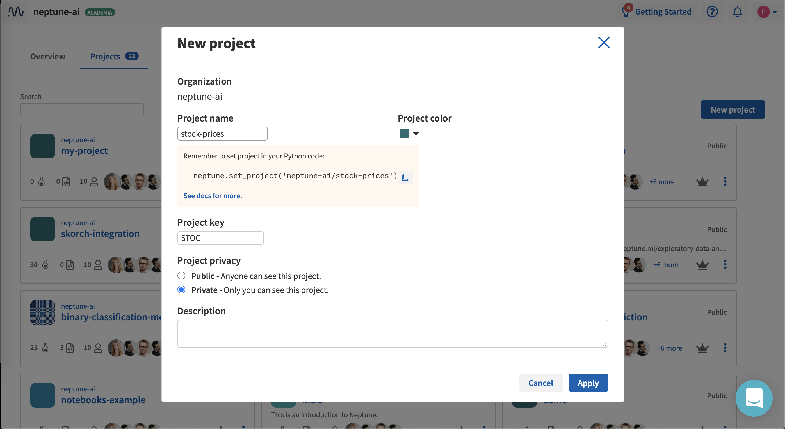

Create a Project
================

Neptune lets you create a project.

1. Click **Project** at the top-left of the window.

2. In the pane that appears, click **New project**.

3. Set a name, color, description and :ref:`project type <core-concepts_project-types>` (Public or Private).

4. Click **Apply**.

The new project is created.

.. _how-to_team-management_invite-to-project: