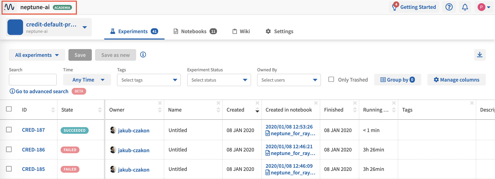

User Management
===============

User Roles
----------
.. _core-concepts_user-roles:

There are user roles in projects and in workspaces.

Roles in a workspace
^^^^^^^^^^^^^^^^^^^^

Workspace roles apply only to team workspaces.

.. _core-concepts_user-roles_workspace-admin:

If you have :ref:`created a Team workspace <how-to_team-management_create-workspace>`,
you can invite people to it. Two roles are available: Admin and Member.

The following table summarizes the permissions available for the workspace roles.

.. csv-table::
   :header: "Permission","Admin","Member"
   :widths: 20, 20, 20

      Managing subscription (including invoice data),yes,no
      Managing workspace members,yes,no
      Creating and deleting projects,yes,no

You can access workspace settings by clicking the workspace name on the top bar.

Workspace settings can be viewed under the *Overview*, *Projects*, *People*, and *Subscription* tabs.

.. note::

    - An Admin of a workspace is also the Owner of all projects and can grant workspace ownership to anyone in the workspace.
    - Project Owners can grant project ownership to anyone in the workspace.
    - A workspace must have at least one Admin, so the last remaining Admin cannot be removed from the workspace.

Roles in a project
^^^^^^^^^^^^^^^^^^

.. _core-concepts_user-roles_project-owner:

The following table summarizes the permissions available for the three project roles: Owner, Contributor and Viewer.

- **Content** permissions refer to running experiments, creating Notebooks, and modifying previously stored data.
- **Project member** permissions are those for inviting members and change their roles.
- **Project settings** permissions refer to the definition of a project as private or public.

.. csv-table::
   :header: "Permission","Owner","Contributor","Viewer"
   :widths: 25, 15, 15, 15
   :delim: #

      Viewing project content#yes#yes#yes
      Editing project content#yes#yes#no
      Viewing project members#yes#yes#yes
      Editing project members#yes#no#no
      Viewing or editing of project settings and properties#yes#no#no
