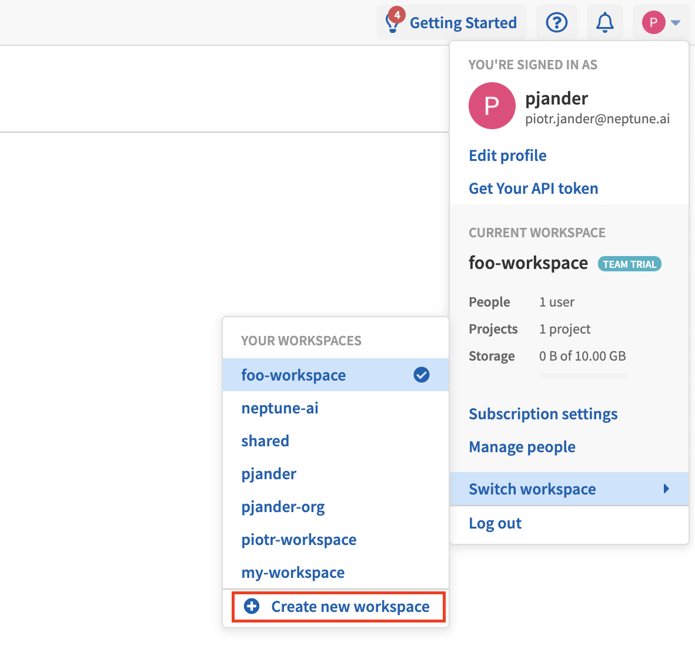
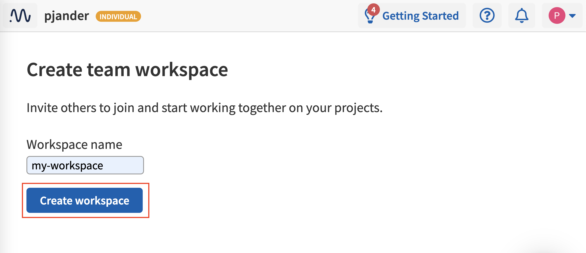
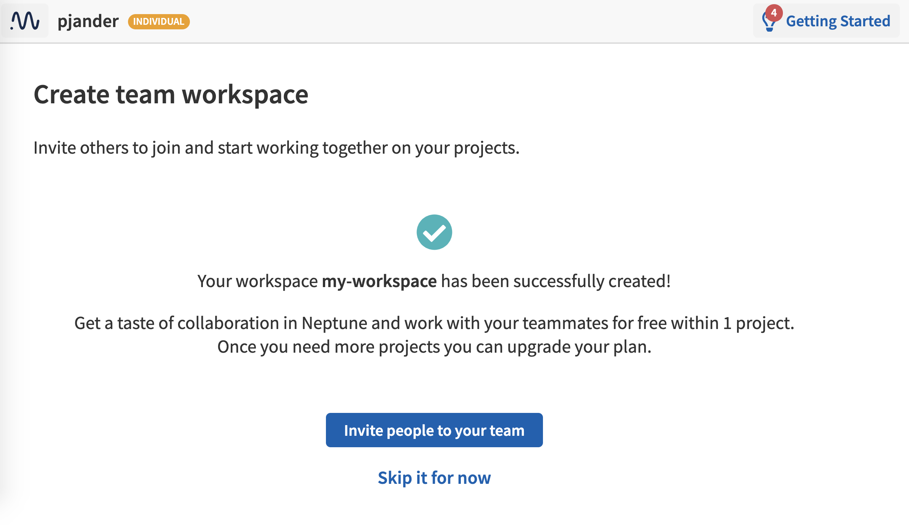

Create a workspace
==================

1. Click your avatar at the upper-right corner, then click **Switch workspace**, and finally click **Create new workspace**

2. Type in a name and click **Create workspace**.

3. Once the workspace has been created, you can :ref:`invite people <invite-to-workspace>` to your workspace.

.. _invite-to-workspace: